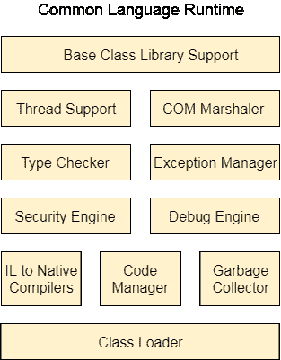

# 。NET 框架

> 原文：<https://www.javatpoint.com/net-framework>

。NET 是一个开发软件应用程序的框架。它由微软设计和开发，第一个测试版于 2000 年发布。

它用于开发网络、视窗、电话应用程序。此外，它提供了广泛的功能和支持。

这个框架包含大量的类库，称为框架类库(FCL)。用。NET 是在称为 CLR(公共语言运行时)的执行环境中执行的。这些是的核心和基本部分。NET 框架。

该框架提供各种服务，如内存管理、网络、安全、内存管理和类型安全。

那个。Net Framework 支持 C#、F#、VB.NET、J#、VC++、JScript.NET、APL、COBOL、Perl、Oberon、ML、Pascal、Eiffel、Smalltalk、Python、Cobra、ADA 等 60 多种编程语言。

以下是。NET 框架堆栈，显示框架的模块和组件。

那个。NET 框架由四个主要组件组成:

1.  公共语言运行时
2.  框架类库(FCL)，
3.  核心语言(WinForms、ASP.NET 和 ADO。NET)，以及
4.  其他模块(WCF、WPF、WF、卡空间、LINQ、实体框架、并行 LINQ、任务并行库等。)

## 公共语言运行时

它是一个加载和执行程序的程序执行引擎。它将程序转换成本机代码。它充当框架和操作系统之间的接口。它进行异常处理、内存管理和垃圾收集。此外，它还提供安全性、类型安全性、互操作性和可移植性。CLR 组件列表如下所示:

## FCL(框架类库)

它是一个标准库，由数千个类组成，用于构建应用程序。基本类库是 FCL 的核心，提供基本功能。

## 窗体

Windows 窗体是一种智能客户端技术。NET Framework，一组简化常见应用程序任务(如读写文件系统)的托管库。

## ASP.NET

ASP.NET 是一个由微软设计和开发的网络框架。它用于开发网站、网络应用程序和网络服务。它提供了 HTML、CSS 和 JavaScript 的完美集成。它于 2002 年 1 月首次发布。

## ADO.NET

ADO.NET 是。Net Framework，用于在应用程序和数据源之间建立连接。数据源可以是例如 SQL Server 和 XML。ADO。NET 由可用于连接、检索、插入和删除数据的类组成。

## WPF(视窗演示基金会)

视窗演示基金会(WPF)是微软的一个图形子系统，用于在基于视窗的应用程序中呈现用户界面。WPF，以前被称为“阿瓦隆”，最初是作为的一部分发布的。NET 框架 3.0。WPF 使用 DirectX。

## WCF(视窗通讯基金会)

它是构建面向服务的应用程序的框架。使用 WCF，您可以将数据作为异步消息从一个服务端点发送到另一个服务端点。

## WF(工作流基金会)

Windows Workflow Foundation (WF)是一项微软技术，它提供了一个应用编程接口、一个进程内工作流引擎和一个可重新托管的设计器，以将长时间运行的进程作为工作流实施。NET 应用程序。

## LINQ(语言综合查询)

这是一种查询语言，介绍于。NET 3.5 框架。它用于使用 C# 或 Visual Basics 编程语言查询数据源。

## 实体框架

这是一个基于 ORM 的开源框架，用于使用。NET 对象。它消除了开发人员处理数据库的大量工作。这是微软推荐的处理数据库的技术。

## 平行 LINQ

平行 LINQ 或 PLINQ 是 LINQ 对对象的平行实现。它结合了 LINQ 的简单性和可读性，并提供了并行编程的能力。

通过使用所有可用的计算机功能，它可以提高并提供执行 LINQ 查询的快速速度。

除了上述特性和库之外。NET 包含其他 API 和模型来改进和增强。NET 框架。

2015 年增加了任务并行和任务并行库。英寸 NET 4.5 中，增加了基于任务的异步模型。

* * *

## 。NET 框架索引

* * *

**。网络框架**

*   [。NET 框架](net-framework)
*   [CLR](net-common-language-runtime)
*   [FCL](net-framework-class-library)

**C#**

*   [C# 教程](c-sharp-tutorial)
*   [什么是 C#](what-is-c-sharp)
*   [C++ vs C#](cpp-vs-csharp)
*   [Java vs C#](java-vs-csharp)
*   [C# 历史记录](csharp-history)
*   [C# 功能](csharp-features)
*   [C# 示例](c-sharp-example)
*   [C# 变量](csharp-variables)
*   [C# 数据类型](csharp-data-types)
*   [C# 操作员](csharp-operators)
*   [C# 关键词](csharp-keywords)

**C# 控制报表**

*   [C# if-else](c-sharp-if-else)
*   [C# 开关](c-sharp-switch)
*   [C# For 循环](c-sharp-for-loop)
*   [C# While 循环](c-sharp-while-loop)
*   [C# 边做边循环](c-sharp-do-while-loop)
*   [C# 中断](c-sharp-break-statement)
*   [C# 继续](c-sharp-continue-statement)
*   [C# 转到](c-sharp-goto-statement)
*   [C# 评论](c-sharp-comments)

**C# 功能**

*   [C# 功能](c-sharp-function)
*   [C# 值调用](c-sharp-call-by-value)
*   [C# 引用调用](c-sharp-call-by-reference)
*   [C# 输出参数](c-sharp-out-parameter)

**C# 数组**

*   [C# 数组](c-sharp-arrays)
*   [C# 数组至函数](c-sharp-passing-array-to-function)
*   [C# 多维数组](c-sharp-multidimensional-array)
*   [C# 交错数组](c-sharp-jagged-array)
*   [C# 参数](c-sharp-params)
*   [C# 数组类](c-sharp-array-class)
*   [C# 命令行参数](c-sharp-command-line-arguments)

**C# 对象和类**

*   [C# 对象和类](c-sharp-object-and-class)
*   [C# 构造器](c-sharp-constructor)
*   [【c# 破坏者】](c-sharp-destructor)
*   [C# 本](c-sharp-this)
*   [C# 静态](c-sharp-static)
*   [C# 静态类](c-sharp-static-class)
*   [C# 静态构造函数](c-sharp-static-constructor)
*   [C# 结构](c-sharp-structs)
*   [C# 枚举](c-sharp-enum)

**C# 属性**

*   [C# 属性](c-sharp-properties)

**C# 继承**

*   [C# 继承](c-sharp-inheritance)
*   [C# 聚合](c-sharp-aggregation)

**C# 多态性**

*   [C# 成员重载](c-sharp-member-overloading)
*   [C# 方法覆盖](c-sharp-method-overriding)
*   [C# 基础](c-sharp-base)
*   [C# 多态性](c-sharp-polymorphism)
*   [C# 密封](c-sharp-sealed)

**C# 抽象**

*   [C# 摘要](c-sharp-abstract)
*   [C# 界面](c-sharp-interface)

**C# 命名空间**

*   [C# 命名空间](c-sharp-namespaces)
*   [C# 访问修饰符](c-sharp-access-modifiers)
*   [C# 封装](c-sharp-encapsulation)

**C# 字符串**

*   [C# 字符串](c-sharp-strings)

**C# 字符串函数**

*   [字符串克隆()](csharp-string-clone)
*   [字符串比较()](csharp-string-compare)
*   [字符串比较器 dinal()](csharp-string-compareordinal)
*   [字符串比较()](csharp-string-compareto)
*   [字符串连接（）](csharp-string-concat)
*   [字符串包含()](csharp-string-contains)
*   [字符串复制()](csharp-string-copy)
*   [字串 CopyTo()](csharp-string-copyto)
*   [字串 end with()](csharp-string-endswith)
*   [字符串等于()](csharp-string-equals)
*   [字符串格式()](csharp-string-format)
*   [字串 get numeric stepper()](csharp-string-getenumerator)
*   [字符串 GetHashCode（）](csharp-string-gethashcode)
*   [字串 gettetype()](csharp-string-gettype)
*   [字串 GetTypeCode()](csharp-string-gettypecode)
*   [字符串索引（）](csharp-string-indexof)
*   [字符串插入()](csharp-string-insert)
*   [弦乐实习生()](csharp-string-intern)
*   [字符串是内部()](csharp-string-isinterned)
*   [字符串被规范化()](csharp-string-isnormalized)
*   [字符串规格化()](csharp-string-normalize)
*   [字符串 is ul mpty()](csharp-string-isnullorempty)
*   [is ullorwhite space()](csharp-string-isnullorwhitespace)
*   [字符串连接()](csharp-string-join)
*   [字符串最后索引的 （）](csharp-string-lastindexof)
*   [字符串 lastindexofaniy()](csharp-string-lastindexofany)
*   [弦垫左（）](csharp-string-padleft)
*   [String PadRight()](csharp-string-padright)
*   [字符串删除()](csharp-string-remove)
*   [字符串替换()](csharp-string-replace)
*   [字符串分割()](csharp-string-split)
*   [字符串开始开关()](csharp-string-startswith)
*   [String SubString()](csharp-string-substring)
*   [串火炬数组()](csharp-string-tochararray)
*   [字符串 tolpower()](csharp-string-tolower)
*   [字符串 to ower invoke()](csharp-string-tolowerinvariant)
*   字符串 ToString()
*   串 ToUpper()
*   [字符串 to pperinvariant()](csharp-string-toupperinvariant)
*   [细绳修剪()](csharp-string-trim)
*   [String TrimEnd()](csharp-string-trimend)
*   [字符串 trimstat()](csharp-string-trimstart)

**C# 异常**

*   [C# 异常处理](c-sharp-exception-handling)
*   [C# 试/抓](c-sharp-try-catch)
*   [C# 最后](c-sharp-finally)
*   [C# 自定义异常](c-sharp-user-defined-exceptions)
*   [C# 选中未选中](c-sharp-checked-and-unchecked)
*   [C# 系统异常](c-sharp-systemexception)

**C# 文件输入输出**

*   [C# FileStream](c-sharp-filestream)
*   [C# 流写入器](c-sharp-streamwriter)
*   [C# StreamReader](c-sharp-streamreader)
*   [C# 文字写手](c-sharp-textwriter)
*   [c# text performer](c-sharp-textreader)
*   [C# BinaryWriter](c-sharp-binarywriter)
*   [C# BinaryReader](c-sharp-binaryreader)
*   [C# 字符串编写器](c-sharp-stringwriter)
*   [C# StringReader](c-sharp-stringreader)
*   [C# FileInfo](c-sharp-fileinfo)
*   [C# 目录信息](c-sharp-directoryinfo)
*   [C# 序列化](c-sharp-serialization)
*   [C# 反序列化](c-sharp-deserialization)
*   [C# 系统。IO](c-sharp-system-io)

**C# 集合**

*   [C# 集合](c-sharp-collections)
*   [C# 列表<T>T1】](c-sharp-list)
*   [C # HashSet<T>T1】](c-sharp-hashset)
*   [C# 排序集<T>T1】](c-sharp-sortedset)
*   [C# 栈<T>T1】](c-sharp-stack)
*   [c# queue<>](c-sharp-queue)
*   [C# 链接列表<T>T1】](c-sharp-linkedlist)
*   [C# 词典< K，V>T1】](c-sharp-dictionary)
*   [C# SortedDictionary < K，V>T1】](c-sharp-sorteddictionary)
*   [C# 排序列表< K，V>T1】](c-sharp-sortedlist)

**C# 泛型**

*   [C# 泛型](c-sharp-generics)

**C# 代表**

*   [C# 代表](c-sharp-delegates)

**C# 反射**

*   [C# 反射](c-sharp-reflection)

**C# 匿名函数**

*   [匿名功能](c-sharp-anonymous-function)

**C# 多线程**

*   [C# 多线程](c-sharp-multithreading)
*   [C# 线程生命周期](c-sharp-thread-life-cycle)
*   [C# 螺纹类](c-sharp-thread-class)
*   [C# 主螺纹](c-sharp-main-thread)
*   [C# 螺纹示例](c-sharp-threading-example)
*   [C# 线程休眠](c-sharp-thread-sleep)
*   [C# 线程中止](c-sharp-thread-abort)
*   [C# 螺纹连接](c-sharp-thread-join)
*   [C# 螺纹名称](c-sharp-thread-name)
*   [C# 线程优先级](c-sharp-threadpriority)

**C# 同步**

*   [C# 同步](c-sharp-thread-synchronization)

**C# 新功能**

*   [C# 新功能(40+)](csharp-new-features)

**C# 2.0**

*   [部分类型](csharp-partial-types)
*   [迭代器](csharp-iterators)
*   [可空类型](csharp-nullable)
*   [委托协方差](csharp-delegate-covariance)
*   [委托推理](csharp-delegate-inference)
*   [静态类](c-sharp-static-class)
*   方法组转换(委托)

**C# 3.0**

*   [匿名类型](csharp-anonymous-types)
*   [延伸方法](csharp-extension-methods)
*   [查询表达式](csharp-query-expression)
*   [局部法](csharp-partial-method)
*   [隐式类型化局部变量](csharp-implicitly-typed-local-variable)
*   [对象和集合初始化器](csharp-object-and-collection-initializer)
*   [自动实现的属性](csharp-auto-implemented-properties)
*   λ表达式
*   表达式树

**C# 4.0**

*   [动态绑定](csharp-dynamic-binding)
*   [命名和可选参数](csharp-named-and-optional-arguments)
*   通用协变和逆变
*   嵌入式互操作类型(“NoPIA”)

**C# 5.0**

*   [异步方法](csharp-asynchronous-methods)
*   [来电者信息属性](csharp-caller-info-attributes)

**C# 6.0**

*   [使用静态指令](csharp-using-static-directive)
*   [异常过滤器](csharp-exception-filters)
*   [等待捕获/最终封锁](csharp-await-in-catch-finally-blocks)
*   [自动属性初始化器](cshrap-auto-initialize-property)
*   [仅吸气剂属性的默认值](csharp-default-values-for-getter-only-properties)
*   [表达体成员](csharp-expression-bodied-members)
*   [零传播子](csharp-null-propagator)
*   [字符串插值](csharp-string-interpolation)
*   [操作员姓名](csharp-nameof-operator)
*   [字典初始化器](csharp-dictionary-initializer)
*   编译器即服务(罗斯林)

**C# 7.0**

*   [模式匹配](csharp-pattern-matching)
*   元组
*   [解构](csharp-deconstruction)
*   [本地功能](csharp-local-functions)
*   [数字分隔符](csharp-digit-separator)
*   [二进制文字](csharp-binary-literals)
*   [参考返回和本地](csharp-ref-keyword)
*   [表达式主体构造函数和终结器](csharp-expression-bodied-constructors-and-finalizers)
*   [表达体吸气剂和沉降剂](csharp-expression-bodied-getters-and-setters)
*   [输出变量](c-sharp-out-parameter)
*   通用异步返回类型

**C# 7.1**

*   [异步主](csharp-async-main)
*   [默认表达式](csharp-default-expression)

**C# 程序列表**

*   [C# 程序](csharp-programs)
*   [斐波那契数列](fibonacci-series-in-csharp)
*   [质数](prime-number-program-in-csharp)
*   [回文号](palindrome-program-in-csharp)
*   [阶乘](factorial-program-in-csharp)
*   [T1】阿姆斯壮号 T3】](armstrong-number-in-csharp)
*   [位数之和](sum-of-digits-program-in-csharp)
*   [反向编号](csharp-program-to-reverse-number)
*   [互换号](csharp-program-to-swap-two-numbers-without-third-variable)
*   [十进制到二进制](csharp-program-to-convert-decimal-to-binary)
*   [字符中的数字](csharp-program-to-convert-number-in-characters)
*   [【字母三角】](csharp-program-to-print-alphabet-triangle)
*   [数字三角](csharp-program-to-print-number-triangle)
*   [斐波那契三角](csharp-program-to-generate-fibonacci-triangle)

**C# 面试问题**

*   [C# 面试问题](c-sharp-interview-questions)

**ADO.NET 教程**

*   [ADO.NET 教程](ado-net-tutorial)
*   [ADO.NET 介绍](ado-net-introduction)
*   [ADO.NET 数据提供商](ado-net-data-providers)
*   [ADO.NET SQL Server](ado-net-sql-server-connectivity)
*   [ADO.NET 连接](ado-net-connection)
*   [ADO.NET 指挥部](ado-net-command)
*   ado . net 数据读取器
*   [ADO.NET 数据集](ado-net-dataset)
*   [ADO。NET 数据适配器〔t1〕](ado-net-dataadapter)
*   [ADO。净日期〔t1〕](ado-net-datatables)
*   [ADO.NET WF 示例](ado-net-web-form-example)
*   [ADO.NET MVC 范例](ado-net-mvc-example)

**ADO.NET 面试问题**

*   [ADO.NET 面试问题](ado-dot-net-interview-questions)

**ASP.NET 教程**

*   [ASP。NET 教程](asp-net-tutorial)
*   [ASP。NET 简介](asp-net-introduction)
*   [ASP.NET 生命周期](asp-net-life-cycle)

**ASP.NET 网页表单**

*   [ASP.NET WF 简介](asp-net-web-form-introduction)
*   [ASP.NET WF 特色](asp-net-web-form-features)
*   [ASP.NET WF 项目](asp-net-web-form-project)
*   [ASP.NET WF 示例](asp-net-web-form-example)
*   [ASP.NET 服务器控制](asp-net-server-controls)
*   [ASP.NET 标签](asp-net-label)
*   [ASP.NET 文本框](asp-net-textbox)
*   [ASP.NET 按钮](asp-net-button)
*   [ASP.NET 超级链接](asp-net-hyperlink)
*   [ASP.NET 电台按钮](asp-net-radiobutton)
*   [ASP.NET 日历](asp-net-calender)
*   [ASP.NET 复选框](asp-net-checkbox)
*   [ASP.NET 链接按钮](asp-net-linkbutton)
*   [ASP.NET 文件上传](asp-net-fileupload)
*   [多个文件上传](asp-net-upload-multiple-files)
*   [ASP.NET 下载文件](asp-net-download-file)
*   [ASP.NET 饼干](asp-net-cookie)
*   [ASP.NET 时段](asp-net-session)
*   [ASP.NET 下载列表](asp-net-dropdownlist)
*   [ASP.NET 数据列表](asp-net-datalist)
*   [ASP.NET 数据网格](asp-net-datagrid)
*   [WF 用户注册](asp-net-web-form-user-registration)
*   [WF 事件处理](asp-net-web-form-events-handling)
*   [WF 认证](asp-net-web-form-authentication)
*   [WF 模型绑定](asp-net-web-form-model-binding)
*   [HTML 服务器控件](asp-net-html-server-controls)

**ASP.NET 验证**

*   [比较器](asp-net-web-form-comparevalidator)
*   [范围验证器](asp-net-web-form-rangevalidator)
*   [正则表达式验证器](asp-net-web-form-regular-expression-validator)
*   [要求 dfielddvalidador](asp-net-web-form-required-field-validator)
*   [有效性摘要](asp-net-web-form-validation-summary)

**ASP.NET MVC**

*   [ASP.NET MVC](asp-net-mvc-introduction)
*   [MVC 项目](asp-net-mvc-project)
*   [MVC 控制器](asp-net-mvc-controller)
*   [MVC 动作](asp-net-mvc-actions)
*   [MVC 动作选择器](asp-net-mvc-action-selectors)
*   [MVC 动作过滤器](asp-net-mvc-action-filters)
*   [MVC 模型](asp-net-mvc-model)
*   [MVC 模型绑定](asp-net-mvc-model-binding)
*   [MVC 视图](asp-net-mvc-view)
*   [MVC 验证](asp-net-mvc-validation)
*   [MVC 实体框架](asp-net-mvc-entity-framework)
*   [MVC 认证](asp-net-mvc-authentication)
*   [MVC 自举](asp-net-mvc-bootstrap)
*   [MVC 布线](asp-net-mvc-routing)
*   [MVC 脚手架](asp-net-mvc-scaffolding)
*   [MVC 视野袋](asp-net-mvc-viewbag)

**ASP.NET 剃刀**

*   [ASP.NET 剃刀](asp-net-razor)
*   [剃刀代码表达式](asp-net-razor-code-expressions)
*   [剃刀代码块](asp-net-razor-code-blocks)
*   [剃刀控制结构](asp-net-razor-control-structures)
*   [剃刀 HTML 助手](asp-net-razor-html-helpers)
*   [剃刀局部视图](asp-net-razor-partial-views)

**ASP.NET 面试问题**

*   [ASP.NET 访谈](asp-dot-net-interview-questions)

* * *