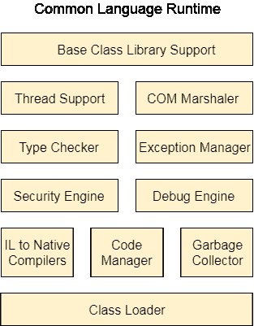

# 。公共语言运行时

> 原文：<https://www.javatpoint.com/net-common-language-runtime>

.NET CLR 是一个运行时环境，它管理并执行以任何方式编写的代码.NET 编程语言。

它将代码转换成可由中央处理器执行的本机代码。

## 。网络 CLR 函数

以下是 CLR 的功能。

*   它将程序转换成本机代码。
*   处理异常
*   提供类型安全
*   内存管理
*   提供安全性
*   提高性能
*   独立于语言
*   独立于平台
*   碎片帐集
*   为面向对象程序提供语言特性，如继承、接口和重载。

## 。净 CLR 版本

CLR 会不时更新自己，以提供更好的性能。

| .NET 版本 | CLR 版本 |
| One | One |
| One point one | One point one |
| Two | Two |
| Three | Two |
| Three point five | Two |
| four | four |
| Four point five | four |
| Four point six | four |
| Four point six | four |

## 。净 CLR 结构

下面是公共语言运行库的组件结构。

**基础类库支持**

它是一个类库，为.NET 应用程序。

**螺纹支架**

它管理多线程应用程序的并行执行。

**COM 编组员**

它提供了 COM 对象和应用程序之间的通信。

**类型检查器**

它检查应用程序中使用的类型，并验证它们是否符合 CLR 提供的标准。

**代码管理器**

它在运行时管理代码。

**垃圾收集器**

它释放未使用的内存，并将其分配给新的应用程序。

**异常处理程序**

它在运行时处理异常，以避免应用程序失败。

**类装入器**

它用于在运行时加载所有类。