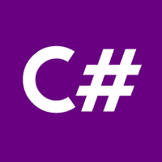

# C# 教程

> 原文：<https://www.javatpoint.com/c-sharp-tutorial>

C# 教程提供了 C# 的基本和高级概念。我们的 C# 教程是为初学者和专业人士设计的。

C# 是一种。Net 框架。

我们的 C# 教程包含了 C# 的所有主题，比如第一个例子、控制语句、对象和类、继承、构造函数、析构函数、this、静态、密封、多态、抽象、抽象类、接口、命名空间、封装、属性、索引器、数组、字符串、正则表达式、异常处理、多线程、文件 IO、集合等。

## 什么是 C#

C# 发音为“C-Sharp”。它是微软提供的一种面向对象的编程语言，运行在。Net 框架。

借助 C# 编程语言，我们可以开发不同类型的安全和健壮的应用程序:

*   窗口应用程序
*   Web 应用程序
*   分布式应用程序
*   Web 服务应用程序
*   数据库应用等。

C# 被 ECMA 和国际标准化组织批准为标准。C# 是为命令行界面(公共语言基础设施)设计的。CLI 是描述可执行代码和运行时环境的规范。

C# 编程语言受到 C++、Java、埃菲尔、Modula-3、Pascal 等的影响。语言。

* * *

## C# 索引

* * *

**。网络框架**

*   [。NET 框架](net-framework)
*   [CLR](net-common-language-runtime)
*   [FCL](net-framework-class-library)

**C#**

*   [C# 教程](c-sharp-tutorial)
*   [什么是 C#](what-is-c-sharp)
*   [C++ vs C#](cpp-vs-csharp)
*   [Java vs C#](java-vs-csharp)
*   [C# 历史记录](csharp-history)
*   [C# 功能](csharp-features)
*   [C# 示例](c-sharp-example)
*   [C# 变量](csharp-variables)
*   [C# 数据类型](csharp-data-types)
*   [C# 操作员](csharp-operators)
*   [C# 关键词](csharp-keywords)

**C# 控制报表**

*   [C# if-else](c-sharp-if-else)
*   [C# 开关](c-sharp-switch)
*   [C# For 循环](c-sharp-for-loop)
*   [C# While 循环](c-sharp-while-loop)
*   [C# 边做边循环](c-sharp-do-while-loop)
*   [C# 中断](c-sharp-break-statement)
*   [C# 继续](c-sharp-continue-statement)
*   [C# 转到](c-sharp-goto-statement)
*   [C# 评论](c-sharp-comments)

**C# 功能**

*   [C# 功能](c-sharp-function)
*   [C# 值调用](c-sharp-call-by-value)
*   [C# 引用调用](c-sharp-call-by-reference)
*   [C# 输出参数](c-sharp-out-parameter)

**C# 数组**

*   [C# 数组](c-sharp-arrays)
*   [C# 数组至函数](c-sharp-passing-array-to-function)
*   [C# 多维数组](c-sharp-multidimensional-array)
*   [C# 交错数组](c-sharp-jagged-array)
*   [C# 参数](c-sharp-params)
*   [C# 数组类](c-sharp-array-class)
*   [C# 命令行参数](c-sharp-command-line-arguments)

**C# 对象和类**

*   [C# 对象和类](c-sharp-object-and-class)
*   [C# 构造器](c-sharp-constructor)
*   [【c# 破坏者】](c-sharp-destructor)
*   [C# 本](c-sharp-this)
*   [C# 静态](c-sharp-static)
*   [C# 静态类](c-sharp-static-class)
*   [C# 静态构造函数](c-sharp-static-constructor)
*   [C# 结构](c-sharp-structs)
*   [C# 枚举](c-sharp-enum)

**C# 属性**

*   [C# 属性](c-sharp-properties)

**C# 继承**

*   [C# 继承](c-sharp-inheritance)
*   [C# 聚合](c-sharp-aggregation)

**C# 多态性**

*   [C# 成员重载](c-sharp-member-overloading)
*   [C# 方法覆盖](c-sharp-method-overriding)
*   [C# 基础](c-sharp-base)
*   [C# 多态性](c-sharp-polymorphism)
*   [C# 密封](c-sharp-sealed)

**C# 抽象**

*   [C# 摘要](c-sharp-abstract)
*   [C# 界面](c-sharp-interface)

**C# 命名空间**

*   [C# 命名空间](c-sharp-namespaces)
*   [C# 访问修饰符](c-sharp-access-modifiers)
*   [C# 封装](c-sharp-encapsulation)

**C# 字符串**

*   [C# 字符串](c-sharp-strings)

**C# 字符串函数**

*   [字符串克隆()](csharp-string-clone)
*   [字符串比较()](csharp-string-compare)
*   [字符串比较器 dinal()](csharp-string-compareordinal)
*   [字符串比较()](csharp-string-compareto)
*   [字符串连接（）](csharp-string-concat)
*   [字符串包含()](csharp-string-contains)
*   [字符串复制()](csharp-string-copy)
*   [字串 CopyTo()](csharp-string-copyto)
*   [字串 end with()](csharp-string-endswith)
*   [字符串等于()](csharp-string-equals)
*   [字符串格式()](csharp-string-format)
*   [字串 get numeric stepper()](csharp-string-getenumerator)
*   [字符串 GetHashCode（）](csharp-string-gethashcode)
*   [字串 gettetype()](csharp-string-gettype)
*   [字串 GetTypeCode()](csharp-string-gettypecode)
*   [字符串索引（）](csharp-string-indexof)
*   [字符串插入()](csharp-string-insert)
*   [弦乐实习生()](csharp-string-intern)
*   [字符串是内部()](csharp-string-isinterned)
*   [字符串被规范化()](csharp-string-isnormalized)
*   [字符串规格化()](csharp-string-normalize)
*   [字符串 is ul mpty()](csharp-string-isnullorempty)
*   [is ullorwhite space()](csharp-string-isnullorwhitespace)
*   [字符串连接()](csharp-string-join)
*   [字符串最后索引的 （）](csharp-string-lastindexof)
*   [字符串 lastindexofaniy()](csharp-string-lastindexofany)
*   [弦垫左（）](csharp-string-padleft)
*   [String PadRight()](csharp-string-padright)
*   [字符串删除()](csharp-string-remove)
*   [字符串替换()](csharp-string-replace)
*   [字符串分割()](csharp-string-split)
*   [字符串开始开关()](csharp-string-startswith)
*   [String SubString()](csharp-string-substring)
*   [串火炬数组()](csharp-string-tochararray)
*   [字符串 tolpower()](csharp-string-tolower)
*   [字符串 to ower invoke()](csharp-string-tolowerinvariant)
*   字符串 ToString()
*   串 ToUpper()
*   [字符串 to pperinvariant()](csharp-string-toupperinvariant)
*   [细绳修剪()](csharp-string-trim)
*   [String TrimEnd()](csharp-string-trimend)
*   [字符串 trimstat()](csharp-string-trimstart)

**C# 异常**

*   [C# 异常处理](c-sharp-exception-handling)
*   [C# 试/抓](c-sharp-try-catch)
*   [C# 最后](c-sharp-finally)
*   [C# 自定义异常](c-sharp-user-defined-exceptions)
*   [C# 选中未选中](c-sharp-checked-and-unchecked)
*   [C# 系统异常](c-sharp-systemexception)

**C# 文件输入输出**

*   [C# FileStream](c-sharp-filestream)
*   [C# 流写入器](c-sharp-streamwriter)
*   [C# StreamReader](c-sharp-streamreader)
*   [C# 文字写手](c-sharp-textwriter)
*   [c# text performer](c-sharp-textreader)
*   [C# BinaryWriter](c-sharp-binarywriter)
*   [C# BinaryReader](c-sharp-binaryreader)
*   [C# 字符串编写器](c-sharp-stringwriter)
*   [C# StringReader](c-sharp-stringreader)
*   [C# FileInfo](c-sharp-fileinfo)
*   [C# 目录信息](c-sharp-directoryinfo)
*   [C# 序列化](c-sharp-serialization)
*   [C# 反序列化](c-sharp-deserialization)
*   [C# 系统。IO](c-sharp-system-io)

**C# 集合**

*   [C# 集合](c-sharp-collections)
*   [C# 列表<T>T1】](c-sharp-list)
*   [C # HashSet<T>T1】](c-sharp-hashset)
*   [C# 排序集<T>T1】](c-sharp-sortedset)
*   [C# 栈<T>T1】](c-sharp-stack)
*   [c# queue<>](c-sharp-queue)
*   [C# 链接列表<T>T1】](c-sharp-linkedlist)
*   [C# 词典< K，V>T1】](c-sharp-dictionary)
*   [C# SortedDictionary < K，V>T1】](c-sharp-sorteddictionary)
*   [C# 排序列表< K，V>T1】](c-sharp-sortedlist)

**C# 泛型**

*   [C# 泛型](c-sharp-generics)

**C# 代表**

*   [C# 代表](c-sharp-delegates)

**C# 反射**

*   [C# 反射](c-sharp-reflection)

**C# 匿名函数**

*   [匿名功能](c-sharp-anonymous-function)

**C# 多线程**

*   [C# 多线程](c-sharp-multithreading)
*   [C# 线程生命周期](c-sharp-thread-life-cycle)
*   [C# 螺纹类](c-sharp-thread-class)
*   [C# 主螺纹](c-sharp-main-thread)
*   [C# 螺纹示例](c-sharp-threading-example)
*   [C# 线程休眠](c-sharp-thread-sleep)
*   [C# 线程中止](c-sharp-thread-abort)
*   [C# 螺纹连接](c-sharp-thread-join)
*   [C# 螺纹名称](c-sharp-thread-name)
*   [C# 线程优先级](c-sharp-threadpriority)

**C# 同步**

*   [C# 同步](c-sharp-thread-synchronization)

**C# 新功能**

*   [C# 新功能](csharp-new-features)

**C# 2.0**

*   [部分类型](csharp-partial-types)
*   [迭代器](csharp-iterators)
*   [可空类型](csharp-nullable)
*   [委托协方差](csharp-delegate-covariance)
*   [委托推理](csharp-delegate-inference)
*   [静态类](c-sharp-static-class)
*   方法组转换(委托)

**C# 3.0**

*   [匿名类型](csharp-anonymous-types)
*   [延伸方法](csharp-extension-methods)
*   [查询表达式](csharp-query-expression)
*   [局部法](csharp-partial-method)
*   [隐式类型化局部变量](csharp-implicitly-typed-local-variable)
*   [对象和集合初始化器](csharp-object-and-collection-initializer)
*   [自动实现的属性](csharp-auto-implemented-properties)
*   λ表达式
*   表达式树

**C# 4.0**

*   [动态绑定](csharp-dynamic-binding)
*   [命名和可选参数](csharp-named-and-optional-arguments)
*   通用协变和逆变
*   嵌入式互操作类型(“NoPIA”)

**C# 5.0**

*   [异步方法](csharp-asynchronous-methods)
*   [来电者信息属性](csharp-caller-info-attributes)

**C# 6.0**

*   [使用静态指令](csharp-using-static-directive)
*   [异常过滤器](csharp-exception-filters)
*   [等待捕获/最终封锁](csharp-await-in-catch-finally-blocks)
*   [自动属性初始化器](cshrap-auto-initialize-property)
*   [仅吸气剂属性的默认值](csharp-default-values-for-getter-only-properties)
*   [表达体成员](csharp-expression-bodied-members)
*   [零传播子](csharp-null-propagator)
*   [字符串插值](csharp-string-interpolation)
*   [操作员姓名](csharp-nameof-operator)
*   [字典初始化器](csharp-dictionary-initializer)
*   编译器即服务(罗斯林)

**C# 7.0**

*   [模式匹配](csharp-pattern-matching)
*   元组
*   [解构](csharp-deconstruction)
*   [本地功能](csharp-local-functions)
*   [数字分隔符](csharp-digit-separator)
*   [二进制文字](csharp-binary-literals)
*   [参考返回和本地](csharp-ref-keyword)
*   [表达式主体构造函数和终结器](csharp-expression-bodied-constructors-and-finalizers)
*   [表达体吸气剂和沉降剂](csharp-expression-bodied-getters-and-setters)
*   [输出变量](c-sharp-out-parameter)
*   通用异步返回类型

**C# 7.1**

*   [异步主](csharp-async-main)
*   [默认表达式](csharp-default-expression)

**C# 程序列表**

*   [C# 程序](csharp-programs)
*   [斐波那契数列](fibonacci-series-in-csharp)
*   [质数](prime-number-program-in-csharp)
*   [回文号](palindrome-program-in-csharp)
*   [阶乘](factorial-program-in-csharp)
*   [T1】阿姆斯壮号 T3】](armstrong-number-in-csharp)
*   [位数之和](sum-of-digits-program-in-csharp)
*   [反向编号](csharp-program-to-reverse-number)
*   [互换号](csharp-program-to-swap-two-numbers-without-third-variable)
*   [十进制到二进制](csharp-program-to-convert-decimal-to-binary)
*   [字符中的数字](csharp-program-to-convert-number-in-characters)
*   [【字母三角】](csharp-program-to-print-alphabet-triangle)
*   [数字三角](csharp-program-to-print-number-triangle)
*   [斐波那契三角](csharp-program-to-generate-fibonacci-triangle)

* * *

## 先决条件

在学习 C# 之前，你必须具备 C 编程语言的基础知识。

* * *

## 观众

我们的 C# 教程旨在帮助初学者和专业人士。

* * *

## 问题

我们保证您在这个 C# 教程中不会发现任何问题。但是如果有任何错误，请在联系表格中发布问题。