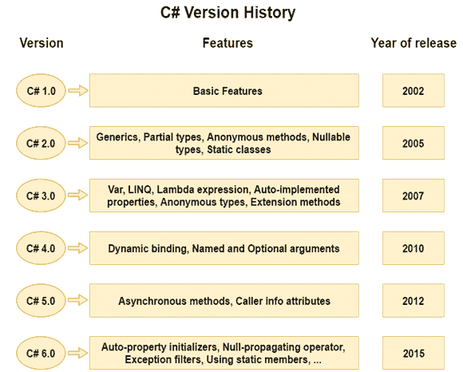

# C# 历史

> 原文：<https://www.javatpoint.com/csharp-history>

**c# 语言的历史**有意思知道。这里我们将讨论 C# 语言的简史。

C# 发音为**“C-Sharp”**。这是一种由**微软**提供的面向对象编程语言，运行在**上。Net 框架。**

**安德斯·海尔斯伯格**被誉为 C# 语言的**创始人。**

它基于 **C++和 Java** ，但是它有许多额外的扩展用于执行面向组件的编程方法。

自从 2002 年第一次发布以来，C# 已经有了很大的发展。**介绍的。NET Framework 1.0** 而 C# 的当前版本是 5.0。

让我们看看下面给出的每个 C# 版本中引入的重要特性。

