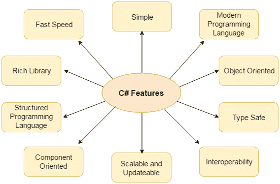

# C#特性

> 原文：<https://www.javatpoint.com/csharp-features>

C#是面向对象的编程语言。它提供了很多**特性**，如下所示。

1.  简单的
2.  现代编程语言
3.  面向对象的
4.  类型安全
5.  互用性
6.  可扩展和可更新
7.  面向组件
8.  结构化编程语言
9.  丰富的图书馆
10.  快速

* * *

### 1)简单

C#是一种简单的语言，因为它提供了结构化的方法(将问题分解成多个部分)、丰富的库函数集、数据类型等。

### 2)现代编程语言

C#编程基于当前的趋势，对于构建可扩展、可互操作和健壮的应用程序来说，它非常强大和简单。

### 3)面向对象

C#是面向对象的编程语言。OOPs 使得开发和维护变得更加容易，因为在面向过程的编程语言中，如果代码随着项目规模的增长而增长，就不容易管理。

### 4)类型安全

C#类型安全代码只能访问它有权执行的内存位置。因此，它提高了程序的安全性。

### 5)互操作性

互用性过程使 C#程序能够做几乎任何原生 C++应用程序可以做的事情。

### 6)可扩展和可更新

C#是自动可扩展和可更新的编程语言。为了更新我们的应用程序，我们删除旧文件并用新文件更新它们。

### 7)面向组件

C#是面向组件的编程语言。它是主要的软件开发方法，用于开发更健壮和高度可伸缩的应用程序。

### 8)结构化编程语言

C#是一种结构化的编程语言，从这个意义上说，我们可以使用函数将程序分成几部分。所以，很容易理解和修改。

### 9)丰富的图书馆

C#提供了许多内置函数，这使得开发速度很快。

### 10)快速

C#语言编译执行时间快。