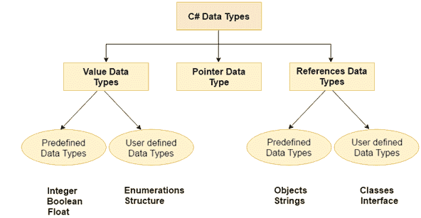
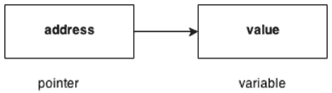

# C#数据类型

> 原文：<https://www.javatpoint.com/csharp-data-types>

数据类型指定变量可以存储的数据类型，如整数、浮点、字符等。



C#语言中有 3 种数据类型。

| 类型 | 数据类型 |
| 数值数据类型 | short、int、char、float、double 等 |
| 参考数据类型 | 字符串、类、对象和接口 |
| 指针数据类型 | 两颗北极指极星 |

* * *

## 数值数据类型

值数据类型是基于整数和基于浮点的。C#语言支持有符号和无符号文字。

C#语言中有两种值类型的数据类型。

**1)预定义的数据类型** -如整数、布尔、浮点等。

**2)用户定义的数据类型** -如结构、枚举等。

数据类型的内存大小可能会根据 32 位或 64 位操作系统而变化。

让我们看看值数据类型。它的大小是根据 32 位操作系统给出的。

| 数据类型 | 存储容量 | 范围 |
| 茶 | 1 字节 | -128 到 127 |
| 有符号字符 | 1 字节 | -128 到 127 |
| 无符号字符 | 1 字节 | 0 到 127 |
| 短的 | 2 字节 | -32，768 至 32，767 |
| 签名短 | 2 字节 | -32，768 至 32，767 |
| 无符号短 | 2 字节 | 0 至 65，535 |
| （同 Internationalorganizations）国际组织 | 4 字节 | -2，147，483，648 至-2，147，483，647 |
| 带符号整数 | 4 字节 | -2，147，483，648 至-2，147，483，647 |
| 无符号整数 | 4 字节 | 0 至 4，294，967，295 |
| 长的 | 8 字节 | ？9，223，372，036，854，775，808 至 9，223，372，036，854，775，807 |
| 签名长 | 8 字节 | ？9，223，372，036，854，775，808 至 9，223，372，036，854，775，807 |
| 无符号长 | 8 字节 | 0 - 18,446,744,073,709,551,615 |
| 漂浮物 | 4 字节 | 1.5 * 10<sup>-45</sup>-3.4 * 10<sup>38</sup>，7 位精度 |
| 两倍 | 8 字节 | 5.0 * 10<sup>-324</sup>-1.7 * 10<sup>308</sup>，15 位精度 |
| 小数 | 16 字节 | 至少-7.9 * 10 <sup>？28</sup> - 7.9 * 10 <sup>28</sup> ，至少 28 位精度 |

* * *

## 参考数据类型

引用数据类型不包含变量中存储的实际数据，但包含对变量的引用。

如果其中一个变量改变了数据，另一个变量会自动反映这种值的改变。

C#语言中有两种类型的引用数据类型。

**1)预定义类型** -如对象、字符串。

**2)用户定义的类型** -如类、接口。

* * *

## 指针数据类型

C#语言中的指针是一个变量，它也称为定位符或指示符，指向一个值的地址。



* * *

## 指针中使用的符号

| 标志 | 名字 | 描述 |
| &(和符号) | 地址算符 | 确定变量的地址。 |
| *(星号) | 间接运算符 | 访问地址的值。 |

* * *

## 声明指针

C#语言中的指针可以用*(星号符号)来声明。

```
int * a;  //pointer to int    
char * c; //pointer to char

```