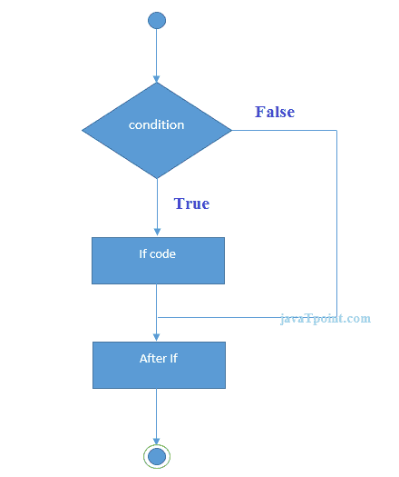
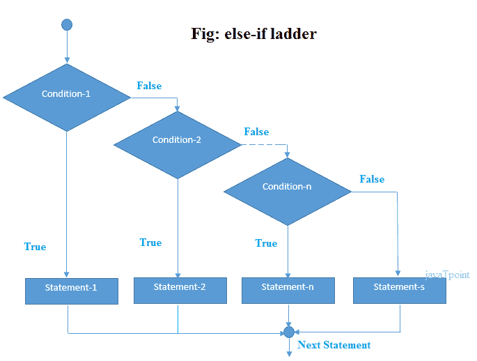

# C# if-else

> 原文:[https://www.javatpoint.com/c-sharp-if-else](https://www.javatpoint.com/c-sharp-if-else)

在 C#编程中， *if 语句*用于测试条件。C#中有各种类型的 if 语句。

*   如果语句
*   if-else 语句
*   嵌套 if 语句
*   如果-否则-如果梯子

## C# IF 语句

C# if 语句测试条件。如果条件为真，则执行。

**语法:**

```
if(condition){
//code to be executed
}

```



### C# If 示例

```
using System;    
public class IfExample
    {
       public static void Main(string[] args)
        {
            int num = 10;
            if (num % 2 == 0)
            {
                Console.WriteLine("It is even number");
            }

        }
    }

```

输出:

```
It is even number

```

## C# IF-else 语句

C# if-else 语句也测试该条件。如果条件为真则执行*如果条件为真则执行*否则执行*否则执行*。

**语法:**

```
if(condition){
//code if condition is true
}else{
//code if condition is false
}

```


### C# If-else 示例

```
using System;    
public class IfExample
    {
        public static void Main(string[] args)
        {
            int num = 11;
            if (num % 2 == 0)
            {
                Console.WriteLine("It is even number");
            }
            else
            {
                Console.WriteLine("It is odd number");
            }

        }
    }

```

输出:

```
It is odd number

```

## C# If-else 示例:用户输入

在这个例子中，我们使用**控制台从用户那里获得输入。ReadLine()** 方法。它返回字符串。对于数值，需要使用**转换将其转换为整数。to t32()**法。

```
using System;    
public class IfExample
    {
       public static void Main(string[] args)
        {
            Console.WriteLine("Enter a number:");
            int num = Convert.ToInt32(Console.ReadLine());

            if (num % 2 == 0)
            {
                Console.WriteLine("It is even number");
            }
            else
            {
                Console.WriteLine("It is odd number");
            }

        }
    }

```

输出:

```
Enter a number:11
It is odd number

```

输出:

```
Enter a number:12
It is even number

```

## C# IF-else-if 阶梯语句

C# if-else-if 梯形语句执行多个语句中的一个条件。

**语法:**

```
if(condition1){
//code to be executed if condition1 is true
}else if(condition2){
//code to be executed if condition2 is true
}
else if(condition3){
//code to be executed if condition3 is true
}
...
else{
//code to be executed if all the conditions are false
}

```



### C# If else-if 示例

```
using System;    
public class IfExample
    {
        public static void Main(string[] args)
        {
            Console.WriteLine("Enter a number to check grade:");
            int num = Convert.ToInt32(Console.ReadLine());

            if (num <0 || num >100)
            {
                Console.WriteLine("wrong number");
            }
            else if(num >= 0 && num < 50){
                Console.WriteLine("Fail");
            }
            else if (num >= 50 && num < 60)
            {
                Console.WriteLine("D Grade");
            }
            else if (num >= 60 && num < 70)
            {
                Console.WriteLine("C Grade");
            }
            else if (num >= 70 && num < 80)
            {
                Console.WriteLine("B Grade");
            }
            else if (num >= 80 && num < 90)
            {
                Console.WriteLine("A Grade");
            }
            else if (num >= 90 && num <= 100)
            {
                Console.WriteLine("A+ Grade");
            }
        }
    }

```

输出:

```
Enter a number to check grade:66
C Grade

```

输出:

```
Enter a number to check grade:-2
wrong number

```