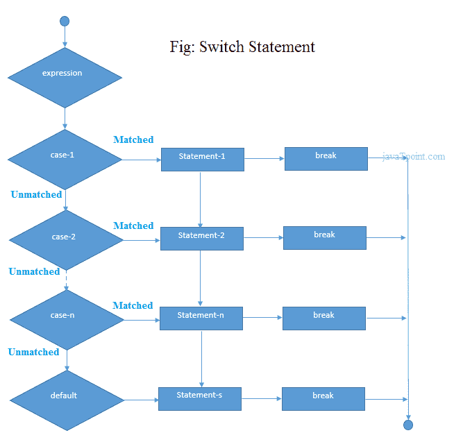

# C#开关

> 原文：<https://www.javatpoint.com/c-sharp-switch>

C# *switch 语句*从多个条件中执行一条语句。就像 C#中的 if-else-if 阶梯语句。

**语法:**

```
switch(expression){  
case value1:  
 //code to be executed;  
 break;
case value2:  
 //code to be executed;  
 break;
......  

default:   
 //code to be executed if all cases are not matched;  
 break;
}  

```



### C#开关示例

```
using System;
  public class SwitchExample
    {
      public static void Main(string[] args)
      {
          Console.WriteLine("Enter a number:");
          int num = Convert.ToInt32(Console.ReadLine());

          switch (num)
          {
              case 10: Console.WriteLine("It is 10"); break;
              case 20: Console.WriteLine("It is 20"); break;
              case 30: Console.WriteLine("It is 30"); break;
              default: Console.WriteLine("Not 10, 20 or 30"); break;
          }
      }
    }

```

输出:

```
Enter a number:
10
It is 10

```

输出:

```
Enter a number:
55
Not 10, 20 or 30

```

#### 注意:在 C#中，break 语句在开关情况下是必须的。