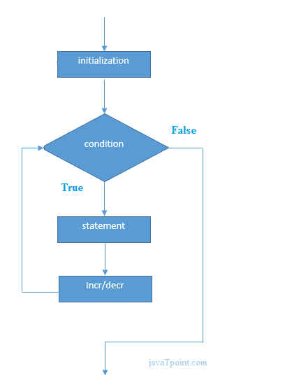

# C# For 循环

> 原文：<https://www.javatpoint.com/c-sharp-for-loop>

循环的 C# *用于多次迭代程序的一部分。如果迭代次数是固定的，建议使用 for 循环而不是 while 或 do-while 循环。*

循环的 C#与 C/C++相同。我们可以初始化变量，检查条件和增减值。

**语法:**

```
for(initialization; condition; incr/decr){
//code to be executed
}

```

**流程图:**



### C# For 循环示例

```
using System;
public class ForExample
    {
      public static void Main(string[] args)
      {
          for(int i=1;i<=10;i++){  
            Console.WriteLine(i);  
          }  
      }
    }

```

输出:

```
1
2
3
4
5
6
7
8
9
10

```

## C#嵌套循环

在 C#中，我们可以在一个 for 循环内部使用另一个 for 循环，它被称为嵌套 for 循环。当外循环执行一次时，内循环完全执行。因此，如果外环和内环执行 3 次，每个外环将执行 3 次内环，即总共 9 次。

让我们看一个 C#中嵌套 for 循环的简单例子。

```
using System;
public class ForExample
    {
      public static void Main(string[] args)
      {
        for(int i=1;i<=3;i++){  
                for(int j=1;j<=3;j++){  
                    Console.WriteLine(i+" "+j);  
                }  
        }  
      }
    }

```

输出:

```
1 1
1 2
1 3
2 1
2 2 
2 3
3 1
3 2
3 3

```

## C#无限循环

如果我们在 for 循环中使用双分号，它将被执行无限次。让我们看一个 C#中无限 for 循环的简单例子。

```
using System;
public class ForExample
    {
      public static void Main(string[] args)
      {
          for (; ;)
          {
                  Console.WriteLine("Infinitive For Loop");
          }  
      }
 }

```

输出:

```
Infinitive For Loop
Infinitive For Loop
Infinitive For Loop
Infinitive For Loop
Infinitive For Loop
ctrl+c

```