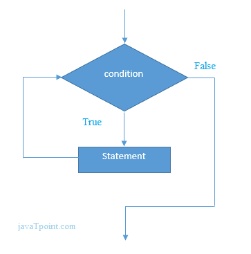

# C# While 循环

> 原文：<https://www.javatpoint.com/c-sharp-while-loop>

在 C# 中， *while 循环*用于多次迭代程序的一部分。如果迭代次数不固定，建议使用 while 循环而不是 for 循环。

**语法:**

```cs
while(condition){
//code to be executed
}

```

**流程图:**



### C# While 循环示例

让我们看一个 while 循环打印表 1 的简单例子。

```cs
using System;
public class WhileExample
    {
      public static void Main(string[] args)
      {
          int i=1;  
          while(i<=10) 
          {
              Console.WriteLine(i);
              i++;
          }  
     }
   }

```

输出:

```cs
1
2
3
4
5
6
7
8
9
10

```

### C# 嵌套 While 循环示例:

在 C# 中，我们可以在另一个 while 循环内部使用 while 循环，它被称为嵌套 while 循环。当外部循环执行一次时，嵌套的 while 循环将完全执行。

让我们看一个 C# 编程语言中嵌套 while 循环的简单例子。

```cs
using System;
public class WhileExample
    {
      public static void Main(string[] args)
      {
          int i=1;  
          while(i<=3) 
          {
              int j = 1;
              while (j <= 3)
              {
                  Console.WriteLine(i+" "+j);
                  j++;
              }
              i++;
          }  
     }
   }

```

输出:

```cs
1 1
1 2
1 3
2 1
2 2 
2 3
3 1
3 2
3 3

```

### C# 无限循环示例:

我们也可以通过传递 *true* 作为测试条件来创建无限 while 循环。

```cs
using System;
public class WhileExample
    {
      public static void Main(string[] args)
      {
          while(true)
          {
                  Console.WriteLine("Infinitive While Loop");
          }  
      }
    }

```

输出:

```cs
Infinitive While Loop 
Infinitive While Loop
Infinitive While Loop
Infinitive While Loop
Infinitive While Loop
ctrl+c

```