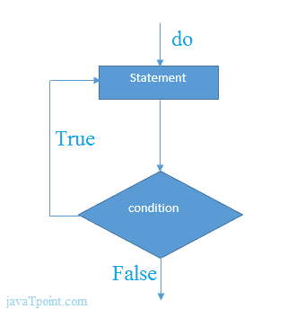

# C# 边循环边做

> 原文：<https://www.javatpoint.com/c-sharp-do-while-loop>

C# *do-while 循环*用于多次迭代程序的一部分。如果迭代次数不固定，并且必须至少执行一次循环，建议使用 do-while 循环。

C# *边做边循环*至少执行一次，因为循环体后检查条件。

**语法:**

```
do{
//code to be executed
}while(condition);

```



### C# 边做边循环示例

让我们看一个 C# do-while 循环打印 1 的表的简单例子。

```
using System;
public class DoWhileExample
    {
      public static void Main(string[] args)
      {
          int i = 1;

          do{
              Console.WriteLine(i);
              i++;
          } while (i <= 10) ;

     }
   }

```

输出:

```
1
2
3
4
5
6
7
8
9
10

```

## C# 嵌套边做边循环

在 C# 中，如果在另一个 do-while 循环中使用 do-while 循环，则称为嵌套 do-while 循环。嵌套的 do-while 循环对每个外部 do-while 循环完全执行。

让我们看一个 C# 中嵌套 do-while 循环的简单例子。

```
using System;
public class DoWhileExample
    {
      public static void Main(string[] args)
      {
          int i=1;  

          do{
              int j = 1;

              do{
                  Console.WriteLine(i+" "+j);
                  j++;
              } while (j <= 3) ;
              i++;
          } while (i <= 3) ;  
     }
   }

```

输出:

```
1 1
1 2
1 3
2 1
2 2 
2 3
3 1
3 2
3 3

```

## C# 不定式边做边循环

在 C# 中，如果在 do-while 循环中通过 **true** ，则为不定式 do-while 循环。

**语法:**

```
do{
//code to be executed
}while(true);

```

### C# 不定式边做边循环示例

```
using System;
public class WhileExample
    {
      public static void Main(string[] args)
      {

          do{
              Console.WriteLine("Infinitive do-while Loop");
          } while(true); 
      }
    }

```

输出:

```
Infinitive do-while Loop 
Infinitive do-while Loop
Infinitive do-while Loop
Infinitive do-while Loop
Infinitive do-while Loop
ctrl+c

```