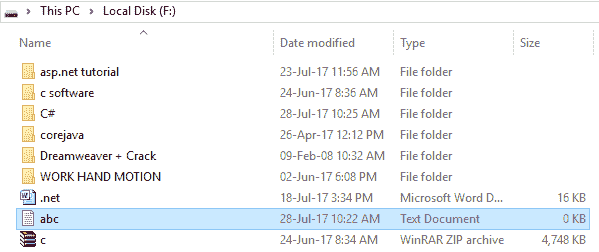
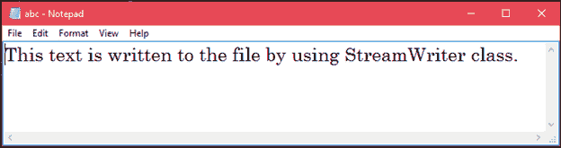
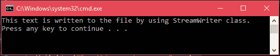

# C# 文件信息类

> 原文：<https://www.javatpoint.com/c-sharp-fileinfo>

FileInfo 类用于在 C# 中处理文件及其操作。它提供了用于创建、删除和读取文件的属性和方法。它使用 StreamWriter 类将数据写入文件。它是系统的一部分。IO 命名空间。

### C# 文件信息类签名

```
[SerializableAttribute]
[ComVisibleAttribute(true)]
public sealed class FileInfo : FileSystemInfo

```

### C# 文件信息构造函数

下表包含文件信息类的构造函数。

| 构造器 | 描述 |
| FileInfo(字符串) | 它用于初始化文件信息类的新实例，该类充当文件路径的包装器。 |

### C# 文件信息属性

下表包含文件信息类的属性。

| 性能 | 描述 |
| 属性 | 它用于获取或设置当前文件或目录的属性。 |
| 创造时间 | 用于获取或设置当前文件或目录的创建时间。 |
| 目录 | 它用于获取父目录的实例。 |
| 目录名 | 它用于获取表示目录完整路径的字符串。 |
| 存在 | 它用于获取指示文件是否存在的值。 |
| 表 | 它用于获取目录或文件的完整路径。 |
| IsReadOnly | 它用于获取或设置一个值，该值确定当前文件是否为只读文件。 |
| 最后访问时间 | 它用于获取或设置从上次访问当前文件或目录开始的时间。 |
| 长度 | 它用于获取当前文件的字节大小。 |
| 名字 | 它用于获取文件的名称。 |

### C# 文件信息方法

下表包含文件信息类的方法。

| 方法 | 描述 |
| 附录文本() | 它用于创建一个 StreamWriter，该 StreamWriter 将文本追加到由文件信息的这个实例表示的文件中。 |
| CopyTo（String） | 它用于将现有文件复制到新文件。 |
| 创建() | 它用于创建文件。 |
| CreateText() | 它用于创建一个编写新文本文件的 StreamWriter。 |
| 解密() | 它用于解密由当前帐户使用加密方法加密的文件。 |
| 删除() | 它用于永久删除文件。 |
| 加密() | 它用于加密文件，以便只有用于加密文件的帐户才能解密文件。 |
| GetAccessControl() | 它用于获取封装访问控制列表条目的文件安全对象。 |
| 已移动(字符串) | 它用于将指定文件移动到新的指定位置。 |
| 打开(文件模式) | 它用于以指定模式打开文件。 |
| OpenRead（） | 它用于创建只读文件流。 |
| 打开文本（） | 它用于创建一个 UTF8 编码的 StreamReader，从现有的文本文件中读取。 |
| OpenWrite() | 它用于创建只写文件流。 |
| 刷新() | 它用于刷新对象的状态。 |
| 替换(字符串，字符串) | 它用于用当前文件信息对象描述的文件替换指定文件的内容。 |
| ToString() | 它用于以字符串形式返回路径。 |

* * *

### C# 文件信息示例:创建文件

```
using System;
using System.IO;
namespace CSharpProgram
{
    class Program
    {
        static void Main(string[] args)
        {
            try
            {
                // Specifying file location
                string loc = "F:\\abc.txt";
                // Creating FileInfo instance
                FileInfo file = new FileInfo(loc);
                // Creating an empty file
                file.Create();
                Console.WriteLine("File is created Successfuly");
            }catch(IOException e)
            {
                Console.WriteLine("Something went wrong: "+e);
            }
        }
    }
}

```

输出:

```
File is created Successfully

```

我们可以看到在 **F** 里面驱动一个文件 **abc.txt** 被创建。截图如下。



### C# 文件信息示例:写入文件

```
using System;
using System.IO;
namespace CSharpProgram
{
    class Program
    {
        static void Main(string[] args)
        {
            try
            {
                // Specifying file location
                string loc = "F:\\abc.txt";
                // Creating FileInfo instance
                FileInfo file = new FileInfo(loc);
                // Creating an file instance to write
                StreamWriter sw = file.CreateText();
                // Writing to the file
                sw.WriteLine("This text is written to the file by using StreamWriter class.");
                sw.Close();
            }catch(IOException e)
            {
                Console.WriteLine("Something went wrong: "+e);
            }
        }
    }
}

```

输出:



### C# 文件信息示例:从文件中读取文本

```
using System;
using System.IO;
namespace CSharpProgram
{
    class Program
    {
        static void Main(string[] args)
        {
            try
            {
                // Specifying file to read
                string loc = "F:\\abc.txt";
                // Creating FileInfo instance
                FileInfo file = new FileInfo(loc);
                // Opening file to read
                StreamReader sr = file.OpenText();
                string data = "";
                while ((data = sr.ReadLine()) != null)
                {
                     Console.WriteLine(data);
                }
            }
            catch (IOException e)
            {
                Console.WriteLine("Something went wrong: " + e);
            }
        }
    }
}

```

输出:

