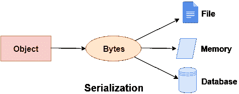

# C#序列化

> 原文：<https://www.javatpoint.com/c-sharp-serialization>

在 C#中，序列化是将对象转换为字节流的过程，以便将其保存到内存、文件或数据库中。序列化的反向过程称为反序列化。

序列化在远程应用程序中内部使用。



## c# serializableattribute 属性

要序列化对象，需要对类型应用 *SerializableAttribute* 属性。如果不将*序列化属性*应用于该类型，则运行时会引发*序列化异常*异常。

## C#序列化示例

让我们看看 C#中序列化的简单例子，我们正在序列化 Student 类的对象。这里，我们将使用 **BinaryFormatter。序列化(流，引用)**方法序列化对象。

```
using System;
using System.IO;
using System.Runtime.Serialization.Formatters.Binary;
[Serializable]
class Student
{
    int rollno;
    string name;
    public Student(int rollno, string name)
    {
        this.rollno = rollno;
        this.name = name;
    }
}
public class SerializeExample
{
    public static void Main(string[] args)
    {
        FileStream stream = new FileStream("e:\\sss.txt", FileMode.OpenOrCreate);
        BinaryFormatter formatter=new BinaryFormatter();

        Student s = new Student(101, "sonoo");
        formatter.Serialize(stream, s);

        stream.Close();
    }
}

```

sss.txt:

```
  JConsoleApplication1, Version=1.0.0.0, Culture=neutral, PublicKeyToken=null Student rollnoname e sonoo

```

如您所见，序列化数据存储在文件中。要获取数据，您需要执行反序列化。