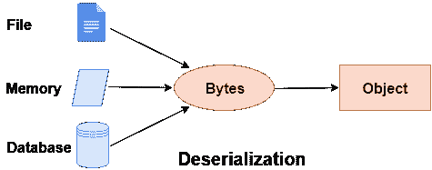

# C# 反序列化

> 原文：<https://www.javatpoint.com/c-sharp-deserialization>

在 C# 编程中，反序列化是序列化的逆过程。这意味着您可以从字节流中读取对象。这里，我们将使用 **BinaryFormatter。反序列化(流)**方法对流进行反序列化。



### C# 反序列化示例

让我们看看 C# 中反序列化的简单例子。

```cs
using System;
using System.IO;
using System.Runtime.Serialization.Formatters.Binary;
[Serializable]
class Student
{
    public int rollno;
    public string name;
    public Student(int rollno, string name)
    {
        this.rollno = rollno;
        this.name = name;
    }
}
public class DeserializeExample
{
    public static void Main(string[] args)
    {
        FileStream stream = new FileStream("e:\\sss.txt", FileMode.OpenOrCreate);
        BinaryFormatter formatter=new BinaryFormatter();

        Student s=(Student)formatter.Deserialize(stream);
        Console.WriteLine("Rollno: " + s.rollno);
        Console.WriteLine("Name: " + s.name);

        stream.Close();
    }
}

```

输出:

```cs
Rollno: 101
Name: sonoo

```