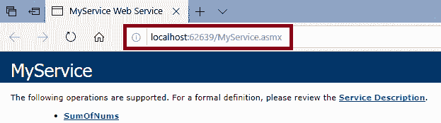

# C#中的网络服务

> 原文:[https://www.javatpoint.com/web-services-in-c-sharp](https://www.javatpoint.com/web-services-in-c-sharp)

## 介绍

网络服务被称为软件程序。这些服务使用 XML 在通用互联网协议的帮助下与其他软件交换信息。简单来说，我们使用网络服务通过互联网与对象进行交互。

## 以下是关于网络服务的几点。

1.  网络服务不依赖于任何特定的语言。
2.  网络服务是独立于协议的。
3.  网络服务与平台无关。
4.  网络服务被称为无状态架构。这些服务只依赖于给定的输入。
5.  网络服务也是可伸缩的。
6.  网络服务基于可扩展标记语言(开放的，基于文本的标准)。

## 网络服务技术

**XML:** 网络服务只指定数据。因此，对于编程语言或平台来说，理解 [XML](https://www.javatpoint.com/what-is-xml) 的应用程序可以用不同的方式格式化 XML。

**SOAP:** 服务和应用程序之间的通信由 [SOAP](https://www.javatpoint.com/soap-web-services) 建立。

**WSDL:** WSDL 给了我们一个统一的方法，有助于给其他程序指定 Web 服务。

**UDDI:** 在 UDDI 的帮助下，我们可以搜索 Web Service 注册表。

在部署这些技术时，这允许开发人员以服务的形式打包应用程序，并在网络上发布服务。

## 网络服务的优势

1.  网络服务总是使用开放的、基于文本的标准。Web 服务使用所有这些组件，即使它们是用不同的语言为不同的平台编写的。
2.  网络服务促进了编程的模块化方法，使得多个组织可以与同一个网络服务进行通信。
3.  网络服务很容易实现，但很昂贵，因为它们使用现有的基础设施，我们可以将大多数应用程序重新打包为网络服务。
4.  网络服务降低了企业应用程序集成和 B2B 通信的成本。
5.  网络服务是一个可互操作的组织，它包含 100 家供应商并促进他们的互操作性。

## 网络服务的局限性

网络服务的局限性有:

1.  网络服务的局限性之一是 SOAP，WSDL，UDDI 需要开发。
2.  对互操作性的支持也是网络服务的局限性。
3.  网络服务的限制也是版税。
4.  如果我们想在高性能的情况下使用 web 服务，那么 web 服务将会很慢。
5.  网络服务的使用增加了网络流量。
6.  网络服务的安全级别很低。
7.  我们使用标准过程来描述特定 web 服务的质量。
8.  网络服务的标准是草案形式。
9.  由供应商保留特定标准的知识产权也是 web 服务的限制。

## 网络服务的例子

网络服务几乎可以完成任何类型的任务。

**门户网站:**门户网站用于从链接的网络服务中获取头条新闻。

**天气报告:**对于天气报告，我们将使用天气报告网络服务在我们的[网站](https://www.javatpoint.com/website)上显示天气信息。

**股票报价:**有股票报价的股票市场最新信息可以在我们的网站上显示。

**新闻标题:**通过使用新闻标题 Web Service，我们可以在网站上展示新闻的最新更新。

我们可以制作我们的网络服务，并让它们重新投入使用。这里我们举一个例子，比如我们可以为公司广告制作带有页脚的免费[短信](https://www.javatpoint.com/sms-full-form)发送服务。因此，无论何时任何人使用本服务，他们都会间接为我们公司做广告。为了利用网络服务，我们可以应用 N 个想法。

为了首先创建网络服务，我们将考虑一个场景。为了创建任何网络服务，首先，我们应该了解为什么我们需要网络服务。

## 对网络服务的需求

我们会考虑一个我们想在网站上展示的场景。在我们的网站上，我们想展示关于地区、国家和国际的信息。在这里，如果我们正在考虑为所有这些功能编写代码，这将花费大量的时间和精力来为所有这些功能编写代码。所有上述信息已经由一些现有网站提供，因此在这种情况下，我们希望使用其他网站的当前逻辑。但是出现了一个问题，如何在我的应用程序中使用现有的逻辑。

这个问题的解决方案是 **Web 服务**。

通过使用网络服务，我们可以重用别人的业务逻辑，而不是复制它。要使用其他人的业务逻辑，我们只需编写几行代码。这种技术类似于应用编程接口、动态链接库和插件库。

[API](https://www.javatpoint.com/api-full-form) 的库和网络服务的唯一区别是网络服务位于另一台服务器的远程。

其他应用程序可以调用网络服务。网络服务被称为业务逻辑的一部分，托管在互联网上，其他应用程序可以使用它们。

这里我们有一些关于网络服务的观点。

#### 注 1:网络服务不仅限于。Net 框架。网络服务的标准在. NET 网络服务发布之前就已经定义好了，并且得到了微软以外的供应商的支持。

#### 注意:2: Web 服务也可以跨平台工作。如果服务是用一种语言编写的，那么其他应用程序可以使用这些服务，尽管应用程序使用了另一种语言。如果我们想使用网络服务，唯一的方法是我们只需要互联网来连接我们发出 HTTP 请求的地方。

我们知道网络服务是跨平台的，但是尽管如此，应该有一种可以理解的语言，这样我们就可以对服务提出请求，并在服务的响应中得到服务。网络服务使用易于理解的 XML。

这是为什么 web 服务是用基于 XML 的数据交换标准构建的唯一原因。

网络服务使用数据集类型。XML 模式很容易识别这些数据类型。

网络服务使用简单的数据类型，如字符串和数字。这些数据类型有助于与网络服务的通信。我们不能发送专有的[。NET](https://www.javatpoint.com/net-framework) 像图像、文件流或事件日志这样的对象。另一种编程语言没有任何方法来联系这些。NET 对象。如果我们使用一些设备将它们发送到客户端，不同的编程语言仍然无法解释。

#### 注:3 如果我们想使用。NET 对象，我们可以使用。NET 远程处理。。NET 远程处理被称为分布式技术，通过它我们可以使用。NET 对象。但是非。NET 客户端无法使用。

## 网络服务支持的数据类型。

*   **内置类型(基本):**
    网络服务使用的数据类型有:
    网络服务使用内置的 C#数据类型，如短、int、long、short、float、char、byte、string 和 DateTime。
*   **对象:** WPF 使用用户定义类的对象。尽管这个类包含方法，但是这个类不可能传输给客户端。
*   **数组:** WPF 使用任何支持的数据类型(内置或自定义)的数组。我们也可以使用 WPF 的数组列表。
*   **枚举:** WPF 支持枚举。对于枚举的值，WPF 使用字符串名称。WPF 不会使用整数。
*   **XmlNode:** 基于系统的对象。Xml.XmlNode 表示 Xml 文档的一部分。我们可以使用 XmlNode 发送任意的 XML。

**数据集和数据表:**WPF 支持数据集和数据表，但 WPF 不支持[ADO.NET](https://www.javatpoint.com/ado-net-tutorial)数据对象，如数据列和数据行。

### 创建网络服务

一个简单的 asmx 页面被称为网络服务。对于 web 服务的创建，我们将使用 Visual Studio 2017，它使用。NET 框架 4.8。为了创建网络服务，我们将遵循以下步骤:

步骤 1:首先，我们将创建一个用于创建网络服务的网络应用程序。

为此，我们将点击文件->选择项目，如下图所示:


之后，新窗口将打开，如下图所示:

从这里，**我们将选择 Web->Asp.Net Web 应用->Web 应用的名称- >点击确定。**


之后，我们将看到一个新窗口，如下所示:


为了创建网络服务，**我们将右键单击项目名称- >单击添加- >添加新项目。如下图截图所示:**


**之后会出现一个新的窗口。从我们要点击的网站- >选择网络服务(。asmx 页面)- >给网络服务命名，如下图所示:**


将网络服务添加到应用程序后，将出现一个新窗口，如下所示:


Visual Studio 创建了不可更改的 web 服务-Visual Studio 中使用的模板分析。

### 默认代码的解释

【web service(Namespace =*“http://tempuri . org/”*)】

基于 XML 的网络服务需要客户端应用程序的唯一名称空间，这有助于将网络服务与网络上的其他服务区分开来。网络服务使用默认命名空间，即 tempura.org。该命名空间可用于正在开发的 XML 网络服务。将要发布的 XML 网络服务应该使用永久命名空间。网络服务的实例应该用其他 URI 来代替它，这在生产系统中更有意义。

我们将把网络服务标识为网络服务中使用的命名空间；它的公司将控制命名空间。这里我们举了一个公司的互联网域名的例子，我们可以将它用作名称空间的一部分 XML 网络服务的名称空间，它看起来像网址。我们用网址指出了网络上的实际资源。

需要注意的几点:

以下是创建 web 服务时应该注意的几点。

*   我们不能有一个以上的[网络服务]标签。
*   命名空间的更改不会影响命名空间。

*【WebServiceBinding(ConformsTo = WsiProfiles。base cprofile 1 _ 1)]*

*web 服务不支持直接方法重载。为了允许网络服务中的方法重载，我们必须添加 MessageName 属性来区分网络服务中使用的一个方法和另一个方法，后者具有相同的名称和使用的参数。*

[WebServiceBinding(CONFOrmSTO = WsiProfiles。BasicProfile1_1)]到[WebServiceBinding(ConformsTo = WsiProfiles。无)]。

```

[WebMethod]
        public int SumOfNums(int FirstNumber, int SecondNumber)
        {
            return FirstNumber + SecondNumber;
        }

//here we will use MessageName property to do the differentiation between both of the methods.
        [WebMethod(MessageName = "SumOfFloats")]

        public float SumOfNums(float FirstNumber, float SecondNumber)
        {
            return FirstNumber + SecondNumber;
        }

```

如果我们想从脚本中调用网络服务，我们将使用[ASP.NET](https://www.javatpoint.com/asp-net-tutorial)、 [AJAX](https://www.javatpoint.com/ajax-tutorial) 并取消下面一行的注释。

[系统。网站.脚本.服务.脚本服务]

[web 方法]

该属性总是用在方法的顶部。我们在网络服务中编写这个属性。[WebMethod]属性用于定义使用该属性的方法向用户/客户端访问公开。

如果我们移除这个属性，在这种情况下，客户端将无法看到方法的细节；因此，他们无法实施。

### 代理类或 WSDL

WSDL(网络服务开发语言)文档用于生成网络服务的代理类。WSDL 文件定义了网络服务。WSDL 文件包含

1.  Web 服务公开的所有方法。
2.  WSDL 文件包含参数及其类型。
3.  WSDL 文档包含方法的返回类型。

Visual Studio 使用该信息来创建代理类。客户端应用程序将调用代理类方法。代理类将序列化参数，准备 SOAP 请求消息并将其发送给网络服务。网络服务执行这个方法，并向代理返回 SOAP 返回消息。然后，代理类将反序列化 SOAP 响应消息，并将其提供给客户端应用程序。不需要序列化或反序列化往返于 SOAP 格式的点网 CLR 对象。代理类承担了序列化和反序列化的所有责任，这使得开发人员的生活变得容易。

现在我们将看到 WebService1.asmx.cs 窗口:

**1。网页包括**系统。它还包括 visual Studio 在网络应用程序中包含的其他四个名称空间。****

**2。“服务 1”**类继承自**“系统”。网络服务。继承了**的“制度”之后。我们可以访问内置的 ASP.Net 对象，例如(应用程序、会话、用户、上下文、服务器)。如果不需要的内置对象。NET，那么也就不需要任何来自“网络服务”的服务类了。****

**3。“服务 1”**包括“网络服务”属性。如果我们想将任何类作为服务公开，那么还需要包含“网络服务”的属性。

**网络服务**属性包含不同的属性，如:

**NameSpace:**NameSpace 属性的使用使得服务是唯一可识别的。nameSpace 是 XML 的属性。客户端应用程序可以包含不同的服务，所以这就是为什么会有冲突的可能性。为了避免冲突，提供者有责任使命名空间唯一。

**名称:**通过使用名称属性，我们将为服务提供描述性名称。

**描述:**该属性用于避免对服务进行简单描述。

4.“服务 1”还包含另一个属性，即“网络服务绑定”。这用于指示服务的标准。如果服务不遵循此标准，我们将获得例外。

5.通过该服务，又增加了一个属性，即“[系统。为了使服务可以从客户端脚本访问，服务应该用这个服务来修饰。

6.“Service1”类包含一个方法“Hello World”。此方法用“[WebMethod]”属性修饰。客户端应用程序访问服务方法。客户端应用程序应该添加“服务 1”方法。

该服务可能正在使用某种方法来实现内部功能。客户端应用程序不需要使用它们。不需要将这些方法与 Web 方法属性一起使用。

WebMethod 属性包含 Name 和 Description 属性，我们可以使用这两个属性分别提供自描述的名称或描述。

### 加价

现在我们将看到加价。

对于标记，我们必须右键单击解决方案资源管理器窗口中的 Service1.asmx，然后选择视图标记，如下图所示:


在 Service1.asmx 中，我们将看到服务使用带有属性的网络服务指令。从这里，这将向我们显示应用程序调用服务，而不是由最终用户调用。因此 asmx 页面没有标记。

### Service1.asmx

```

<%@ WebService Language="C#" CodeBehind="Service1.asmx.cs" Class="WebApplication7.Service1" %>

```

以下是关于 Service1.asmx 的几点

*   **“Web Service”**指令:该指令表明 asmx 页面是 Web 服务。
*   **“语言”=“C#”:**这表示服务使用 c#语言。
*   **“代码隐藏”:**该属性与 ASP.NET 或网络服务没有任何关系。代码隐藏是 Visual Studio 的属性。此属性用于将 asmx 页面与页面后面的代码进行映射。
*   **“类”**属性包含类的限定名。这是服务的入口点，就像 C 语言中的 main()一样。

现在，我们将在按下 F5 按钮后运行该应用程序。变化)。在这里可以找到服务描述的链接，如下图所示:


点击服务说明的链接后，我们将转到服务的 WSDL 文档，如下图所示:


还有另一个到地狱世界的链接。点击此链接后，这将把我们重定向到测试页面。


单击此链接后，这将把我们重定向到 Service1 Web Service 页面进行测试。


## 网络服务的实现

现在，我们将实施该服务。现在我们将把解决方案资源管理器中的文件“服务 1”重命名为“我的服务”。这里我们将把服务 1 的类名改为 MyService。现在我们将打开标记(。asmx)页面。


从上面的截图中，我们可以看到 visual Studio 无法解析类属性中的“Service1”。这里的类显示了服务的完全限定名，我们将 Service1 类重命名为 MyService，但是 Visual Studio 无法解析它。

在这里，我们将该类的属性更改为“网络应用程序”。我的服务”并将“代码隐藏”属性从“Service1.asmx.cs”更改为“我的服务. asmx.cs”，就像我们命名文件一样。

### MyService.asmx

```

<%@ WebService Language="C#" CodeBehind="MyService.asmx.cs" Class="WebApplication7.MyService" %>

```

### MyService.asmx.cs

```

using System;
using System.Collections.Generic;
using System.Linq;
using System.Web;
using System.Web.Services;
using System.Web.Script.Serialization;

namespace WebApplication7
{
    /// <summary>
    /// Summary description for Service1
    /// </summary>
    [WebService(Namespace = "http://tempuri.org/")]
    [WebServiceBinding(ConformsTo = WsiProfiles.BasicProfile1_1)]
    [System.ComponentModel.ToolboxItem(false)]
    // To allow this Web Service to be called from script, using ASP.NET AJAX, uncomment the following line. 
    [System.Web.Script.Services.ScriptService]
    public class MyService : System.Web.Services.WebService
    {

        [WebMethod]
        public int SumOfNums(int First, int Second)
        {
            return First + Second;
        }
    }
}

```

之后，服务就可以使用了。现在我们将编译并运行这个应用程序。

编译后，将打开一个新窗口，如下图所示:



### 网络服务的测试

现在，我们将通过单击 F5 按钮来运行应用程序。将打开[http://localhost:62639/MyServiCe . asmx](http://localhost:62639/MyService.asmx)页面。该页面将包含服务描述的链接(WSDL 文档，网络服务文档)，并包含另一个 SumOfNums 链接。该页面是 SumOfNums 方法的测试页面，如下图所示:


现在我们将使用面向对象编程概念方法重载。现在我们在 MyService 类中添加了 WebMethod。

### MyService.asmx.cs

```

using System;
using System.Collections.Generic;
using System. Linq;
using System. Web;
using System.Web.Services;
using System.Web.Script.Serialization;

namespace WebApplication7
{
    /// <summary>
    /// Summary description for Service1
    /// </summary>
    [WebService(Namespace = "http://tempuri.org/")]
    [WebServiceBinding(ConformsTo = WsiProfiles.BasicProfile1_1)]
    [System.ComponentModel.ToolboxItem(false)]
    // To allow this Web Service to be called from script, using ASP.NET AJAX, uncomment the following line. 
    [System.Web.Script.Services.ScriptService]
    public class MyService : System.Web.Services.WebService
    {

        [WebMethod(MessageName = "SumOfFloats")]

        public float SumOfNums(float First, float Second)
        {
            return First + Second;
        }

    }
}

```

现在，我们将通过按下按钮 F5 来运行这个应用程序。将打开[页面，其中包含服务描述链接(WSDL 文档，网络服务文档)。这里我们有另一个 SumOfNums 链接，它是 SumOfNums 方法的测试页面，如下图所示:](http://localhost:62639/MyService.asmx)


在第一个文本框和第二个文本框中输入值后，将调用如下截图所示的方法:


### 方法重载

现在我们将在服务中使用重载方法。Web 服务不支持方法重载。这将在方法重载的情况下引发错误。这里我们举一个例子来说明在 Web 服务中进行的方法重载，并抛出一个错误，因为它不支持重载。

### MyService.asmx.cs

```

using System;
using System.Collections.Generic;
using System. Linq;
using System. Web;
using System.Web.Services;
using System.Web.Script.Serialization;

namespace WebApplication7
{
    /// <summary>
    /// Summary description for Service1
    /// </summary>
    [WebService(Namespace = "http://tempuri.org/")]
    [WebServiceBinding(ConformsTo = WsiProfiles.BasicProfile1_1)]
    [System.ComponentModel.ToolboxItem(false)]
    // To allow this Web Service to be called from script, using ASP.NET AJAX, uncomment the following line. 
    [System.Web.Script.Services.ScriptService]
    public class MyService : System.Web.Services.WebService
    {

        [WebMethod]
        public int SumOfNums(int First, int Second)
        {
            return First + Second;
        }

        [WebMethod(MessageName = "SumOfFloats")]

        public float SumOfNums(float First, float Second)
        {
            return First + Second;
        }

    }
}

```

**输出**


在上面的例子中，网络服务不支持方法重载，并显示了服务“网络应用 7”的错误消息。我的服务”不符合 WS-I 基本配置文件 v1.1。现在为了支持重载方法，我们必须遵循以下步骤:要么我们必须删除“**web service binding**(ConformsTo =**WsiProfiles**. basicprofile 1 _ 1)]”，要么我们必须进行一些更改”[web service binding(ConformsTo = WsiProfiles。无)]。

**为了支持重载方法，我们必须对代码进行一些修改，如高亮显示的框所示:**

```

using System;
using System.Collections.Generic;
using System. Linq;
using System. Web;
using System.Web.Services;
using System.Web.Script.Serialization;

namespace WebApplication7
{
    /// <summary>
    /// Summary description for Service1
    /// </summary>
    [WebService(Namespace = "http://tempuri.org/")]
    //make the WsiProfiles to None 
    [WebServiceBinding(ConformsTo = WsiProfiles.None)]
    [System.ComponentModel.ToolboxItem(false)]
    // To allow this Web Service to be called from script, using ASP.NET AJAX, uncomment the following line. 
    [System.Web.Script.Services.ScriptService]
    public class MyService : System.Web.Services.WebService
    {

        [WebMethod]
        public int SumOfNums(int First, int Second)
        {
            return First + Second;
        }

//here we have to add the MessageName property to make the difference between both of the methods.  
        [WebMethod(MessageName = "SumOfFloats")]

        public float SumOfNums(float First, float Second)
        {
            return First + Second;
        }

    }
}

```

完成所有这些更改后，网络服务将如下图所示:


这里 web 服务支持同名的方法。通过添加消息名称属性，我们可以创建这两种方法之间的差异。

通过使用上述属性，我们可以在 Web 服务中使用方法重载。

### 页面测试

点击 SumOfFloats 后，页面会重定向到[http://localhost:62639/my service . asmx？op = sumofflots](http://localhost:62639/MyService.asmx?op=SumOfFloats)在这里我们会看到，该？op=SumOfNums”被附加到服务 URL。该页面包含两个文本框，用于两个输入值(第一个、第二个)，其中 SumOfNums 值将作为输入参数和一个“调用”按钮。点击这个调用按钮后，我们将重定向到[http://localhost:62639/my service . asmx/sumofflots](http://localhost:62639/MyService.asmx/SumOfFloats)，它的值是 SumOfNums 方法返回的 XML 格式。


点击调用按钮后，我们会重定向到[http://localhost:62639/my service . asmx/sumofflots](http://localhost:62639/MyService.asmx/SumOfFloats)页面。此页面包含 XML 格式的值。


同样，在点击“SumOfNums MessageName = " sumofflots "”后。我们将重定向到“http://localhost:62639/MyServiCe . asmx？op = SumOfFloats”。所以“SumOfNums MessageName = " SumOfFloat "”方法被称为客户端应用程序的“SumOfFloats”。

这里有一个问题来自于测试页面的来源。因为我们没有添加标记，但是页面还是被渲染了。

测试页面不是网络服务的一部分。测试页由 ASP.NET 使用网页 c:\[WinDir]\微软呈现。. NET \ Framework \[版本]\ Config \ defaultwsdlhelppgenerator . aspx .“反射”概念呈现给测试页。

### WSDL 文件

网络服务是自我描述的，这意味着 ASP.Net 本身以 WSDL 文档的形式向我们提供了客户消费网络服务所需的所有信息。WSDL 文档告诉客户网络服务中存在的方法。以及该方法使用什么参数和返回值，以及客户端应用程序如何与它们通信。WSDL 是一个 XML 标准。

### 网络服务的托管

对于 web 服务的宿主，我们将添加对服务的引用，并从不同的应用程序中使用它。这里我们假设端口号可以变化，所以现在我们将在 IIS(互联网信息服务器)上托管服务，以获取服务器的特定地址。为此，**我们将打开互联网信息服务器- >转到默认网站- >右键单击应用- >添加应用- >浏览到我们服务的物理位置为物理路径字段- >点击“确定”**。现在，我们将使用别名[http://localhost/WebServiceDemo/](http://localhost/WebServiceDemo/)浏览该应用程序，以测试该应用程序是否被正确托管。这里我们会得到一个错误**“HTTP 错误 403.14-禁止”。**出现此错误是因为没有为此应用程序设置任何默认文档。现在我们将添加一个页面作为默认文档“MyService.asmx”。现在我们可以通过在浏览器 localhost/WebServiceDemo/my service . asmx 中添加这个 [URL](https://www.javatpoint.com/url-full-form) 来浏览我们的应用程序。

### 从客户端脚本使用网络服务

我们可以在任何类型的应用程序中使用 web 服务。这里我们将创建一个应用程序。Net 网络应用程序。为此，我们将遵循以下步骤:

步骤 1:右键单击解决方案资源管理器->添加->新建项目，如下图所示:


**步骤 2:** 点击新建项目后，会打开一个新窗口，如下图截图所示:


第三步。之后，为了与 web 服务通信，我们必须创建一个代理类。要创建代理类，我们必须遵循以下步骤:

### 代理类

为了创建代理类，我们必须右键单击引用->选择添加服务引用，如下图所示:


单击添加服务参考后，将出现一个新窗口，如下图所示:


### 上述窗口的说明:

**地址:**这里，我们将粘贴我们创建的 web 服务的 URL，然后点击 Go。

点击“转到”按钮后，将搜索提供的地址。

**名称空间:**在名称空间中，我们将提供服务的名称，然后单击确定按钮。这将在项目中添加对 web 服务的引用。

现在我们将在应用程序中添加网络表单。为此，我们将遵循以下步骤:

1.在解决方案资源管理器中右键单击项目->选择添加->选择 web 表单，如下图所示:


点击网页表单后，这将打开一个新窗口，我们必须提供网页表单的名称，如下图所示:


在上面的截图中，我们给出了网页表单的名称，然后点击确定。

在 Web 表单中，我们将在 Web 服务的帮助下创建一个使用预定义方法的表。

在 WebForm1.aspx 中，我们完成了如下代码所示的编码:

```

<%@ Page Language="C#" AutoEventWireup="true" CodeBehind="WebForm1.aspx.cs" Inherits="CalculatorWebApplication.WebForm1" %>

<!DOCTYPE html>

<html >
<head runat="server">
    <title></title>
</head>
<body>
    <form id="form1" runat="server">
        <table style="font-family:Arial">
            <tr>
                <td>
                    <b>First Number</b>
                </td>
                <td>
                    <asp:TextBox ID="txtFirstNumber" runat="server"></asp:TextBox>
                </td>
            </tr>
            <tr>
                <td>
                    <b>Second Number</b>
                </td>
                <td>
                    <asp:TextBox ID="txtSecondNumber" runat="server"></asp:TextBox>
                </td>
            </tr>
             <tr>
                <td>
                    <b>Result</b>
                </td>
                <td>
                    <asp:Label ID="lblResult" runat="server" Text="Label"></asp:Label>
                </td>
            </tr>
            <tr>
                <td>
                    <asp:Button ID="btnadd" runat="server" Text="Add" OnClick="btnadd_Click" />
                    </td>

            </tr>
        </table>
    </form>
</body>
</html>

```

在上面的代码中，我们创建了一个表格，其中两个文本框，文本框 1 用于输入第一个数字，文本框 2 用于输入第二个数字。创建一个按钮，在它的帮助下，我们将把两个数字相加。

上述代码的设计视图如下图所示:


这里我们用了两个文本框来输入第一个数字和第二个数字。add 按钮用于添加两个文本框的值。

双击添加按钮后，这将把我们切换到编码页面。该页面是 WebForm.aspx.cs。

为了使用网络服务的方法，我们将在按钮点击时执行以下代码。

### WebForm.aspx.cs

```

using System;
using System.Collections.Generic;
using System. Linq;
using System. Web;
using System.Web.UI;
using System.Web.UI.WebControls;

namespace CalculatorWebApplication
{
    public partial class WebForm1 : System.Web.UI.Page
    {
        protected void Page_Load(object sender, EventArgs e)
        {

        }

        protected void btnadd_Click(object sender, EventArgs e)
        {
            CalculatorService.CalculatorWebServiceSoapClient client = new CalculatorService.CalculatorWebServiceSoapClient();
           int result= client.Add(Convert.ToInt32(txtFirstNumber.Text),
                Convert.ToInt32(txtSecondNumber.Text));
            lblResult.Text = result.ToString();
        }
    }
}

```

现在我们将按 F5 启动 web 服务。输出如下图所示:

**OutPut**


### 包裹

在这里，我们得到了这个应用程序中 web 服务的好处。我们没有为这两个数字的相加写任何逻辑。在我们的计算器 web 应用程序中，我们只使用了 web 服务的方法。我们没有使用任何逻辑进行加法。上面的截图显示了两个数字相加的输出，即 23。

* * *