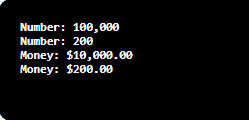

# C# 中的事件

> 原文：<https://www.javatpoint.com/events-in-c-sharp>

这个事件是即将发生的特殊事件。这里我们将举一个事件的例子，微软为开发人员启动事件。在本次活动中，微软希望让开发人员了解现有产品或新产品的功能。为此，微软将使用电子邮件或其他广告选项让开发者了解事件。因此，在这种情况下，微软将作为发布者提出事件并通知开发人员。开发人员将作为事件的订阅者处理事件。

同样，在 C# 中，事件遵循相同的概念。在 C# 中，事件可以是订阅者、发布者、订阅者、通知和处理程序。通常，用户界面使用事件。这里我们将举一个 Windows 中的按钮控件的例子。按钮执行多个事件，如点击、鼠标悬停等。自定义类包含事件，通过该事件，我们将通知其他订阅者类将要发生的其他事情。因此，在这种情况下，我们将定义事件并通知其他类关于事件，它包含事件处理程序。

**事件**是一个封装的委托。C# 和。NET 都支持带有委托的事件。当应用程序的状态改变时，事件和委托会向客户端应用程序发出通知。委托和事件都是紧密耦合的，用于调度事件，事件处理需要实现委托。发送事件类称为发布者，处理事件的接收者类称为订阅者。

### 这些活动的要点是:

这些活动的要点如下:

1.  在 C# 中，事件处理程序会将这两个参数作为输入并返回 void。
2.  事件的第一个参数也称为源，它将发布对象。
3.  发布者将决定我们何时必须发起事件，订阅者将决定我们必须给出什么响应。
4.  事件可以包含许多订阅者。
5.  通常，我们将事件用于单个用户操作，如点击按钮。
6.  如果事件包括多个订阅方，则同步调用事件处理程序。

### 活动声明

### 句法

公共事件 EventHandler CellEvent

### 实施事件的步骤

对于类中事件的声明，首先必须声明委托的事件类型。

公共委托 void CellEventHandler(对象发送方，EventArgs e)；

### 活动声明

公共事件 CellEventHandler CellEvent

### 事件的参与

if (CellEvent！= null) CellEvent(this，e)；

我们只能从声明事件的类中调用事件。

### 预订活动

OurEventClass(资源类)。ourevent+= new changedeventandler(oureventchanged)；

### 分离事件

OurEventClass(资源类)。ourevent-= new changedeventandler(oureventchanged)；

**委托**作为函数的指针。这是一个引用数据类型，它保存方法的引用。**制度。委托**类隐式派生了所有的委托。

可以使用 **delegate** 关键字声明委托，该关键字后面是签名

### 委托的语法

```

<access modifier> delegate <return type> <delegate_name>(<parameters>)

```

### 代表示例

public delegate void print word(int 值)；

上面的 PrintWord 委托可以用来指向与 PrintWord 具有相同返回类型和声明参数的任何方法。这里我们将举一个声明并使用 PrintWord 委托的例子。

```

class Program1
{
    // declare delegate
    public delegate void PrintWord(int value);

    static void Main(string[] args)
    {
        // Print delegate points to PrintNum
        PrintWord printDel = PrintNum;

        // or
        // Print printDel = new Print(PrintNumber);

        printDel(100000);
        printDel(200);

        // Print delegate points to PrintMoney
        printDel = PrintMoney;

        printDel(10000);
        printDel(200);
    }

    public static void PrintNum(int num)
    {
        Console.WriteLine("Number: {0,-12:N0}",num);
    }

    public static void PrintMoney(int money)
    {
        Console.WriteLine("Money: {0:C}", money);
    }
}

```

**输出:**



在上面的例子中，我们声明了 PrintWord 委托，它接受 int 类型参数并返回 void。在 main()方法中，我们声明了 PrintWord 类型方法，并分配了 PrintNum 名称方法。现在我们将调用 PrintWord 委托，该委托又调用 PrintNum 方法。同样，如果 PrintWord 委托变量被分配给 PrintMoney 方法，那么这将调用 PrintMoney 方法。

此外，我们可以使用新的运算符创建委托对象，并指定方法的名称，如下所示:

```

PrintWord printDel = new PrintWord(PrintNum);

```

可以声明委托，如下所示:

```

public delegate void someEvent();
public organize event

```

* * *