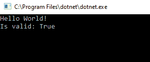
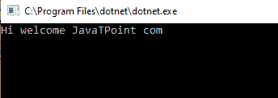
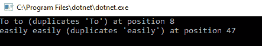

# C#中的正则表达式

> 原文:[https://www.javatpoint.com/regular-expression-in-c-sharp](https://www.javatpoint.com/regular-expression-in-c-sharp)

在 C#中，正则表达式用于解析和验证给定的文本，以匹配定义的模式(例如，电子邮件地址)。该模式可以包含运算符、字符文字或构造。

用中的正则表达式处理文本。NET 框架，一般来说，我们使用正则表达式引擎。在 C#中，正则表达式由**正则表达式**表示。

## 正则表达式

我们使用正则表达式来检查给定的字符串是否与模式匹配。正则表达式或正则表达式是定义模式的字符序列。该模式可以包含数字、文字、运算符、字符等。我们使用模式来搜索字符串或文件。这里我们将看看是否找到匹配。

通常，正则表达式用于解析、查找字符串或验证等。

这里我们举一个例子，我们可以使用正则表达式来检查社会安全号、有效出生日期、匹配全名(名字和姓氏用逗号分隔)、替换子字符串、正确的电子邮件格式、货币格式等等。

## 正则类

类中显示了正则表达式引擎。NET 框架。Regex 类用于解析大量文本以找到特定的字符模式。我们可以使用 Regex 类来提取、编辑、替换或删除子字符串的文本。

系统。正则表达式命名空间包含正则表达式类。正则表达式类将字符串模式作为一个参数和另一个可选参数。

现在我们将从正则表达式中创建一个模式。在这段代码中，我们必须将模式与以字符“M”开头的单词进行匹配。

```

// Create a pattern for the word that starts with letter "M"  
string pattern = @"\b[M]\w+";  
// Create a Regex  
Regex rgex = new Regex(pattern);

```

这里我们有一个代码，它包含有作者姓名的长文本，我们必须对其进行解析。

```

// Long string  
string authors = "Ramesh chand, Rakeshwar";

```

这里我们将使用 Matches 方法来查找返回 MatchCollection 的所有匹配项。

```

// Get all matches  
MatchCollection matchedAuthors = rg.Matches(authors);
To find the matches collection we will use the For loop // Print all matched authors  
for (int count = 0; count < matchedAuthors.Count; count++)  
Console.WriteLine(matchedAuthors[count]. Value);  

```

现在让我们举个例子来找到字母“M”。

```

// Create a pattern for a word which starts with letter "M"  
string pattern1 = @"\b[M]\w+";  
// Create a Regex  
Regex rg = new Regex(pattern1);  
// Long string  
string Authors = "Ramesh Chand,Rakeshwar"; 
// Get all matches  
MatchCollection matchedAuthors = rg.Matches(Authors );  
// For print all matched authors  
for (int count = 0; count < matchedAuthors.Count; count++)  
Console.WriteLine(matchedAuthors[count].Value);  

```

从上面的例子中，我们试图找到字符“M”。但是这里出现了一种情况，如果这个词以小 m 开头。在这种情况下，我们将使用**正则表达式。忽略**参数，这样 Regex 将忽略大写或小写。

```

// Create a pattern for a word that starts with letter "M"  
string pattern1 = @"\b[m]\w+";  
// Create a Regex  
Regex rgex = new Regex(pattern, RegexOptions.IgnoreCase);

```

## C#中的正则表达式示例

这里我们举一个例子来验证电子邮件的格式是否正确。为此，我们将使用 Regex 类。

```

using System;
using System.Text.RegularExpressions;

namespace ConsoleApp1
{
    class Program
    {
        static void Main(string[] args)
        {
            Console.WriteLine("Hello World!");
            string email = "support@javatpoint.com";

            var result = Regex.IsMatch(email, @"^[\w-\.]+@([\w-]+\.)+[\w-]{2,4}$");

            Console.Write("Is valid: {0} ", result);

            Console.ReadLine();
        }
    }
}

```

从上面的例子中，我们正在验证输入字符串，它的格式是否有效。为此，我们使用了 Regex 类。为了验证输入文本，我们使用了 IsMatch 方法和正则表达式模式。

执行上述代码后，我们得到如下结果:



## C#中的正则类方法

为了对输入字符串执行各种操作，Regex 类包含不同的方法。该表列出了 C#中 Regex 的各种方法。

| 方法 | 描述 |
| 伊斯马特 | 我们使用 IsMatch 方法来找出给定的输入字符串是否匹配正则表达式模式。 |
| 比赛 | 方法用于返回与正则表达式模式匹配的文本。 |
| 替换 | 替换方法用于替换与正则表达式模式匹配的文本。 |
| 裂开 | 我们使用 Split 方法将字符串拆分成这些位置的子字符串数组，这与正则表达式模式相匹配。 |

Regex 类的上述方法用于验证、替换或使用基于需求的正则表达式模式拆分字符串的值。

## C#中的正则表达式替换字符串示例

在这个例子的帮助下，我们试图通过使用正则表达式模式来查找子串，该模式替换了 C#中所需的值。

```

using System;
using System.Text.RegularExpressions;

namespace ConsoleApp1
{
    class Program
    {
        static void Main(string[] args)
        {
            string str = "Hi,welcome@JavaTPoint.com";

            string result = Regex.Replace(str, "[^a-zA-Z0-9_]+", " ");

            Console.Write("{0} ", result);

            Console.ReadLine();
        }
    }
}

```

在上面的例子中，我们使用了 Regex。Replace 方法用于通过使用正则表达式模式([^a-zA-Z0-9_]+").

在上面的例子中，正则表达式("[^a-za-z0-9_]+])的模式试图与单个字符匹配，该字符没有在字符组中定义。

执行上述程序后，我们将得到如下输出，如下所示:



## 在正则表达式 C#中查找重复单词

通过使用正则表达式模式，我们可以很容易地找出重复的单词。

在本例中，我们试图使用 C#中的 Regex 类方法在给定的字符串中找到重复的单词。

```

using System;
using System.Text.RegularExpressions;

namespace ConsoleApp1
{
    class Program1
    {
        static void Main(string[] args)
        {
            string str1 = "Welcome To to JavaTPoint. Here we can learn C# easily easily way";

            MatchCollection collection = Regex.Matches(str1, @"\b(\w+?)\s\1\b", RegexOptions.IgnoreCase);

            foreach (Match m in collection)

            {

                Console.WriteLine("{0} (duplicates '{1}') at position {2}", m.Value, m.Groups[1].Value, m.Index);

            }

            Console.ReadLine();
        }
    }
}

```

上面的例子使用了 Regex。Matches 方法用于通过使用正则表达式模式(" \b(\w+？)\s\1\b”)。

**执行上述代码后，我们会得到如下输出，如下所示:**



* * *