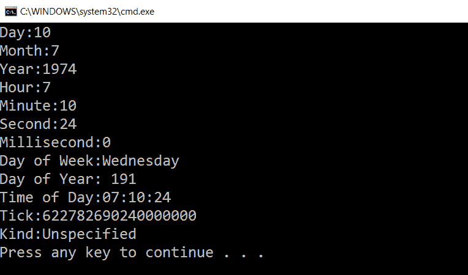
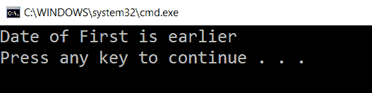
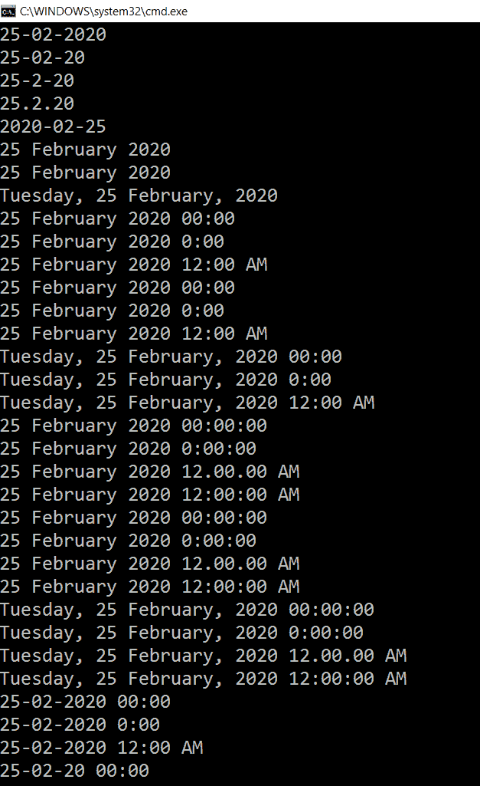
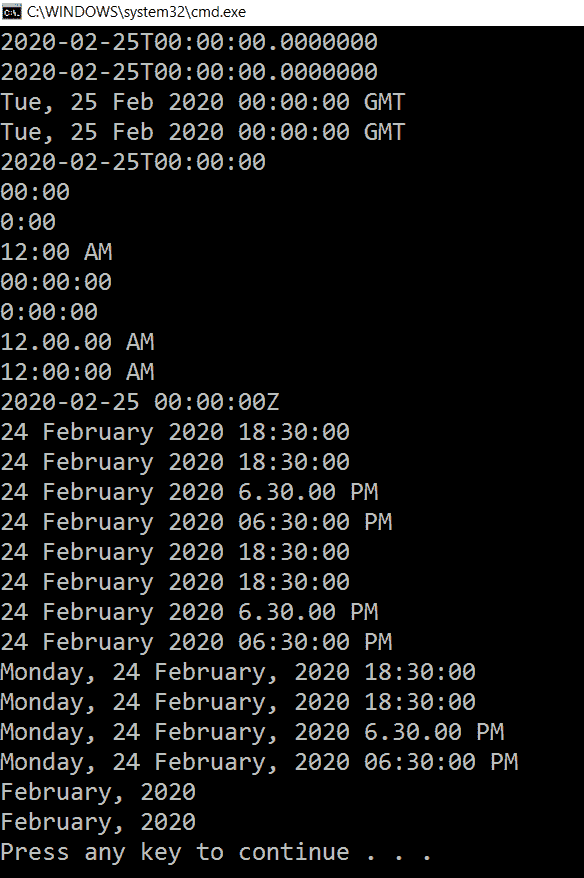
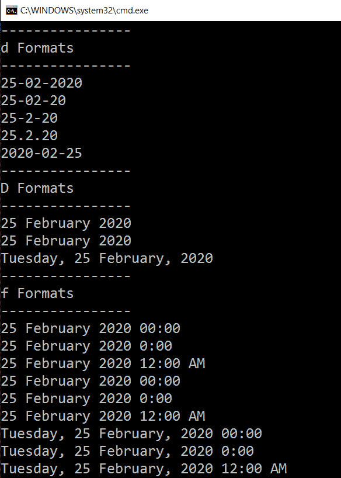
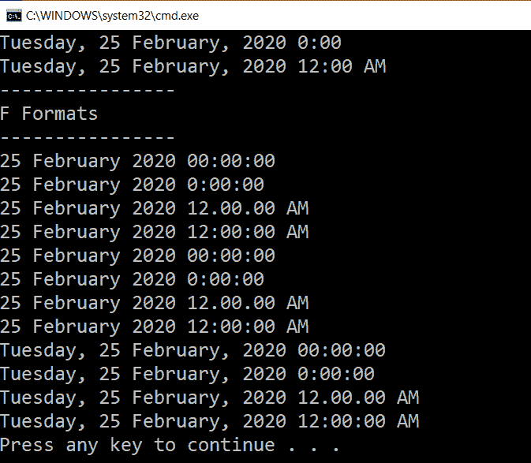
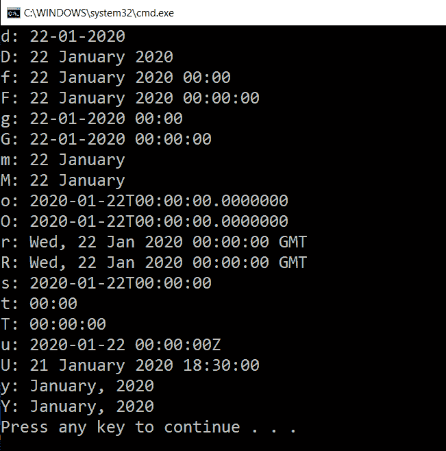
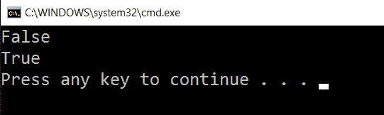
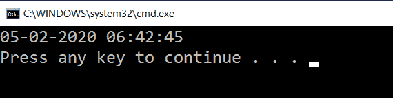
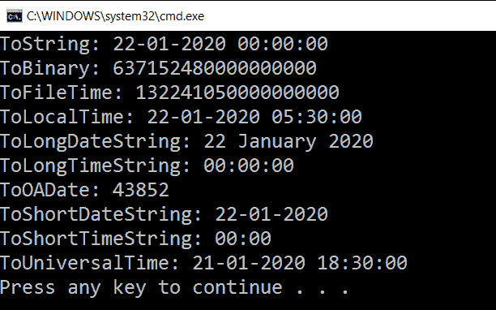

# C 格式的日期时间#

> 原文：<https://www.javatpoint.com/datetime-in-c-sharp>

当需要使用 C#中的日期和时间时，我们使用了日期时间。

我们可以通过日期时间的属性和方法，以不同的格式设置日期和时间的格式。/p >

日期时间的值介于公元 9999 年 1 月 1 日午夜 12:00:00 和 12 月 31 日晚上 11:59:59 之间

这里我们将解释如何用 C#创建日期时间。

我们有不同的方法来创建日期时间对象。日期时间对象有时间、区域性、日期、本地化和毫秒。

这里我们有一个代码，它显示了日期时间结构用来创建日期时间对象的各种构造函数。

```

// From DateTime create the Date and Time
   DateTime DOB= new DateTime(19, 56, 8, 12, 8, 12, 23);
// From String creation of DateTime
            string DateString= "8/12/1956 7:10:24 AM";
            DateTime dateFromString =
                DateTime.Parse(DateString, System.Globalization.CultureInfo.InvariantCulture);
            Console.WriteLine(dateFromString.ToString());
// Empty DateTime  
            DateTime EmpDateTime= new DateTime();
// Just date  
            DateTime OnlyDate= new DateTime(2002, 10, 18);
// DateTime from Ticks  
            DateTime OnlyTime= new DateTime(10000000); 
// Localization with DateTime
            DateTime DateTimewithKind = new DateTime(1976, 7, 10, 7, 10, 24, DateTimeKind.Local); 
// DateTime with date, time and milliseconds  
            DateTime WithMilliseconds= new DateTime(2010, 12, 15, 5, 30, 45, 100);

```

## C#中日期时间的属性

日期时间具有日期和时间属性。从 DateTime 中，我们可以找到日期和时间。日期时间还包含其他属性，如小时、分钟、秒、毫秒、年、月和日。

日期时间的其他属性有:

1.  借助 DayOfWeek 属性，我们可以获得星期几的名称。
2.  为了得到一年中的某一天，我们将使用 DayOfYear 属性。
3.  要获取日期时间中的时间，我们使用 TimeOfDay 属性。
4.  Today 属性将返回日期时间的对象，该对象具有今天的值。时间的值是 12:00:00
5.  “现在”属性将返回具有当前日期和时间的日期时间对象。
6.  DateTime 的 UTC 属性将返回协调世界时(Utc)。
7.  一个刻度表示日期时间中的一百纳秒。DateTime 的 Ticks 属性返回 DateTime 中的刻度数。
8.  Kind 属性返回由实例表示时间的值，该值基于本地时间协调世界时(UTC)。它还显示未指定的默认值。

这里我们举一个在 C#代码中使用日期时间属性的例子。

示例:

```

using System;
using System.Collections;
using System.Collections.Generic;
using System.Linq;
using System.Text;
using System.Threading.Tasks;

namespace ConsoleApp8
{
    class Program
    {
        static void Main(string[] args)
        {

            DateTime DateTimeProperty = new DateTime(1974, 7, 10, 7, 10, 24);
            Console.WriteLine("Day:{0}", DateTimeProperty.Day);
            Console.WriteLine("Month:{0}", DateTimeProperty.Month);
            Console.WriteLine("Year:{0}", DateTimeProperty.Year);
            Console.WriteLine("Hour:{0}", DateTimeProperty.Hour);
            Console.WriteLine("Minute:{0}", DateTimeProperty.Minute);
            Console.WriteLine("Second:{0}", DateTimeProperty.Second);
            Console.WriteLine("Millisecond:{0}", DateTimeProperty.Millisecond);

            Console.WriteLine("Day of Week:{0}", DateTimeProperty.DayOfWeek);
            Console.WriteLine("Day of Year: {0}", DateTimeProperty.DayOfYear);
            Console.WriteLine("Time of Day:{0}", DateTimeProperty.TimeOfDay);
            Console.WriteLine("Tick:{0}", DateTimeProperty.Ticks);
            Console.WriteLine("Kind:{0}", DateTimeProperty.Kind);
        }
    }
}

```

**输出:**



## C#中日期时间的加减

DateTime 结构提供了在 DateTime 对象中添加和减去日期和时间的方法。我们可以在 DateTime 对象中添加和减去 DateTime 结构中的日期。对于日期时间中的加法和减法，我们使用时间跨度结构。

对于加法和减法，我们可以使用 DateTime 对象的加法和减法方法。首先，我们用日期和时间的值创建时间跨度，其中我们使用了加减方法。

这里我们正在创建一个代码，它将从今天开始加 3 和减 30 天，并在控制台上显示这一天。

```

using System;
using System. Collections;
using System.Collections.Generic;
using System. Linq;
using System. Text;
using System.Threading.Tasks;

namespace ConsoleApp8
{
    class Program
    {
        static void Main(string[] args)
        {

            DateTime Day = DateTime.Now;
            TimeSpan Month = new System.TimeSpan(30, 0, 0, 0);
            DateTime aDayAfterAMonth = Day.Add(Month);
            DateTime aDayBeforeAMonth = Day.Subtract(Month);
            Console.WriteLine("{0:dddd}", aDayAfterAMonth);
            Console.WriteLine("{0:dddd}", aDayBeforeAMonth);
        }
    }
}

```

DateTime 结构包含添加年、日、小时、分钟、秒的方法。

**要向日期时间对象添加不同的组件，使用添加方法**。

```

// To Add the Years and Days  
   day.AddYears(2);
   day.AddDays(12);
// Add Hours, Minutes, Seconds, Milliseconds, and Ticks  
   Day.AddHours(4.25);
   day.AddMinutes(15);
   day.AddSeconds(45);
   day.AddMilliseconds(200);
day.AddTicks(5000);

```

日期时间不包含减法方法。要减去日期时间的分量，我们将只使用减法。例如:如果我们需要从日期时间中减去 12 天，我们可以创建另一个日期时间或时间跨度为 12 天的对象。现在我们将从日期时间中减去这个对象。在这种情况下，我们还可以使用减运算符从日期时间中减去日期时间或时间跨度。

现在我们将创建一个代码，通过它我们可以创建日期时间的对象，并减去另一个日期时间和时间跨度的对象。在代码中，我们将只显示从日期时间中减去小时、天或其他组成部分。

```

DateTime DOB = new DateTime(2000, 10, 20, 12, 15, 45);
DateTime SubtractDate = new DateTime(2000, 2, 6, 13, 5, 15);

// Use the TimeSpan with 10 days, 2 hrs, 30 mins, 45 seconds, and 100 milliseconds  
TimeSpan ts = new TimeSpan(10, 2, 30, 45, 100);

// Subtract the DateTime  
TimeSpan Different = DOB.Subtract(SubtractDate);
Console.WriteLine(Different.ToString());

// Subtract the TimeSpan  
DateTime Different2 = DOB.Subtract(ts);
Console.WriteLine(Different2.ToString());

// Subtract 10 Days by creating the object SubtractedDays
 DateTime SubtractedDays = new DateTime(DOB.Year, DOB.Month, DOB.Day - 10);
 Console.WriteLine(SubtractedDays.ToString());

 // Subtract hours, minutes, and seconds with creating the object HoursMinutesSeconds
 DateTime HoursMinutesSeconds = new DateTime(DOB.Year, DOB.Month, DOB.Day, DOB.Hour - 1, DOB.Minute - 15, DOB.Second - 15);
Console.WriteLine(HoursMinutesSeconds.ToString());

```

## 寻找一个月中的日子

为了找到一个月中的天数，我们使用了静态 **DaysInMonth** 方法。此搜索方法[]采用 1 到 12 之间的参数。

在这里，我们将编写一个代码，通过它我们将找出特定月份的天数。

在这里我们将找出 2020 年 2 月的天数。产出将是 28 天。

```

int NumberOfDays = DateTime.DaysInMonth(2004, 2);
Console.WriteLine(NumberOfDays);

```

用同样的技术，我们可以算出一年的总天数。为此，我们将使用方法 DaysInYear。

```

private int DaysInYear(int year)
            {
                int DaysIN= 0;
                for (int j = 1; j <= 12; j++)
                {
                    DaysIN += DateTime.DaysInMonth(year, j);
                }
                return DaysIN;
            }

```

## C#中两个日期时间的比较

**比较器**静态方法用于比较两个日期时间的对象。如果两个**日期时间**的对象相同，则结果为 0。如果第一个日期时间更早，则结果将为 0，否则第一个日期时间将更晚。

**现在我们将在 C#中显示两个日期时间对象的比较。**

```

using System;
using System. Collections;
using System.Collections.Generic;
using System. Linq;
using System. Text;
using System.Threading.Tasks;

namespace ConsoleApp8
{
    class Program
    {
        static void Main(string[] args)
        {

            DateTime DateOfFirst = new DateTime(2002, 10, 22);
            DateTime DateOfSecond = new DateTime(2009, 8, 11);
            int result1 = DateTime.Compare(DateOfFirst, DateOfSecond);

            if (result1 < 0)
                Console.WriteLine("Date of First is earlier");
            else if (result1 == 0)
                Console.WriteLine("Both dates are same");
            else
                Console.WriteLine("Date of First is later");

        }
    }
}

```

**输出:**



## 比较方法

CompareTo 方法用于比较两个日期。我们将在此方法中分配日期时间或对象。

为了比较这两个日期时间对象，我们使用了 CompareTo 方法。下面我们有一个 C#代码来比较日期时间对象。

```

using System;
using System. Collections;
using System.Collections.Generic;
using System. Linq;
using System. Text;
using System.Threading.Tasks;

namespace ConsoleApp8
{
    class Program
    {
        static void Main(string[] args)
        {

            DateTime DateOfFirst = new DateTime(2001, 10, 20);
            DateTime DateOfSecond = new DateTime(2009, 8, 11);
            int ResultOfComparison = DateOfFirst.CompareTo(DateOfSecond);
            if (ResultOfComparison < 0)
                Console.WriteLine("Date Of First is Earlier");
            else if (ResultOfComparison == 0)
                Console.WriteLine("Date of Both are same");
            else
                Console.WriteLine("Date of First is Later");

        }
    }
}

```

**输出:**


## C#中日期时间的格式

在 C#中，我们可以根据需要将日期时间格式化为任何类型的字符串格式。

对于日期时间的格式，我们使用 **GetDateTimeFormats** 方法，该方法返回计算机当前区域性的所有可能的日期时间格式。

这里我们有一个 C#代码，它返回所有可能的标准格式的字符串数组。

```

using System;
using System. Collections;
using System.Collections.Generic;
using System. Linq;
using System. Text;
using System.Threading.Tasks;

namespace ConsoleApp8
{
    class Program
    {
        static void Main(string[] args)
        {

            DateTime DateOfMonth = new DateTime(2020, 02, 25);
            string[] FormatsOfDate = DateOfMonth.GetDateTimeFormats();
            foreach (string format in FormatsOfDate)
                Console.WriteLine(format);

        }
    }
} 

```

**输出:**




我们可以重载 **GetDateTimeFormats** 方法，该方法将格式说明符作为参数，并将日期时间转换为该格式。为了得到想要的格式，我们需要理解**日期时间**说明符的格式。

我们将用表格中的模式显示代码。

| 密码 | 模式 |
| “d” | 短期的 |
| “D” | 长期约会 |
| “f” | 完整的约会时间。时间很短。 |
| “F” | 完整的约会时间。好久不见。 |
| “g” | 生成日期时间。好久不见。 |
| “G” | 一般日期时间。好久不见。 |
| “M”，“M” | 月/日 |
| “啊”、“啊” | 往返日期/时间。 |
| “R”，“R” | RFC1123 |
| " s " | 可排序的日期时间。 |
| “t” | 短时间 |
| “T” | 长期的 |
| “u” | 通用可排序日期时间。 |
| “U” | 通用完整日期时间。 |
| “是”、“是” | 年、月 |

**我们将在下面的 C#代码中指定日期时间的格式。**

```

using System;
using System. Collections;
using System.Collections.Generic;
using System. Linq;
using System. Text;
using System.Threading.Tasks;

namespace ConsoleApp8
{
    class Program
    {
        static void Main(string[] args)
        {

            DateTime FormatOfDate = new DateTime(2020, 02, 25);
            // DateTime Formats: d, D, f, F, g, G, m, o, r, s, t, T, u, U,  
            Console.WriteLine("----------------");
            Console.WriteLine("d Formats");
            Console.WriteLine("----------------");
            string[] DateFormat = FormatOfDate.GetDateTimeFormats('d');
            foreach (string format in DateFormat)
                Console.WriteLine(format);
            Console.WriteLine("----------------");
            Console.WriteLine("D Formats");
            Console.WriteLine("----------------");
            DateFormat = FormatOfDate.GetDateTimeFormats('D');
            foreach (string format in DateFormat)
                Console.WriteLine(format);

            Console.WriteLine("----------------");
            Console.WriteLine("f Formats");
            Console.WriteLine("----------------");
            DateFormat = FormatOfDate.GetDateTimeFormats('f');
            foreach (string format in DateFormat)
                Console.WriteLine(format);

            Console.WriteLine("----------------");
            Console.WriteLine("F Formats");
            Console.WriteLine("----------------");
            DateFormat = FormatOfDate.GetDateTimeFormats('F');
            foreach (string format in DateFormat)
                Console.WriteLine(format);

        }
    }
}

```

**输出:**




我们还可以通过在 DateTime 的 ToString()方法中传递格式说明符来格式化 DateTime。现在我们将使用 ToString()方法编写格式化日期时间的 C#代码。

```

Console.WriteLine(DateOfFormat.ToString("r"));

```

现在我们将为 ToString()方法中的日期时间格式说明符编写一个 C#代码。



## 获取闰年和夏令时

通过 C#代码，我们将获得闰年和夏令时。

```

using System;
using System. Collections;
using System.Collections.Generic;
using System. Linq;
using System. Text;
using System.Threading.Tasks;

namespace ConsoleApp8
{
    class Program
    {
        static void Main(string[] args)
        {

            DateTime DateOfTime = new DateTime(2020, 02, 22);
            Console.WriteLine(DateOfTime.IsDaylightSavingTime());
            Console.WriteLine(DateTime.IsLeapYear(DateOfTime.Year));

        }
    }
}

```

**输出:**



## 字符串到日期时间的转换

为了将字符串转换为日期时间对象，我们使用了 Parse 方法。在 Parse 方法中，传递的字符串必须具有正确的日期时间格式。对于日期时间到字符串的转换，使用 ToString()方法。

```

using System;
using System. Collections;
using System.Collections.Generic;
using System. Linq;
using System. Text;
using System.Threading.Tasks;

namespace ConsoleApp8
{
    class Program
    {
        static void Main(string[] args)
        {

            string DT = "2020-02-04T20:12:45-5:00";
            DateTime NEWDt = DateTime.Parse(DT);
            Console.WriteLine(NEWDt.ToString());

        }
    }
}

```

**输出:**



## C#中日期时间的转换

日期时间的结构充满了不言自明的转换，它将日期时间转换为特定的类型。这些方法是 ToFileTime、ToLocalTime、ToLongDateString、ToBinary、ToLongTimeString、ToOADate、ToShortDateString、ToShortTimeString、ToString 和 ToUniversalTime。

这里我们将以 C#为例，将日期时间转换为特定的类型。

```

using System;
using System. Collections;
using System.Collections.Generic;
using System. Linq;
using System. Text;
using System.Threading.Tasks;

namespace ConsoleApp8
{
    class Program
    {
        static void Main(string[] args)
        {

            DateTime DOB = new DateTime(2020, 01, 22);
            Console.WriteLine("ToString: " + DOB.ToString());
            Console.WriteLine("ToBinary: " + DOB.ToBinary());
            Console.WriteLine("ToFileTime: " + DOB.ToFileTime());
            Console.WriteLine("ToLocalTime: " + DOB.ToLocalTime());
            Console.WriteLine("ToLongDateString: " + DOB.ToLongDateString());
            Console.WriteLine("ToLongTimeString: " + DOB.ToLongTimeString());
            Console.WriteLine("ToOADate: " + DOB.ToOADate());
            Console.WriteLine("ToShortDateString: " + DOB.ToShortDateString());
            Console.WriteLine("ToShortTimeString: " + DOB.ToShortTimeString());
            Console.WriteLine("ToUniversalTime: " + DOB.ToUniversalTime());

        }
    }
}  

```

**输出:**



* * *