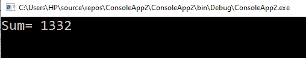
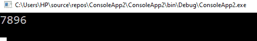
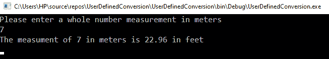

# C#中的类型转换

> 原文:[https://www.javatpoint.com/type-casting-in-c-sharp](https://www.javatpoint.com/type-casting-in-c-sharp)

当一种数据类型的变量被更改为另一种数据类型时，称为**类型转换**。根据我们的需要，我们可以改变数据的类型。在编译时，C#是静态类型的，即在声明变量后，我们不能再次声明它。除非我们隐式更改变量的类型，否则不能将变量的值赋给另一种类型的变量。

这里我们将举一个字符串数据类型的例子。我们不能将字符串隐式转换为 int。因此，如果我们将变量“I”声明为 int，我们就不能将字符串值“Hello”赋给它。

```

int z;
z = "hii"; // error CS0029:  we cannot implicitly convert string type' to 'integer' type

```

但是，当需要将一个变量的值复制到另一个变量或另一种类型的方法参数中时，我们可能会面临这种情况。比如我们有一个可变整数，需要传递给一个类型为 **double** 的方法参数。或者可以将类变量赋给接口类型的变量。这些类型的操作称为**类型转换**。

## 在 C#中，我们可以执行不同类型的转换。

*   **隐式转换:**对于隐式转换，不需要特殊的语法。这种类型的转换是安全的；在这个转换中，没有任何数据丢失。隐式转换包括小类型到大整数类型的转换，以及从派生类到基类的转换。
*   **显式转换(类型种姓):**显式转换将使用强制转换运算符()完成。当出现数据丢失的情况，或者转换不成功时，我们会进行转换。显式转换可能有任何其他原因。转换的例子是将数字类型转换为精度较低或范围较小的类型。显式转换还包括基类实例到派生类的转换。
*   **自定义转换:**我们可以通过定义方法来进行这个转换。我们可以使用该技术来启用自定义类型之间的显式-隐式转换，这与基类或派生类没有任何关系。

**与辅助类的转换:**用于**整数**和**系统等非兼容类型的转换。DateTime** 对象或者十六进制字符串和字节数组，我们可以用 System。位转换类，系统。转换类和内置数值类型的 Parse 方法，如 int32 Parse。

**隐式转换:**我们很容易理解和使用隐式转换。这里我们将整数赋给 double，这就是所谓的隐式转换，因为我们在这个转换中没有丢失任何数据。

为了理解这种转换，我们将举一个例子。

```

Int value1=567;
Int value2=765;
Long sum;
sum=value1+value2

```

这里我们有两个整型变量 value1 和值 2。我们将对两个整型值求和，并将结果存储在长变量中。这里不会显示任何错误，我们也不会丢失任何数据。这种类型的转换称为隐式转换。

### 示例:

```

using System;
namespace ConsoleApp2
{
    class SumProgramme
    {
        static void Main(string[] args)
        {
            int value1 = 567;
            int value2 = 765;
            long summation;

            summation = value1 + value2;

            Console.WriteLine("summation = " + summation);

            Console.ReadLine();
        }
    }
}

```

**输出:**



### 显式转换

我们可以通过定义方法来进行显式转换。用户将进行显式转换。用户将按照他们的要求进行转换。编译器将按照我们的命令执行。

现在，我们将通过应用以下代码进行转换:

### 示例:

```

using System;
using System.Collections.Generic;
using System. Linq;
using System. Text;
using System.Threading.Tasks;

namespace ConsoleApp2
{
    class ProgramExplicit
    {
        static void Main(string[] args)
        {
   double db = 7896.45;
            int xy;

            // here we do the cast double to int.
            xy = (int)db;
            Console.WriteLine(xy);
            Console.ReadKey();
        }
    }
}

```

**输出:**



### 转换运算符

转换运算符具有以下属性:

*   声明为“隐式”的转换将在需要时自动发生。
*   声明为“显式”的转换需要调用强制转换。
*   所有转换都必须声明为正数。

现在我们将举一个遵循以下代码的例子。

```

using System;
using System.Collections.Generic;
using System. Linq;
using System. Text;
using System.Threading.Tasks;

namespace UserDefinedConversion
{
    class Program
    {

        public struct ImperialMeasurement
        {
            public float feet;
            public ImperialMeasurement(float r)
            {
                this.feet = r;
            }
            public static explicit operator ImperialMeasurement(int m)
            {
                float ConversionResult = 3.28f * m;
                ImperialMeasurement temp = new ImperialMeasurement(ConversionResult);
                return temp;
            }
        }
        static void Main(string[] args)
        {
            Console.WriteLine("Please enter a whole number measurement in meters");
            int nm = Convert.ToInt32(Console.ReadLine());
            ImperialMeasurement im = (ImperialMeasurement)nm;
            Console.WriteLine($"The measument of {nm} in meters is {im.feet} in feet ");
            Console.ReadKey();
        }
    }

}

```

**输出:**



* * *