# C# 中的列表框控件

> 原文：<https://www.javatpoint.com/listbox-control-in-c-sharp>

列表框控件为我们提供了一个显示项目列表的用户界面。从那里，用户可以从列表中选择一个或多个项目。我们可以使用列表框来显示多个列，这些列可以包含图像和其他控件。

## C# 中列表框控件的创建

为了创建列表框，我们将遵循 Windows 窗体中的两种方法。要创建列表框控件，我们可以在设计时使用表单设计器，也可以在运行时使用列表框类来创建控件。

### 设计时创建列表框

在第一种方法中，我们将在设计时使用 Windows 窗体创建 ListBox 控件。

要创建列表框控件，我们只需将列表框控件从工具箱中拖放到表单中。拖放列表框后，表单如下图所示。当列表框显示在表单上时，现在我们将使用鼠标调整其大小，并设置其属性和事件。

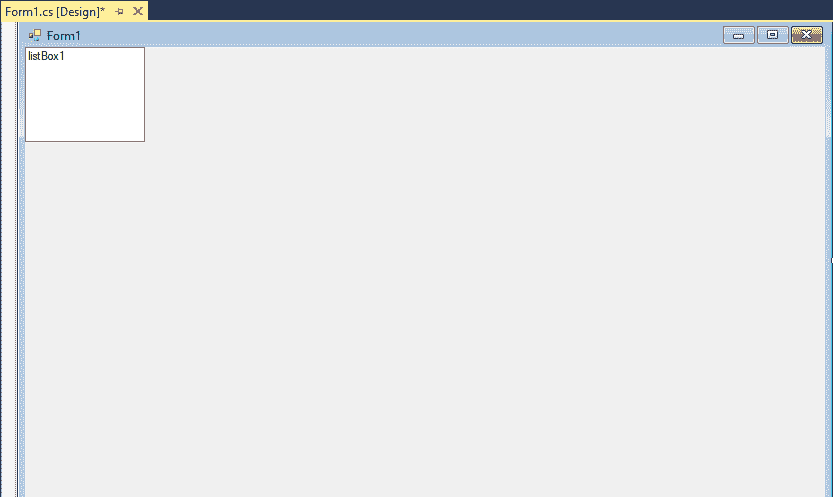

### 创建列表框的动态方法

列表框类以窗口形式显示列表框控件。对于创建列表框的运行时执行，首先，我们将创建列表框类的实例并设置其属性，并将列表框对象添加到表单控件中。

**第一步。**为了在第一步中创建动态列表框，我们将创建列表框类的实例。

为了创建列表框的对象，我们将编写以下代码:

```

ListBox List1 = new ListBox();

```

**第二步。**下一步，我们将设置 ListBox 控件的属性。为此，我们将编写以下代码。在属性中，我们将设置列表框的位置、宽度、高度、背景色、前景色、名称和字体属性，如下所示:

```

ListBox box = new ListBox();
box.Location = new Point(300, 110);
box.Size = new Size(160, 103);
box.ForeColor = Color.Purple;
box.Items.Add(765);
box.Items.Add(875);
box.Items.Add(345);

```

**第三步。**当使用 ListBox 控件设置属性时，在下一步中，我们将把 ListBox 添加到表单中。为此，我们将使用表单。控件。添加方法，将列表框控件添加到窗体控件中，并根据它们的位置和大小在窗体上显示它。

```

// Now we will add ListBox control 
            // to the form 
            this.Controls.Add(box);

```

现在，我们将编写一个代码，在 ListBox 控件中添加该项，并在列表中显示它们。

### 示例:

```

using System;
using System.Collections.Generic;
using System.ComponentModel;
using System.Data;
using System.Drawing;
using System.Linq;
using System.Text;
using System.Threading.Tasks;
using System.Windows.Forms;

namespace WindowsFormsApp2
{
    public partial class Form1: Form
    {
        public Form1()
        {
            InitializeComponent();

        }

        private void Form1_Load(object sender, EventArgs e)
        {
            ListBox box = new ListBox();
            box.Location = new Point(300, 110);
            box.Size = new Size(160, 103);
            box.ForeColor = Color.Purple;
            box.Items.Add(765);
            box.Items.Add(875);
            box.Items.Add(345);

            // Now we will add ListBox control 
            // to the form 
            this.Controls.Add(box);
        }

    }
}

```

**输出:**

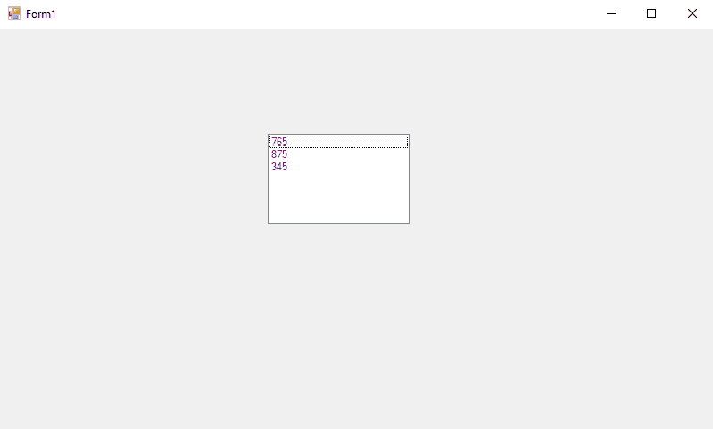

现在，我们将举另一个在运行时创建 ListBox 项的例子。

为此，将按照上述代码执行相同的步骤。

**第一步。**首先，我们将创建一个 ListBox 的对象。为此，我们将编写以下代码:

```

ListBox ListItem = new ListBox();

```

**第二步。**下一步，我们将设置 ListBox 控件的属性。我们将为位置、宽度、高度等编写代码。

```

ListItem.Location = new System.Drawing.Point(15, 15);
ListItem.Name = "ListItem";
ListItem.Size = new System.Drawing.Size(350, 400);
ListItem.BackColor = System.Drawing.Color.Orange;
ListItem.ForeColor = System.Drawing.Color.Black;

```

**第三步。**现在我们将使用下面的代码在运行时添加列表框中的项目。

```

ListItem.Items.Add("Vaishali Tyagi");
ListItem.Items.Add("Samlesh Tyagi");
ListItem.Items.Add("Preeti Tyagi");
ListItem.Items.Add("Priyanka Tyagi");

```

**第四步。**下一步，我们将把列表框添加到表单中。为此，我们将使用**表格。添加方法**帮助我们将列表框控件添加到表单控件中，并根据控件的位置和大小将其显示在表单上。

```

this.Controls.Add(ListItem);

```

现在我们将用 C# 编写一段代码，在 Windows 窗体中创建 ListBox 控件。

### 例 2。

```

using System;
using System.Collections.Generic;
using System.ComponentModel;
using System.Data;
using System.Drawing;
using System.Linq;
using System.Text;
using System.Threading.Tasks;
using System.Windows.Forms;

namespace WindowsFormsApp2
{
    public partial class Form1: Form
    {
        public Form1()
        {
            InitializeComponent();

        }
        ListBox ListItem = new ListBox();

        private void Form1_Load(object sender, EventArgs e)
      {
            ListItem.Location = new System.Drawing.Point(15, 15);
            ListItem.Name = "ListItem";
            ListItem.Size = new System.Drawing.Size(350, 400);
            ListItem.BackColor = System.Drawing.Color.Orange;
            ListItem.ForeColor = System.Drawing.Color.Black;
            ListItem.Items.Add("Vaishali Tyagi");
            ListItem.Items.Add("Samlesh Tyagi");
            ListItem.Items.Add("Preeti Tyagi");
            ListItem.Items.Add("Priyanka Tyagi");
            this.Controls.Add(ListItem);

        }
    }
}

```

**OutPut:**

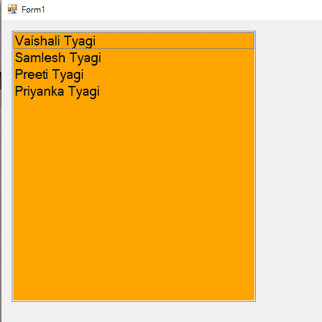

### 上述代码的解释

### C# 中列表框的属性

### 列表框名称属性

name 属性表示列表框控件的唯一名称。我们在代码中使用这个名称来访问控件。下面的代码设置并获取列表框控件的文本名称。

```

ListItem.Name = "ListItem";

```

### 列表框的位置、高度、宽度和大小属性

**位置:**Location 属性包含一个点，该点显示表单上列表框的起始位置。我们还可以使用“左”和“上”属性从窗体的左上角显示控件的位置。

**大小:**Size 属性显示控件的大小。我们也可以使用宽度和高度属性来代替大小属性。为此，我们将编写以下代码来设置 ListBox 控件的位置、高度和宽度属性。

```

ListItem.Location = new System.Drawing.Point(15, 15);
ListItem.Size = new System.Drawing.Size(350, 400); 

```

### 字体或列表框

字体属性显示列表框控件文本的字体。当我们单击属性窗口中的字体属性时，我们可以看到字体的名称、大小和字体的其他选项。为此，我们将编写以下代码，在运行时设置字体属性。

```

ListItem.Font = new Font("Georgia", 16);

```

### 列表框的背景色和前景色

为了设置列表框的背景色和前景色，我们使用了背景色和前景色属性。在属性窗口中点击这些属性后，会出现一个颜色对话框。

**为此，我们将编写以下代码:**

```

ListItem.BackColor = System.Drawing.Color.Orange;
ListItem.ForeColor = System.Drawing.Color.Black;

```

## 使用列表框在 C# 中创建应用程序

在这里，我们将在列表框中添加元素，删除元素，并在网格视图中显示它们。

为了创建应用程序，我们将设计一个用户界面，其中该界面包含两个列表框(列表框 1 和列表框 2)，五个按钮，包括不同的功能，即，将数据从第一个列表框添加到第二个列表框，删除数据，全部添加，全部删除，最终确定，以及一个网格视图，我们将在其中显示最终确定的数据。

要设计图形用户界面，我们将遵循以下步骤:

**第一步。**在第一个中，我们将为项目的创建创建一个新项目；我们将遵循以下步骤:

点击**新建- >项目**，如下图截图所示。

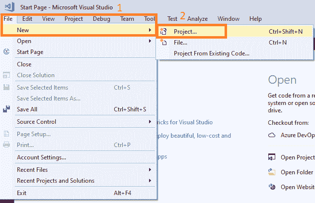

**第二步**。之后会出现一个新的窗口，我们**选择 Visual C#- > Windows 窗体应用- >项目名称(AddRemoveCreation)点击确定，**如下图截图**所示。**

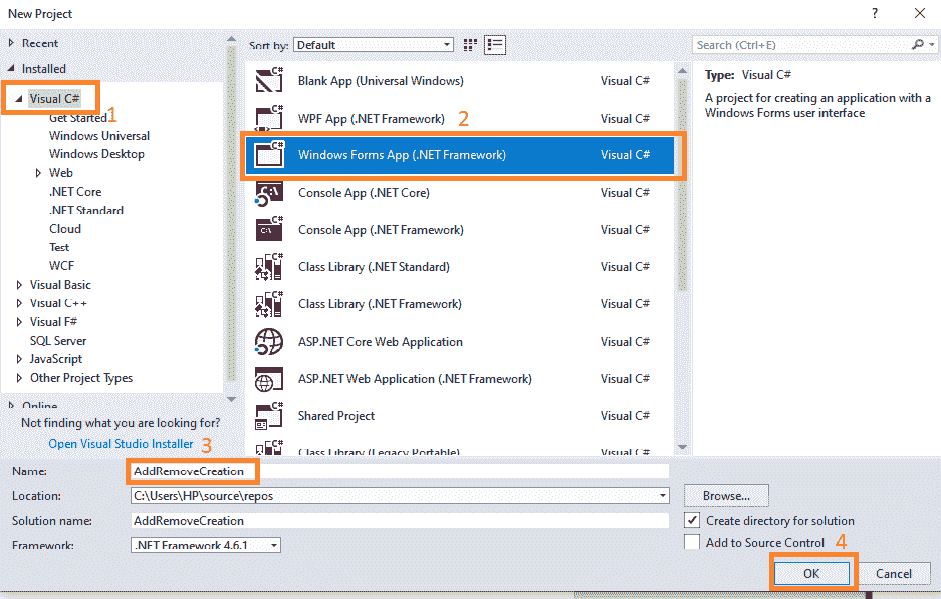

**第三步。**之后，将创建一个表单，如下图所示:

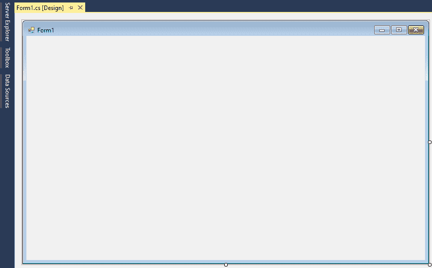

**第四步。**下一步，我们将从工具箱中拖放列表框。这里我们将使用两个列表框(列表框 1 和列表框 2)和五个按钮(添加、删除、全部添加、全部删除和最终确定)。

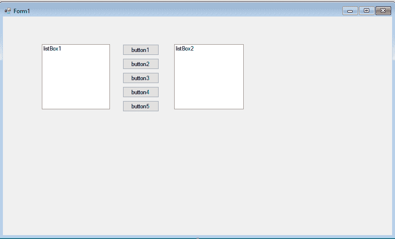

**第五步。**在下一步中，我们将通过**右键点击按钮- >选择属性- >更改按钮的文本和名称，如下图截图所示:**

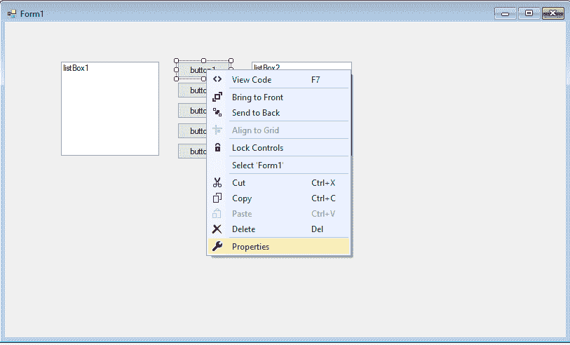

**第六步。**点击属性后，会打开属性窗口，我们会在这里更改按钮的名称和按钮上的文字，如下图截图所示:

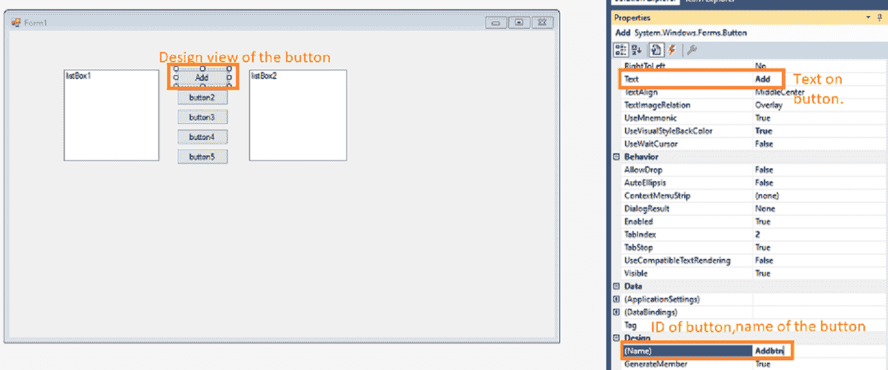

**第七步。**之后，我们将在点击 GridView 中的 finalize 按钮后显示数据。为此，我们将点击**数据- >网格视图**。

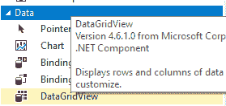

**之后页面会是这样的，如下图:**

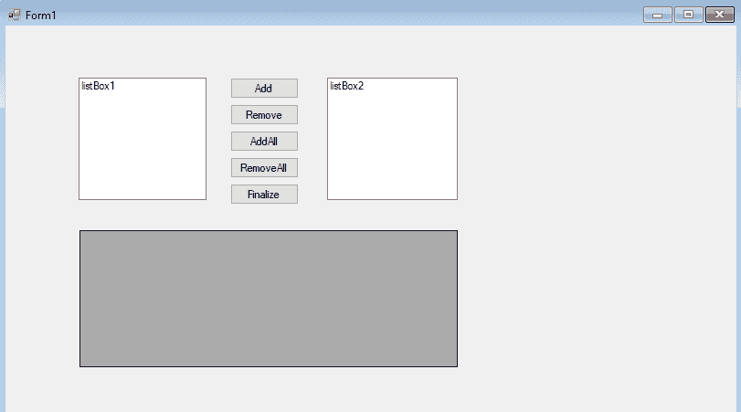

### 现在我们将展示如何在列表框 1 中添加数据，并在列表框 2 中导入数据。

为此，我们将执行以下代码:

```

using System;
using System.Collections.Generic;
using System.ComponentModel;
using System.Data;
using System.Drawing;
using System.Linq;
using System.Text;
using System.Threading.Tasks;
using System.Windows.Forms;

namespace AddRemoveCreation
{
     public partial class Form1: Form
    {
        //create an object dtCourse of the DataTable.
        private DataTable dtCourse = new DataTable();
        //create an object dtSelectedCourse of the DataTable.
        private DataTable dtSelectedCourse = new DataTable();

        public Form1()
        {
            //InitializeComponent() is used to initialize the form.
            InitializeComponent();
        }

        private void Form1_Load(object sender, EventArgs e)
        {
            //call the function at the form loading
            FillCouseTable();
            SelectedCourseTable();
            //Add the value in the DataSource of the ListBox1
            listBox1.DataSource = dtCourse;
            //listbox1.DisplayMember is used to decide which column we want to show in the final output
            listBox1.DisplayMember = "CourseName";
            //dtSelectedCourse datatable add the value in the listbox2 datasource
            listBox2.DataSource = dtSelectedCourse;
            listBox2.DisplayMember = "CourseName";

        }
        //FillCourseTable() function is declare to add the data in the datatable with the help of the data object
        private void FillCouseTable()
        {
            //adding the column name
            dtCourse.Columns.Add("CourseID", typeof(int));
            dtCourse.Columns.Add("CourseName");
            dtCourse.Columns.Add("CourseDuration");
            //add the data in the dtCourse table 
            dtCourse.Rows.Add(1, "Advance OOPS", "4 Months");
            dtCourse.Rows.Add(2, "Data Structure", "5 Months");
            dtCourse.Rows.Add(3, "Java", "6 Months");
            dtCourse.Rows.Add(4, "C++", "3 Months");
            dtCourse.Rows.Add(5, "C", "2 Months");

        }
        //SelectedCourseTable() function is declare which contain the column name of the data table.
        private void SelectedCourseTable()
        {
            dtSelectedCourse.Columns.Add("CourseID", typeof(int));
            dtSelectedCourse.Columns.Add("CourseName");
            dtSelectedCourse.Columns.Add("CourseDuration");

        }
        //After clicking on the add button function Addbtn_Click() is create which contain the functionality of Add button

        private void Addbtn_Click(object sender, EventArgs e)
        {
            //if the condition applies if the listbox1 contain the item greater than zero then this will import the data in the listbox2 and delete the data from the listbox1
            if(listBox1.Items.Count>0)
            {
                //Here we are improting the data to the dtSelectedCourse datatable from the dtcourse datatable
                dtSelectedCourse.ImportRow(dtCourse.Rows[listBox1.SelectedIndex]);
                dtCourse.Rows[listBox1.SelectedIndex].Delete();
            }
        }

```

**这里我们要展示的是包含数据的 listbox1。**

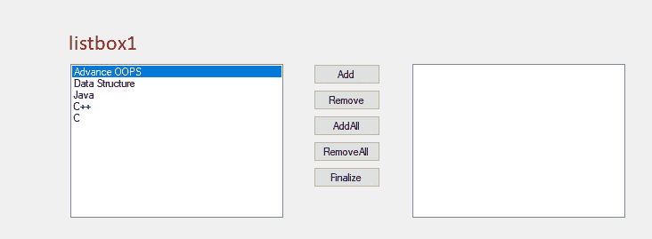

点击添加按钮后，数据将被添加到列表框 2，并从列表框 1 中删除。

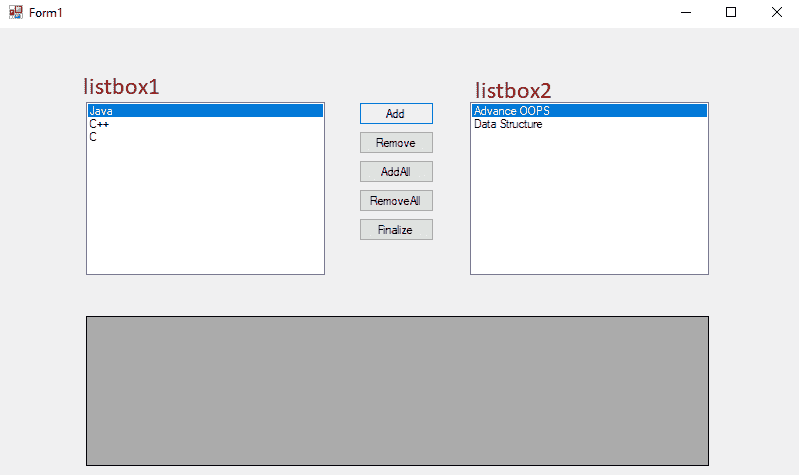

### 从列表框中删除数据

这里我们将展示如何从 listbox2 中移除数据。

为此，我们将编写以下代码:

```

using System;
using System.Collections.Generic;
using System.ComponentModel;
using System.Data;
using System.Drawing;
using System.Linq;
using System.Text;
using System.Threading.Tasks;
using System.Windows.Forms;

namespace AddRemoveCreation
{
     public partial class Form1: Form
    {
        //create an object dtCourse of the DataTable.
        private DataTable dtCourse = new DataTable();
        //create an object dtSelectedCourse of the DataTable.
        private DataTable dtSelectedCourse = new DataTable();

        public Form1()
        {
            //InitializeComponent() is used to initialize the form.
            InitializeComponent();
        }

        private void Form1_Load(object sender, EventArgs e)
        {
            //call the function at the form loading
            FillCouseTable();
            SelectedCourseTable();
            //Add the value in the DataSource of the ListBox1
            listBox1.DataSource = dtCourse;
            //listbox1.DisplayMember is used to decide which column we want to show in the final output
            listBox1.DisplayMember = "CourseName";
            //dtSelectedCourse datatable add the value in the listbox2 datasource
            listBox2.DataSource = dtSelectedCourse;
            listBox2.DisplayMember = "CourseName";

        }
        //FillCourseTable() function is declare to add the data in the datatable with the help of the data object
        private void FillCouseTable()
        {
            //adding the column name
            dtCourse.Columns.Add("CourseID", typeof(int));
            dtCourse.Columns.Add("CourseName");
            dtCourse.Columns.Add("CourseDuration");
            //add the data in the dtCourse table 
            dtCourse.Rows.Add(1, "Advance OOPS", "4 Months");
            dtCourse.Rows.Add(2, "Data Structure", "5 Months");
            dtCourse.Rows.Add(3, "Java", "6 Months");
            dtCourse.Rows.Add(4, "C++", "3 Months");
            dtCourse.Rows.Add(5, "C", "2 Months");

        }
        //SelectedCourseTable() function is declare which contain the column name of the data table.
        private void SelectedCourseTable()
        {
            dtSelectedCourse.Columns.Add("CourseID", typeof(int));
            dtSelectedCourse.Columns.Add("CourseName");
            dtSelectedCourse.Columns.Add("CourseDuration");

        }

//After clicking on the Remove button Removebtn_Click() function is created where we remove the element from the listbox2 and import the data in the data table.

        private void Removebtn_Click(object sender, EventArgs e)
        {
            //for removing the element we apply condition if listbox contain the element greater than zero
            if (listBox2.Items.Count > 0)
            {
                //here the data will be import to the datatable dtcourse from the dtSelected Database.
                dtCourse.ImportRow(dtSelectedCourse.Rows[listBox2.SelectedIndex]);
                //All data will be deleted from the datatable dtSelectedCourse
                dtSelectedCourse.Rows[listBox2.SelectedIndex].Delete();
            }
        }
}
}

```

在删除数据之前，整个数据都在 listbox2 中，listbox1 不包含任何值。输出如下所示:

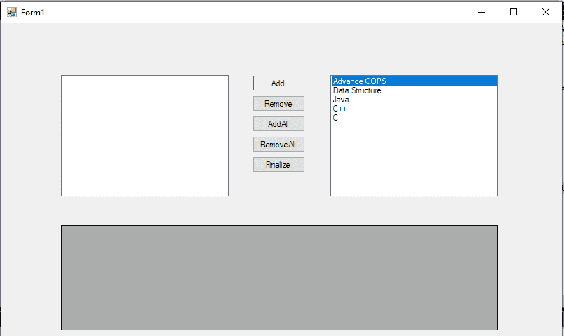

点击删除按钮后，数据将从列表框 2 中删除，并添加到列表框 1 中，如下图所示:

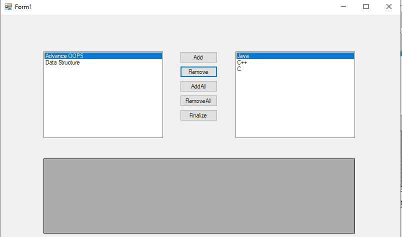

### 在列表框中一次性添加全部数据

为了将完整的数据从 listbox1 添加到 listbox2，我们将编写如下所示的代码:

```

using System;
using System.Collections.Generic;
using System.ComponentModel;
using System.Data;
using System.Drawing;
using System.Linq;
using System.Text;
using System.Threading.Tasks;
using System.Windows.Forms;

namespace AddRemoveCreation
{
     public partial class Form1: Form
    {
        //create an object dtCourse of the DataTable.
        private DataTable dtCourse = new DataTable();
        //create an object dtSelectedCourse of the DataTable.
        private DataTable dtSelectedCourse = new DataTable();

        public Form1()
        {
            //InitializeComponent() is used to initialize the form.
            InitializeComponent();
        }

        private void Form1_Load(object sender, EventArgs e)
        {
            //call the function at the form loading
            FillCouseTable();
            SelectedCourseTable();
            //Add the value in the DataSource of the ListBox1
            listBox1.DataSource = dtCourse;
            //listbox1.DisplayMember is used to decide which column we want to show in the final output
            listBox1.DisplayMember = "CourseName";
            //dtSelectedCourse datatable add the value in the listbox2 datasource
            listBox2.DataSource = dtSelectedCourse;
            listBox2.DisplayMember = "CourseName";

        }
        //FillCourseTable() function is declare to add the data in the datatable with the help of the data object
        private void FillCouseTable()
        {
            //adding the column name
            dtCourse.Columns.Add("CourseID", typeof(int));
            dtCourse.Columns.Add("CourseName");
            dtCourse.Columns.Add("CourseDuration");
            //add the data in the dtCourse table 
            dtCourse.Rows.Add(1, "Advance OOPS", "4 Months");
            dtCourse.Rows.Add(2, "Data Structure", "5 Months");
            dtCourse.Rows.Add(3, "Java", "6 Months");
            dtCourse.Rows.Add(4, "C++", "3 Months");
            dtCourse.Rows.Add(5, "C", "2 Months");

        }
        //SelectedCourseTable() function is declare which contain the column name of the data table.
        private void SelectedCourseTable()
        {
            dtSelectedCourse.Columns.Add("CourseID", typeof(int));
            dtSelectedCourse.Columns.Add("CourseName");
            dtSelectedCourse.Columns.Add("CourseDuration");

        }
        //After clicking on the AddAll button AddAllbtn_Click() function is create. 
        private void AddAllbtn_Click(object sender, EventArgs e)
        {
            //if condition is apply this will check if the listbox contain the element greater than zero.
            if(listBox1.Items.Count>0)
            {
                //dtCourse.Rows.Count will count the element and assign the value in the count variable.
                int count = dtCourse.Rows.Count;
                //for condition is apply this will going upto the count
                for(int i=count-1;i>=0;i--)
                {
                    //dtCourse.Rows[listbox1.SelectedIndex] with the help of this data will be import to the dtSelected datatable.
                    dtSelectedCourse.ImportRow(dtCourse.Rows[listBox1.SelectedIndex]);
                    //with this code data eill be delete from the dtCourse datatable.
                    dtCourse.Rows[listBox1.SelectedIndex].Delete();

                }
            }
        }
}
}

```

列表框 1 中的数据如下所示:


写完这段代码后，**添加所有**按钮将工作，如下图所示:

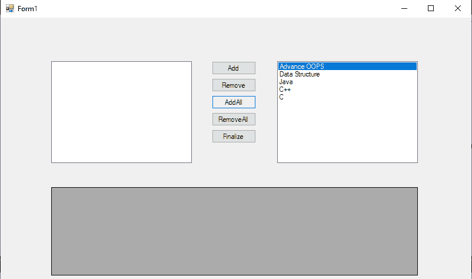

### 从列表框中删除所有数据

在这里，我们将删除列表框 2 中的所有数据，并添加列表框 1 中的所有数据。

为了从列表框中删除所有数据，我们将编写如下所示的代码:

```

using System;
using System.Collections.Generic;
using System.ComponentModel;
using System. Data;
using System. Drawing;
using System. Linq;
using System. Text;
using System.Threading.Tasks;
using System.Windows.Forms;

namespace AddRemoveCreation
{
     public partial class Form1: Form
    {
        //create an object dtCourse of the DataTable.
        private DataTable dtCourse = new DataTable();
        //create an object dtSelectedCourse of the DataTable.
        private DataTable dtSelectedCourse = new DataTable();

        public Form1()
        {
            //InitializeComponent() is used to initialize the form.
            InitializeComponent();
        }

        private void Form1_Load(object sender, EventArgs e)
        {
            //call the function at the form loading
            FillCouseTable();
            SelectedCourseTable();
            //Add the value in the DataSource of the ListBox1
            listBox1.DataSource = dtCourse;
            //listbox1.DisplayMember is used to decide which column we want to show in the final output
            listBox1.DisplayMember = "CourseName";
            //dtSelectedCourse datatable add the value in the listbox2 datasource
            listBox2.DataSource = dtSelectedCourse;
            listBox2.DisplayMember = "CourseName";

        }
        //FillCourseTable() function is declare to add the data in the datatable with the help of the data object
        private void FillCouseTable()
        {
            //adding the column name
            dtCourse.Columns.Add("CourseID", typeof(int));
            dtCourse.Columns.Add("CourseName");
            dtCourse.Columns.Add("CourseDuration");
            //add the data in the dtCourse table 
            dtCourse.Rows.Add(1, "Advance OOPS", "4 Months");
            dtCourse.Rows.Add(2, "Data Structure", "5 Months");
            dtCourse.Rows.Add(3, "Java", "6 Months");
            dtCourse.Rows.Add(4, "C++", "3 Months");
            dtCourse.Rows.Add(5, "C", "2 Months");

        }
        //SelectedCourseTable() function is declare which contain the column name of the data table.
        private void SelectedCourseTable()
        {
            dtSelectedCourse.Columns.Add("CourseID", typeof(int));
            dtSelectedCourse.Columns.Add("CourseName");
            dtSelectedCourse.Columns.Add("CourseDuration");

        }

//After clicking on the Remove button RemoveAllbtn_Click() function is create. 

        private void RemoveAllbtn_Click(object sender, EventArgs e)
        {
            //if the condition is applied, this will count the listbox2 containing the value.

            if (listBox2.Items.Count > 0)
            {
                int count = dtSelectedCourse.Rows.Count;
                //for loop is apply which will go upto the greater than zero 
                for (int i = count - 1; i >= 0; i--)
                {
                    //dtCourse datatable import the data from the dtSelectedCourse datatable.
                    dtCourse.ImportRow(dtSelectedCourse.Rows[listBox2.SelectedIndex]);
                    //data will be deleted from the dtSelectedCourse datatable.
                    dtSelectedCourse.Rows[listBox2.SelectedIndex].Delete();
                }

            }
        }
}
}

```


### 在网格视图中显示列表框的数据

在这里，我们将使用 GridView 在点击 finalize 按钮后显示 ListBox2 的所有数据。

为了在 GridView 中显示数据，我们将编写以下代码:

```

using System;
using System.Collections.Generic;
using System.ComponentModel;
using System. Data;
using System. Drawing;
using System. Linq;
using System. Text;
using System.Threading.Tasks;
using System.Windows.Forms;

namespace AddRemoveCreation
{
    public partial class Form1: Form
    {
        //create an object dtCourse of the DataTable.
        private DataTable dtCourse = new DataTable();
        //create an object dtSelectedCourse of the DataTable.
        private DataTable dtSelectedCourse = new DataTable();

        public Form1()
        {
            //InitializeComponent() is used to initialize the form.
            InitializeComponent();
        }

        private void Form1_Load(object sender, EventArgs e)
        {
            //call the function at the form loading
            FillCouseTable();
            SelectedCourseTable();
            //Add the value in the DataSource of the ListBox1
            listBox1.DataSource = dtCourse;
            //listbox1.DisplayMember is used to decide which column we want to show in the final output
            listBox1.DisplayMember = "CourseName";
            //dtSelectedCourse datatable add the value in the listbox2 datasource
            listBox2.DataSource = dtSelectedCourse;
            listBox2.DisplayMember = "CourseName";

        }
        //FillCourseTable() function is declare to add the data in the datatable with the help of the data object
        private void FillCouseTable()
        {
            //adding the column name
            dtCourse.Columns.Add("CourseID", typeof(int));
            dtCourse.Columns.Add("CourseName");
            dtCourse.Columns.Add("CourseDuration");
            //add the data in the dtCourse table 
            dtCourse.Rows.Add(1, "Advance OOPS", "4 Months");
            dtCourse.Rows.Add(2, "Data Structure", "5 Months");
            dtCourse.Rows.Add(3, "Java", "6 Months");
            dtCourse.Rows.Add(4, "C++", "3 Months");
            dtCourse.Rows.Add(5, "C", "2 Months");

        }
        //SelectedCourseTable() function is declare which contain the column name of the data table.
        private void SelectedCourseTable()
        {
            dtSelectedCourse.Columns.Add("CourseID", typeof(int));
            dtSelectedCourse.Columns.Add("CourseName");
            dtSelectedCourse.Columns.Add("CourseDuration");

        }

//Clicking on the Finalize button Finalizebtn_Click() function is create 

        private void Finalizebtn_Click(object sender, EventArgs e)
        {
            // create an object of the DialoResult where we will show the message with the help of the MessageBox.Show() function.
            DialogResult dialog=MessageBox.Show("Are you sure you want to finalize the selected course", "Confirmation Message", MessageBoxButtons.YesNo, MessageBoxIcon.Question);
            //Condition is apply if the result is yes.
            if(dialog==DialogResult.Yes)
            {
                //Shows the result of the dtSelectedCourse datatable to GridView.
                dataGridView1.DataSource = dtSelectedCourse;
                //to stop the editing we enable the datagridview to false.
                dataGridView1.Enabled = false;
                //With this code we apply the visiblity of the column index 0 to false.
                dataGridView1.Columns[0].Visible = false;
                //hide the header value of the row
                dataGridView1.RowHeadersVisible = false;
            }
            else
            {
                //If the result no, then shows the message with the help of the MessageBox.Show(). 
                MessageBox.Show("Please Select Atleast one course","Information Message", MessageBoxButtons.YesNo, MessageBoxIcon.Information);
            }
        }
}
}

```

单击“完成”按钮后，将显示确认消息。

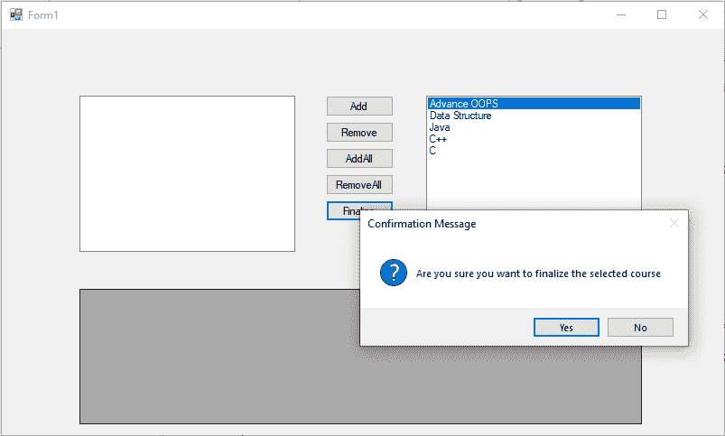

单击“是”后，聚合数据将显示在 GridView 中，如下图所示:

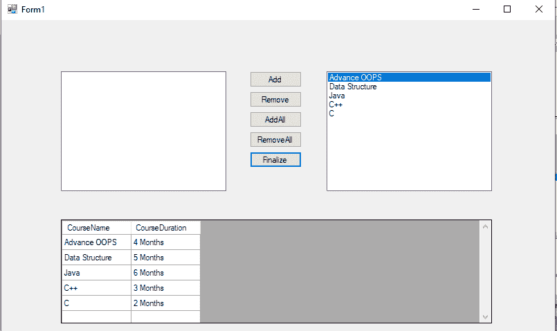

* * *