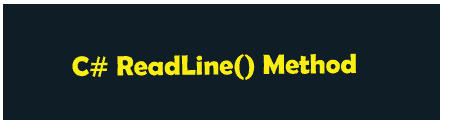

# C# ReadLine()方法

> 原文:[https://www.javatpoint.com/c-sharp-readline-method](https://www.javatpoint.com/c-sharp-readline-method)

**控制台。WriteLine()** 是 C#中使用的一种方法，用于打印单行的整个语句，并将控制权转移到控制台的下一行。类似于控制台。WriteLine()，使用 **ReadLine()** 方法从用户处读取整行字符串或语句值，直到按下**回车**键将控制权转移到下一行。在本节中，我们将详细了解 **ReadLine()、Read()** 和 **Readkey()** 方法。



## 控制台。ReadLine()方法

在 [C#](https://www.javatpoint.com/c-sharp-tutorial) 中， **ReadLine** ()方法是一种常用的方法或功能，用于接受用户的输入，直到按下回车键。换句话说，它是一种从标准输入流中读取每一行字符串或值的方法。

这是**控制台**类(系统命名空间)的预定义方法。**控制台。ReadLine()** 方法从流输出设备(控制台)读取并只返回字符串，直到找到换行符。如果我们想从用户那里读取一个字符或数值，我们需要将字符串转换成合适的数据集。

**语法**

```

public static string ReadLine ();

```

方法引发以下异常:

1.  **IOException:** 如果出现输入/输出错误，就会出现这种情况。
2.  **OutOfMemoryException:** 如果内存不足，无法分配缓冲区来返回字符串，就会出现这种情况。
3.  **argumentoutofrangerexception:**如果下一行的字符数大于**最大值**，则会出现这种情况。

**示例 1:** 让我们编写一个程序，使用 ReadLine()方法从用户处获取输入。

**Program.cs**

```

using System; // Define the System package
namespace ConsoleApp3 // Project name or Folder
{
    class Program 
    {
        static void Main(string[] args) // Defining the main function
        {
            string name; // string variable name
            Console.WriteLine("Hello, what is your name?"); 
            name = Console.ReadLine(); // takes an input from the user
            Console.WriteLine("Hi! "+ name + " Welcome to the JavaTpoint"); // print the output
        }
    }
}

```

**输出**


**示例 2:** 编写一个程序，使用 C#中的 ReadLine()函数打印用户的名和姓。

**程序 2.cs**

```

using System;

namespace ConsoleApp3
{
    class Program2
    {
        static void Main(string[] args)
        {
            string fname, lname; // string variables
            Console.Write("Please, Enter your first Name : ");
            fname = Console.ReadLine(); // takes the first name from the user

            // ReadLine() is a method of Console class to read a line from the standard input stream
            Console.Write("Please, Enter Your Last Name : ");
            lname = Console.ReadLine(); // takes the second name from the user

            Console.WriteLine("Your Full Name is : " + fname + " " + lname);
        }
    }
}

```

**输出**


### Read()方法

C#中的 Read()方法用于从用户处读取单个字符。它不同于 **ReadLine** ()方法，因为 **readLine** ()方法接收用户输入的每一行，直到该行结束，并控制转移到下一条语句来读取字符串。

让我们编写一个程序来理解 C#中 Read()方法打印字符的用法。

**程序 4.cs**

```

using System; // Define the System package
namespace ConsoleApp3
{
    class Program4 
    {
        static void Main(string[] args) 
        {
            char ch;
            Console.Write("Enter the characters "); // Cosole.Write() print the same line statement.
            ch = Convert.ToChar(Console.Read()); // Read a single character from the user.
            Console.WriteLine("You have entered the character " + ch); //print the complete line
        }
    }
}

```

**输出**


### ReadKey()

使用 **ReadKey** ()方法获取下一个字符，或者用户按任意键退出程序。它保持屏幕，直到用户按下键盘上的任何键。按下的键将显示在控制台上。

**程序 5.cs**

```

using System; // Define the System package

namespace ConsoleApp3
{
    class Program5 
    {
        static void Main(string[] args) 
        {     
             DateTime dt = DateTime.Now; // DateTime.Now() print the current time
             Console.WriteLine(" The Current Date and Time is : " + dt);
             Console.Write("Press any key or Enter to exit from the Console Screen");
             Console.ReadKey(); // enter any key to exit from the console screen.
            }
    }
}

```

**输出**


* * *