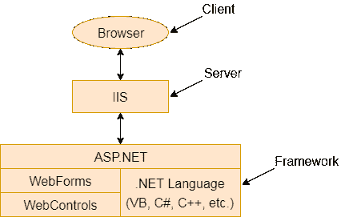

# ASP.NET 网络表单

> 原文:[https://www.javatpoint.com/asp-net-web-form-introduction](https://www.javatpoint.com/asp-net-web-form-introduction)

网络表单是建立在 ASP.NET 技术上的网页。它在服务器上执行，并向浏览器生成输出。它与支持的任何语言的任何浏览器兼容。NET 公共语言运行库。它很灵活，允许我们创建和添加自定义控件。

我们可以使用 Visual Studio 创建 ASP.NET 网络表单。它是一个集成开发环境，允许我们将服务器控件拖放到 web 表单中。它还允许我们为控件设置属性、事件和方法。写业务逻辑，我们可以任意选择。NET 语言，如:Visual Basic 或 Visual C#。

Web 窗体由两个组件组成:可视部分(ASPX 文件)和窗体背后的代码，后者驻留在一个单独的类文件中。

**图:**该图显示了 ASP.NET 的组成

Web 窗体的主要目的是克服 ASP 的限制，并将视图与应用程序逻辑分开。

**ASP.NET 提供了各种控件，如:**服务器控件和网页表单的 HTML 控件。我们在下面列出了所有这些控件。

* * *

## 服务器控件

下表包含 Web 窗体的服务器端控件。

| 控件名称 | 适用事件 | 描述 |
| 标签 | 没有人 | 它用于在 HTML 页面上显示文本。 |
| 文本框 | 文本已更改 | 它用于在表单中创建文本输入。 |
| 纽扣 | 单击，命令 | 它用于创建一个按钮。 |
| 链接按钮 | 单击，命令 | 它用于创建一个看起来类似于超链接的按钮。 |
| 图片按钮 | 点击 | 它用于创建图像按钮。这里，一个图像作为一个按钮。 |
| 超链接 | 没有人 | 它用于创建响应单击事件的超链接控件。 |
| 控件 | 事件中 | 它用于创建下拉列表控件。 |
| 列表框 | SelectedIndexCnhaged | 它用于创建一个类似于 HTML 控件的列表框控件。 |
| 数据网格 | 取消命令、编辑命令、删除命令、项目命令、选择索引已更改、页面索引已更改、排序命令、更新命令、项目已创建、项目数据绑定 | 它用来创建一个用来显示数据的 frid。使用这个控件，我们还可以非常容易地执行分页、排序和格式化。 |
| 数据列表 | 取消命令、编辑命令、删除命令、项目命令、选择索引已更改、更新命令、项目已创建、项目数据绑定 | 它用于创建非表格的数据列表，并用于显示数据。 |
| 中继器 | 项目命令，项目创建，项目数据绑定 | 它允许我们为数据创建非表格类型的格式。您可以将数据绑定到模板项，模板项就像以特定的重复格式组合在一起的 HTML 位。 |
| 检验盒 | 检查已更改 | 它用于创建复选框。 |
| 复选框 | 事件中 | 它用于创建一组一起工作的复选框。 |
| 单选按钮 | 检查已更改 | 它用于创建单选按钮。 |
| 单选按钮列表 | 事件中 | 它用于创建一组单选按钮控件，所有这些控件一起工作。 |
| 图像 | 没有人 | 它用于在页面中显示图像。 |
| 面板 | 没有人 | 它用于创建作为容器的面板。 |
| 占位符 | 没有人 | 它用于设置控件的占位符。 |
| 日历 | 选择已更改，可见已更改，日渲染 | 它用于创建日历。我们可以设置默认日期，前进和后退等。 |
| 广告旋转器 | 广告已创建 | 它允许我们指定要显示的广告列表。每次用户重新显示页面时。 |
| 桌子 | 没有人 | 它用于创建表格。 |
| 可扩展置标语言 | 没有人 | 它用于在 HTML 中显示 XML 文档。 |
| 逐字的 | 没有人 | 它就像一个标签，因为它显示一个文本，但是允许我们在运行时创建新的文本，并将它们放入这个控件中。 |

## HTML 控件

这些控件由浏览器呈现。我们也可以把 HTML 控件做成服务器控件。我们将在进一步的教程中讨论这个问题。

| 控件名称 | 描述 |
| 纽扣 | 它用于创建 HTML 按钮。 |
| 复原按钮 | 将表单上的所有其他 HTML 表单元素重置为默认值 |
| 提交按钮 | 自动将表单数据发布到表单标记的 Action 属性中列出的指定页面 |
| 文本字段 | 在 HTML 表单上给用户一个输入区域 |
| 文本区域 | 用于 HTML 表单上的多行输入 |
| 文件字段 | 在表单上放置文本字段和浏览按钮，并允许用户在单击浏览按钮时从本地计算机中选择文件名 |
| 密码字段 | HTML 表单上的输入区域，尽管在此字段中键入的任何字符都显示为星号 |
| 检验盒 | 给用户一个他们可以选择或清除的复选框 |
| 单选按钮 | 对一个窗体使用了两个或多个控件，并允许用户选择其中一个控件 |
| 桌子 | 允许您以表格形式显示信息 |
| 图像 | 在 HTML 表单上显示图像 |
| 列表框 | 向用户显示项目列表。您可以设置两个或更多的大小，以指定您希望显示的项目数量。如果超过此限制的项目数，滚动条会自动添加到该控件中。 |
| 掉下 | 向用户显示项目列表，但一次只显示一个项目。用户可以单击该控件侧面的向下箭头，将显示项目列表。 |
| 水平规则 | 在整个网页上显示一条水平线 |