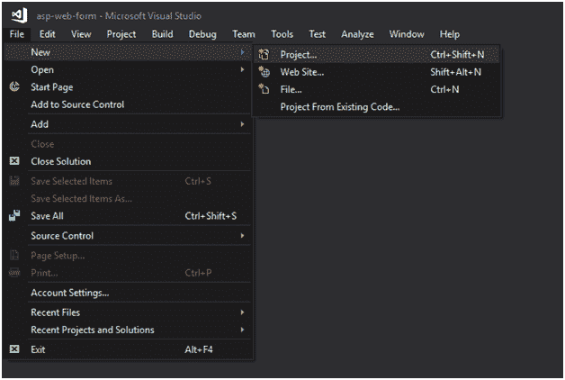
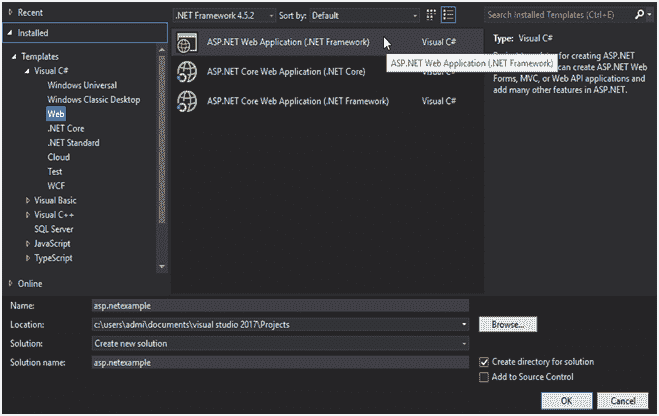
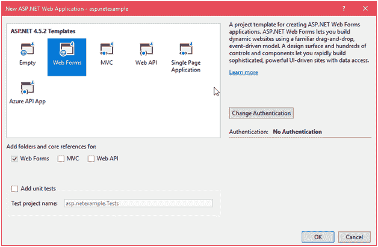
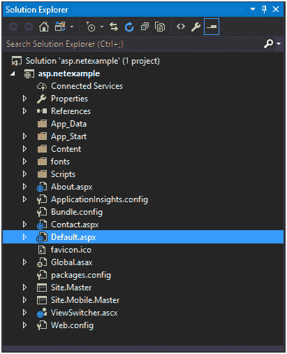
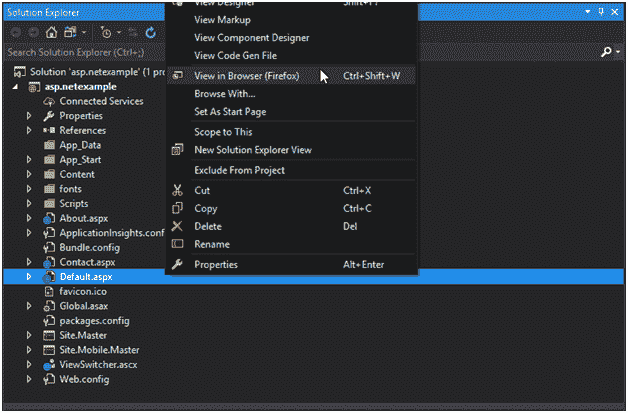
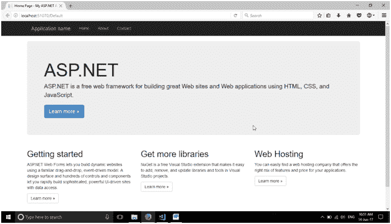

# ASP.NET 网络表单项目

> 原文：<https://www.javatpoint.com/asp-net-web-form-project>

我们正在使用 Visual studio 2017 创建网络项目。它包括以下步骤:

1.  创建新项目

点击菜单栏中的文件菜单，选择**新建- >项目。**

**选择项目类型**

它提供了几个选择，但我们选择了 ASP.NET 网络应用。

**选择项目模板**

选择项目类型后，现在，它会询问我们希望在应用程序中实现的模板类型。

这里，我们选择网络表单是因为我们正在创建一个网络表单应用程序。

点击确定后，在**解决方案浏览器**窗口显示项目，如下图。

这个项目包含一个 **default.aspx** 文件，这是一个启动文件。当我们运行项目时，这个文件首先执行，并显示网站的主页。

我们可以通过选择浏览器中的**视图**选项在浏览器上看到它的输出，如下所示。

最后，它在浏览器中显示如下输出:

嗯，我们已经成功创建了一个项目，并在浏览器上运行。

在下一章中，我们将创建一个新的 web 表单，并在项目中链接该表单。