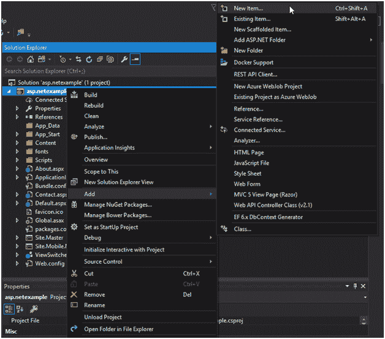
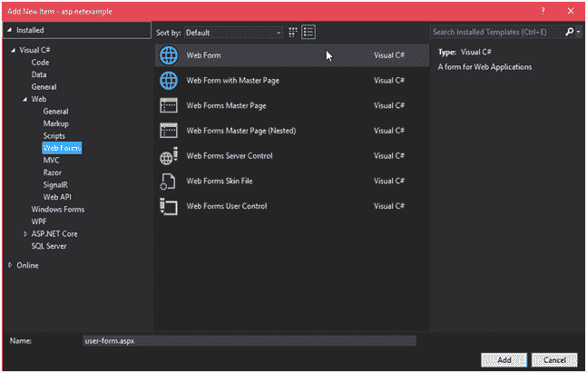
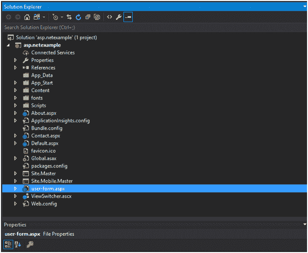
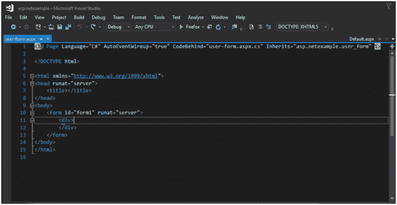
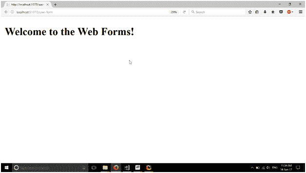

# 创建新的网站表单

> 原文:[https://www.javatpoint.com/asp-net-web-form-example](https://www.javatpoint.com/asp-net-web-form-example)

在这里，我们使用上一个主题中创建的项目。要在现有项目中添加新的 web 窗体，首先选择项目，然后右键单击并添加新项。



选择左上角 web 窗体选项，然后选择 web 窗体并点击添加按钮。



现在点击添加按钮，这个表单将添加到我们的项目中。

在添加表单后，我们可以看到这现在在我们的项目中，如下图所示。



双击此表单，将显示一些自动生成的代码，如下所示:



**// user-form.aspx**

```

<%@ Page Language="C#"  AutoEventWireup="true" CodeBehind="user-form.aspx.cs"
Inherits="asp.netexample.user_form" %>
<!DOCTYPE html>
<html >
<head runat="server">
<title></title>
</head>
<body>
<form id="form1" runat="server">
<div>
</div>
</form>
</body>
</html>

```

如果我们在浏览器上运行这个文件，它不会显示任何输出。所以，让我们用这个表格打印一些信息。

修改后的代码如下。

**// user-form.aspx**

```

<%@  Page Language="C#" AutoEventWireup="true" CodeBehind="user-form.aspx.cs"
Inherits="asp.netexample.user_form" %>
<!DOCTYPE html>
<html >
<head runat="server">
<title></title>
</head>
<body>
<form id="form1" runat="server">
<div>
<h2>Welcome to the Web Forms!</h2>
</div>
</form>
</body>
</html>

```

在浏览器上运行后，它会产生以下输出。



除了这条消息，我们还可以做很多事情，并在这个页面上添加控件。我们将在下一章中向表单添加控件。