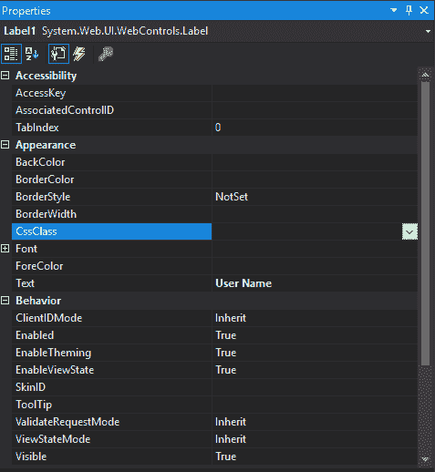
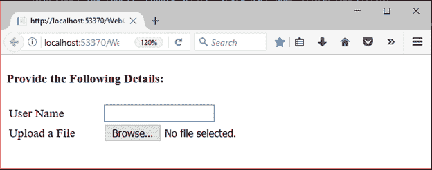

# ASP.NET 网页表单标签

> 原文：<https://www.javatpoint.com/asp-net-label>

此控件用于在 web 窗体上显示文本信息。它主要用于为其他控件创建标题，如:textbox。

要创建**标签**，我们可以编写代码或者使用 visual studio 2017 的拖放功能。

这是服务器端控件，asp 提供自己的标签来创建标签。下面给出了例子。

```

< asp:LabelID="Label1" runat="server" Text="Label" ></asp:Label>

```

该控件有自己的属性，如下所示。

| 财产 | 描述 |
| 访问密钥 | 用于设置标签的快捷键。 |
| tab 键索引 | 控件的制表符顺序。 |
| 背景色 | 用于设置标签的背景颜色。 |
| 单元格的边框颜色 | 用于设置标签的边框颜色。 |
| 边框宽度 | 用于设置标签边框宽度。 |
| 字体 | 它用于设置标签文本的字体。 |
| 前景色 | 它用于设置标签文本的颜色。 |
| 文本 | 它用于设置要为标签显示的文本。 |
| 工具提示 | 当鼠标在标签上时，它显示文本。 |
| 看得见的 | 设置窗体上控件的可见性。 |
| 高度 | 它用于设置控件的高度。 |
| 宽度 | 它用于设置控件的宽度。 |

## 例子

**// WebControls.aspx**

```

<%@ Page Language="C#" AutoEventWireup="true" CodeBehind="WebControls.aspx.cs" 
Inherits="WebFormsControlls.WebControls" %>
<!DOCTYPE html>
<html >
<head runat="server">
    <title></title>
    <style type="text/css">
        .auto-style1 {
            width: 100%;
        }
        .auto-style2 {
            margin-left: 0px;
        }
        .auto-style3 {
            width: 121px;
        }
    </style>
</head>
<body>
    <form id="form1" runat="server">
        <div>
           <h4>Provide the Following Details:</h4>
            <table class="auto-style1">
                <tr>
                    <td class="auto-style3">
                        <asp:Label ID="Label1" runat="server" Text="User Name"></asp:Label></td>
                    <td>
                        <asp:TextBox ID="TextBox1" runat="server" CssClass="auto-style2"></asp:TextBox></td>
                </tr>
                <tr>
                    <td class="auto-style3">
                        <asp:Label ID="Label2" runat="server" Text="Upload a File"></asp:Label></td>
                    <td>
                        <asp:FileUpload ID="FileUpload1" runat="server" /></td>
                </tr>
            </table>        
        </div>
    </form>
</body>
</html>

```

这是标签控件的属性窗口。



输出:

这里，我们将标签控件与两个不同的控件一起使用。它产生以下输出。

