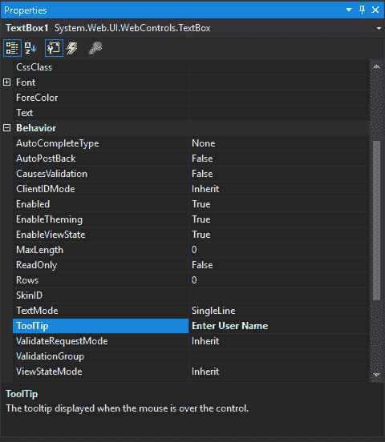

# ASP.NET 网页表单文本框

> 原文:[https://www.javatpoint.com/asp-net-textbox](https://www.javatpoint.com/asp-net-textbox)

这是一个用于接受用户输入的输入控件。要创建**文本框**，我们可以编写代码或者使用 visual studio IDE 的拖放功能。

这是服务器端控件，asp 提供自己的标签来创建它。下面给出了例子。

```

< asp:TextBoxID="TextBox1" runat="server" ></asp:TextBox>

```

服务器将其呈现为 HTML 控件，并向浏览器生成以下代码。

```

<input name="TextBox1" id="TextBox1" type="text">

```

该控件有自己的属性，如下所示。

| 财产 | 描述 |
| 访问密钥 | 它用于设置控件的键盘快捷键。 |
| tab 键索引 | 控件的制表符顺序。 |
| 背景色 | 它用于设置控件的背景色。 |
| 单元格的边框颜色 | 它用于设置控件的边框颜色。 |
| 边框宽度 | 它用于设置控件的边框宽度。 |
| 字体 | 它用于设置控件文本的字体。 |
| 前景色 | 它用于设置控件文本的颜色。 |
| 文本 | 它用于设置要为控件显示的文本。 |
| 工具提示 | 当鼠标在控件上时，它显示文本。 |
| 看得见的 | 设置窗体上控件的可见性。 |
| 高度 | 它用于设置控件的高度。 |
| 宽度 | 它用于设置控件的宽度。 |
| 最大长度 | 它用于设置可以输入的最大字符数。 |
| 只读 | 它用于使控件成为只读的。 |

## 例子

**// WebControls.aspx**

```

<%@ Page Language="C#" AutoEventWireup="true" CodeBehind="WebControls.aspx.cs" 
Inherits="WebFormsControlls.WebControls" %>
<!DOCTYPE html>
<html >
<head runat="server">
    <title></title>
</head>
<body>
    <form id="form1" runat="server">
        <div>
            <asp:Label ID="labelId" runat="server">User Name</asp:Label>
<asp:TextBox ID="UserName" runat="server" ToolTip="Enter User Name"></asp:TextBox>
        </div>
        <p>
        <asp:Button ID="SubmitButton" runat="server" Text="Submit" OnClick="SubmitButton_Click" />
        </p>
        <br />                 
    </form>
     <asp:Label ID="userInput" runat="server"></asp:Label>
</body>
</html>

```

### 代码隐藏

**// WebControls.aspx.cs**

```

using System;
using System.Collections.Generic;
using System.Linq;
using System.Web;
using System.Web.UI;
using System.Web.UI.WebControls;
namespace WebFormsControlls
{
    public partial class WebControls : System.Web.UI.Page
    {
        protected void SubmitButton_Click(object sender, EventArgs e)
        {
            userInput.Text = UserName.Text;
        }
    }
}

```

这是文本框控件的属性窗口。



输出:

它产生以下输出。


当用户向服务器提交输入时，它显示用户输入。以下截屏显示用户输入。

