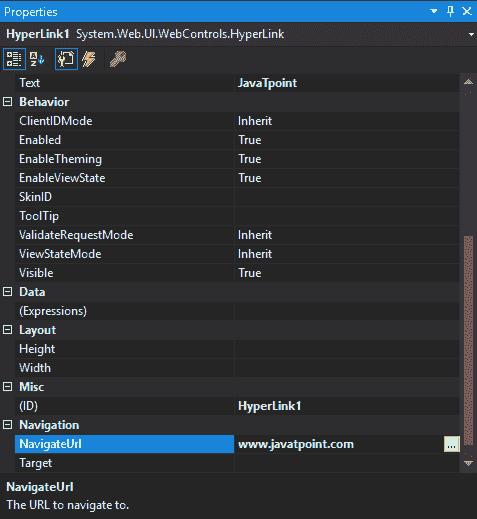
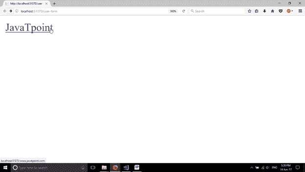
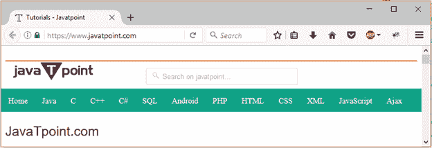

# ASP.NET 网页表单超链接

> 原文:[https://www.javatpoint.com/asp-net-hyperlink](https://www.javatpoint.com/asp-net-hyperlink)

这是一个用于创建超链接的控件。它响应点击事件。我们可以用它来引用服务器上的任何网页。

要创建**超链接**，我们可以编写代码或者使用 visual studio IDE 的拖放功能。该控件列在工具箱中。

这是一个服务器端控件，ASP.NET 提供了自己的标签来创建它。下面给出了例子。

```

< asp:HyperLinkID="HyperLink1" runat="server" Text="JavaTpoint" NavigateUrl="www.javatpoint.com" ></asp:HyperLink>

```

服务器将其呈现为 HTML 控件，并向浏览器生成以下代码。

```

<a id="HyperLink1" href="www.javatpoint.com">JavaTpoint</a>

```

该控件有自己的属性，如下所示。

| 财产 | 描述 |
| 访问密钥 | 它用于设置控件的键盘快捷键。 |
| tab 键索引 | 控件的制表符顺序。 |
| 背景色 | 它用于设置控件的背景色。 |
| 单元格的边框颜色 | 它用于设置控件的边框颜色。 |
| 边框宽度 | 它用于设置控件的边框宽度。 |
| 字体 | 它用于设置控件文本的字体。 |
| 前景色 | 它用于设置控件文本的颜色。 |
| 文本 | 它用于设置要为控件显示的文本。 |
| 工具提示 | 当鼠标在控件上时，它显示文本。 |
| 看得见的 | 设置窗体上控件的可见性。 |
| 高度 | 它用于设置控件的高度。 |
| 宽度 | 它用于设置控件的宽度。 |
| 浏览器 rl | 它用于设置导航网址。 |
| 目标 | 导航网址的目标框架。 |

## 例子

**// user-form.aspx**

```

<%@ Page Language="C#" AutoEventWireup="true" CodeBehind="user-form.aspx.cs" 
Inherits="asp.netexample.user_form" %>
<!DOCTYPE html>
<html >
<head runat="server">
    <title></title>
</head>
<body>
    <form id="form1" runat="server">
        <div>
            <asp:HyperLink ID="HyperLink1" runat="server" Text="JavaTpoint" NavigateUrl="www.javatpoint.com"></asp:HyperLink>
        </div>
    </form>
</body>
</html>

```

此属性窗口显示超链接控件的属性。



输出:



此链接重定向到 Javatpoint 主页。

