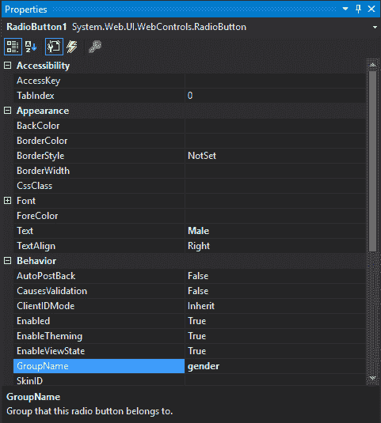
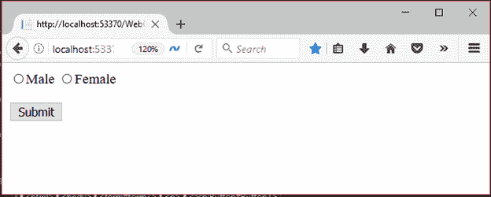
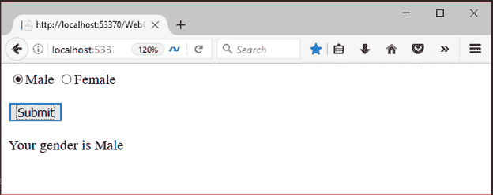

# ASP.NET 网页表单单选按钮

> 原文:[https://www.javatpoint.com/asp-net-radiobutton](https://www.javatpoint.com/asp-net-radiobutton)

它是一个输入控件，用于接受用户的输入。它允许用户从选项组中选择一个选项。

要创建 **RadioButton** ，我们可以从 visual studio 的工具箱中拖动它。

这是一个服务器端控件，ASP.NET 提供了自己的标签来创建它。下面给出了例子。

```

< asp:RadioButtonID="RadioButton1" runat="server" Text="Male" GroupName="gender"/>

```

服务器将其呈现为 HTML 控件，并向浏览器生成以下代码。

```

<input id="RadioButton1" type="radio" name="gender" value="RadioButton1" /><labelfor="RadioButton1">Male</label>

```

该控件有自己的属性，如下所示。

| 财产 | 描述 |
| 访问密钥 | 它用于设置控件的键盘快捷键。 |
| tab 键索引 | 控件的制表符顺序。 |
| 背景色 | 它用于设置控件的背景色。 |
| 单元格的边框颜色 | 它用于设置控件的边框颜色。 |
| 边框宽度 | 它用于设置控件的边框宽度。 |
| 字体 | 它用于设置控件文本的字体。 |
| 前景色 | 它用于设置控件文本的颜色。 |
| 文本 | 它用于设置要为控件显示的文本。 |
| 工具提示 | 当鼠标在控件上时，它显示文本。 |
| 看得见的 | 设置窗体上控件的可见性。 |
| 高度 | 它用于设置控件的高度。 |
| 宽度 | 它用于设置控件的宽度。 |
| 组名 | 它用于设置单选按钮组的名称。 |

## 例子

在这个例子中，我们创建了两个单选按钮，并放入了一个名为性别的组。

**// WebControls.aspx**

```

<%@ Page Language="C#" AutoEventWireup="true" CodeBehind="WebControls.aspx.cs" 
Inherits="WebFormsControlls.WebControls" %>
<!DOCTYPE html>
<html >
<head runat="server">
    <title></title>
</head>
<body>
    <form id="form1" runat="server">
        <div>
            <asp:RadioButton ID="RadioButton1" runat="server" Text="Male" GroupName="gender" />
            <asp:RadioButton ID="RadioButton2" runat="server" Text="Female" GroupName="gender" />
        </div>
        <p>
            <asp:Button ID="Button1" runat="server" Text="Submit" OnClick="Button1_Click" style="width: 61px" />
        </p>
    </form>
    <asp:Label runat="server" id="genderId"></asp:Label>
</body>
</html>

```

### 代码隐藏

**// WebControls.aspx.cs**

```

using System;
using System.Collections.Generic;
using System.Linq;
using System.Web;
using System.Web.UI;
using System.Web.UI.WebControls;
namespace WebFormsControlls
{
    public partial class WebControls : System.Web.UI.Page
    {
        protected void Button1_Click(object sender, EventArgs e)
        {
            genderId.Text = "";
            if (RadioButton1.Checked)
            {
                genderId.Text = "Your gender is "+RadioButton1.Text;
            }
            else genderId.Text = "Your gender is "+RadioButton2.Text;

        }
    }
}

```

对于这个控件，我们设置了如下一些属性:



输出:

它向浏览器生成以下输出。



当用户选择性别时，它会对客户端做出响应。

