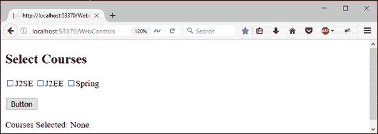
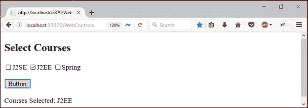

# ASP.NET 网络表单复选框

> 原文：<https://www.javatpoint.com/asp-net-checkbox>

它用于从用户处获取多个输入。它允许用户从选项集中选择选项。

它接受是或否格式的用户输入。当我们希望用户做出多种选择时，它非常有用。

要创建**复选框**，我们可以从 visual studio 的工具箱中拖动它。

这是一个服务器端控件，ASP.NET 提供了自己的标签来创建它。下面给出了例子。

```
< asp:CheckBox ID="CheckBox2" runat="server" Text="J2EE"/>

```

服务器将其呈现为 HTML 控件，并向浏览器生成以下代码。

```
< input id="CheckBox2" type="checkbox" name="CheckBox2" /><label for="CheckBox2">J2EE</label>

```

该控件有自己的属性，如下所示。

| 财产 | 描述 |
| 访问密钥 | 它用于设置控件的键盘快捷键。 |
| tab 键索引 | 控件的制表符顺序。 |
| 背景色 | 它用于设置控件的背景色。 |
| 单元格的边框颜色 | 它用于设置控件的边框颜色。 |
| 边框宽度 | 它用于设置控件的边框宽度。 |
| 字体 | 它用于设置控件文本的字体。 |
| 前景色 | 它用于设置控件文本的颜色。 |
| 文本 | 它用于设置要为控件显示的文本。 |
| 工具提示 | 当鼠标在控件上时，它显示文本。 |
| 看得见的 | 设置窗体上控件的可见性。 |
| 高度 | 它用于设置控件的高度。 |
| 宽度 | 它用于设置控件的宽度。 |
| 检查 | 它用于设置控件的检查状态为真或假。 |

## 例子

**// WebControls.aspx**

```
<%@ Page Language="C#" AutoEventWireup="true" CodeBehind="WebControls.aspx.cs" 
Inherits="WebFormsControlls.WebControls" %>
<!DOCTYPE html>
<html >
<head runat="server">
    <title></title>
</head>
<body>
    <form id="form1" runat="server">
        <div>
            <h2>Select Courses</h2>
            <asp:CheckBox ID="CheckBox1" runat="server" Text="J2SE" />
            <asp:CheckBox ID="CheckBox2" runat="server" Text="J2EE" />
            <asp:CheckBox ID="CheckBox3" runat="server" Text="Spring" />
        </div>
        <p>
            <asp:Button ID="Button1" runat="server" Text="Button" OnClick="Button1_Click" />
        </p>
    </form>
    <p>
        Courses Selected: <asp:Label runat="server" ID="ShowCourses"></asp:Label>
    </p>
</body>
</html>

```

### 代码隐藏

**// WebControls.aspx.cs**

```
using System;
using System.Collections.Generic;
using System.Linq;
using System.Web;
using System.Web.UI;
using System.Web.UI.WebControls;
namespace WebFormsControlls
{
    public partial class WebControls : System.Web.UI.Page
    {
        protected void Page_Load(object sender, EventArgs e)
        {
            ShowCourses.Text = "None";
        }
        protected void Button1_Click(object sender, EventArgs e)
        {
            var message = "" ;
            if (CheckBox1.Checked)
            {
                message = CheckBox1.Text+" ";
            }
            if (CheckBox2.Checked)
            {
                message += CheckBox2.Text + " ";
            }
            if (CheckBox3.Checked)
            {
                message += CheckBox3.Text;
            }
            ShowCourses.Text = message;
        }
    }
}

```



最初，没有选择课程，然后显示没有。它显示用户选择，如下图所示。

