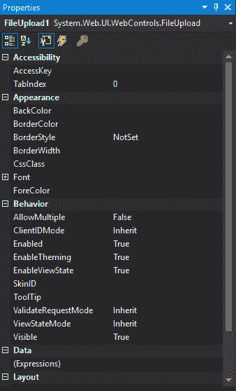
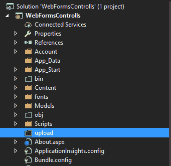
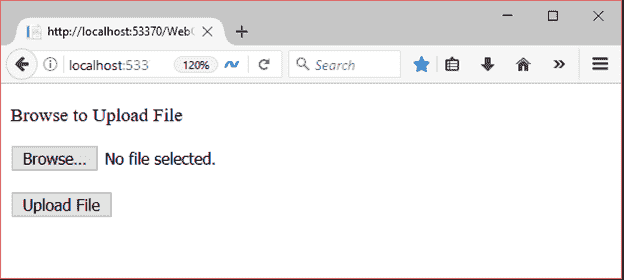
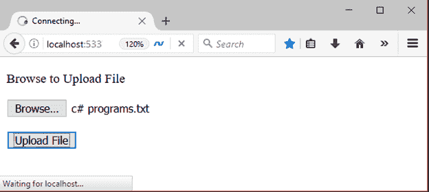
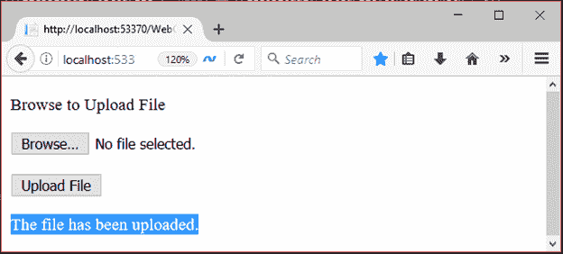
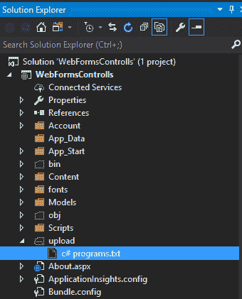

# ASP.NET 网络表单文件上传

> 原文:[https://www.javatpoint.com/asp-net-fileupload](https://www.javatpoint.com/asp-net-fileupload)

它是一个输入控制器，用于将文件上传到服务器。它在表单上创建一个浏览按钮，弹出一个窗口从本地机器上选择文件。

要实现**文件上传**我们可以从 visual studio 的工具箱中拖动。

这是一个服务器端控件，ASP.NET 提供了自己的标签来创建它。下面给出了例子。

```
< asp:FileUpload ID="FileUpload1" runat="server"/>

```

服务器将其呈现为 HTML 控件，并向浏览器生成以下代码。

```
<input name="FileUpload1" id="FileUpload1" type="file">

```

该控件有自己的属性，如下所示。

| 财产 | 描述 |
| 访问密钥 | 它用于设置控件的键盘快捷键。 |
| tab 键索引 | 控件的制表符顺序。 |
| 背景色 | 它用于设置控件的背景色。 |
| 单元格的边框颜色 | 它用于设置控件的边框颜色。 |
| 边框宽度 | 它用于设置控件的边框宽度。 |
| 字体 | 它用于设置控件文本的字体。 |
| 前景色 | 它用于设置控件文本的颜色。 |
| 文本 | 它用于设置要为控件显示的文本。 |
| 工具提示 | 当鼠标在控件上时，它显示文本。 |
| 看得见的 | 设置窗体上控件的可见性。 |
| 高度 | 它用于设置控件的高度。 |
| 宽度 | 它用于设置控件的宽度。 |
| 可选的 | 它用于通过设置 true 或 false 来允许上传多个文件。 |

## 文件上传属性窗口



## 例子

这里，我们以 web 形式实现文件上传控制。

**// WebControls.aspx**

```
<%@ Page Language="C#" AutoEventWireup="true" CodeBehind="WebControls.aspx.cs" 
Inherits="WebFormsControlls.WebControls" %>
<!DOCTYPE html>
<html >
<head runat="server">
    <title></title>
</head>
<body>
    <form id="form1" runat="server">
        <div>
            <p>Browse to Upload File</p>
            <asp:FileUpload ID="FileUpload1" runat="server" />
        </div>
        <p>
            <asp:Button ID="Button1" runat="server" Text="Upload File" OnClick="Button1_Click" />
        </p>
    </form>
    <p>
        <asp:Label runat="server" ID="FileUploadStatus"></asp:Label>
    </p>
</body>
</html>

```

### 密码

**// WebControls.aspx.cs**

```
using System;
using System.Collections.Generic;
using System.Linq;
using System.Web;
using System.Web.UI;
using System.Web.UI.WebControls;
namespace WebFormsControlls
{
    public partial class WebControls : System.Web.UI.Page
    {
        protected System.Web.UI.HtmlControls.HtmlInputFile File1;
        protected System.Web.UI.HtmlControls.HtmlInputButton Submit1;
        protected void Page_Load(object sender, EventArgs e)
        {
        }
        protected void Button1_Click(object sender, EventArgs e)
        {
            if ((FileUpload1.PostedFile != null) && (FileUpload1.PostedFile.ContentLength > 0))
            {
                string fn = System.IO.Path.GetFileName(FileUpload1.PostedFile.FileName);
                string SaveLocation = Server.MapPath("upload") + "\\" + fn;
                try
                {
                    FileUpload1.PostedFile.SaveAs(SaveLocation);
                    FileUploadStatus.Text = "The file has been uploaded.";
                }
                catch (Exception ex)
                {
                    FileUploadStatus.Text = "Error: " + ex.Message;
                }
            }
            else
            {
                FileUploadStatus.Text = "Please select a file to upload.";
            }
        }
    }
}

```

在项目中创建一个目录来存储上传的文件，就像我们在下面的截图中所做的那样。

输出:



输出:

运行代码，它产生以下输出。



我们正在上传一个文件**c # programs . txt**



上传后显示文件上传成功消息，如下图所示。



文件存储到**上传**文件夹。查看文件夹内部，它显示上传的文件存在。

