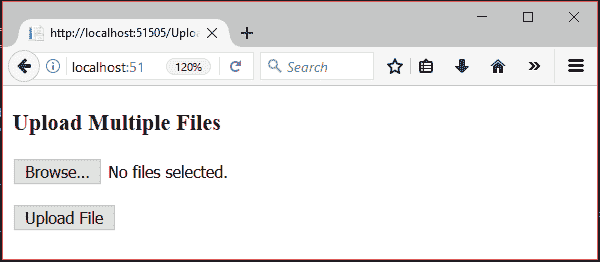
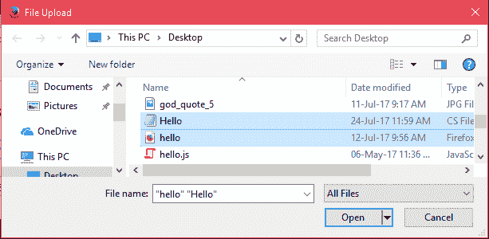
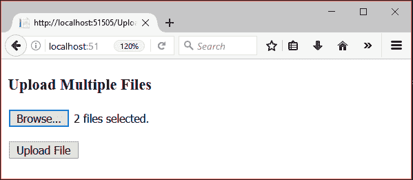
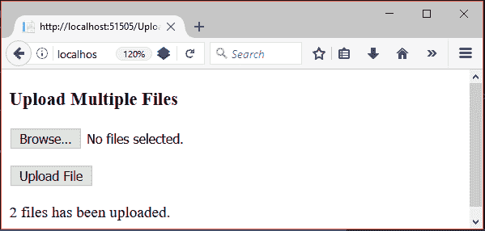
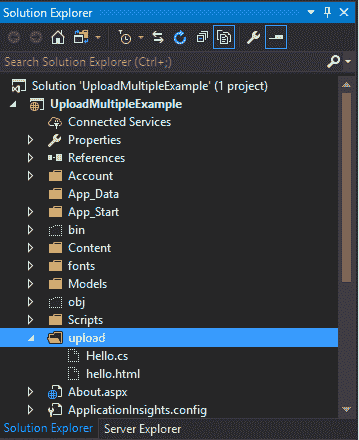

# ASP.NET 上传多个文件

> 原文:[https://www.javatpoint.com/asp-net-upload-multiple-files](https://www.javatpoint.com/asp-net-upload-multiple-files)

ASP.NET 文件上传控件提供 **AllowMultiple** 属性将多个文件上传到服务器。该属性取真值或假值。

**< asp:FileUpload >** 标签用来创建一个浏览按钮，允许我们上传文件。让？让我们创建一个上传多个文件的示例。

## ASP.NET 上传多个文件示例

本示例包含以下文件。

### //uploadmultiplefilestame . aspx

```
<%@ Page Language="C#" AutoEventWireup="true" 
CodeBehind="UploadMultipleFilesExample.aspx.cs" Inherits="UploadMultipleExample.UploadMultipleFilesExample" %>
<!DOCTYPE html>  
    <html >  
    <head runat="server">  
        <title></title>  
    </head>  
    <body>  
        <form id="form1" runat="server">  
            <div>  
                <h3>Upload Multiple Files</h3>  
                <asp:FileUpload ID="FileUpload1" runat="server" AllowMultiple="true" />  
            </div>  
            <p>  
                <asp:Button ID="Button1" runat="server" Text="Upload File" OnClick="Button1_Click" />  
            </p>  
        </form>  
        <p>  
            <asp:Label runat="server" ID="FileUploadStatus"></asp:Label>  
        </p>  
    </body>  
    </html>  

```

### //uploadmultiplefilestame . aspx . cs

```
using System;
using System.Collections.Generic;
using System.Linq;
using System.Web;
using System.Web.UI;
using System.Web.UI.WebControls;
namespace UploadMultipleExample
{
    public partial class UploadMultipleFilesExample : System.Web.UI.Page
    {
        protected void Page_Load(object sender, EventArgs e)
        {
        }
        protected void Button1_Click(object sender, EventArgs e)
        {
            if ((FileUpload1.PostedFile != null) && (FileUpload1.PostedFile.ContentLength > 0))
            {
                var count = 0;
                foreach (HttpPostedFile uploadedFile in FileUpload1.PostedFiles)
                {
                    string fn = System.IO.Path.GetFileName(uploadedFile.FileName);
                    string SaveLocation = Server.MapPath("upload") + "\\" + fn;
                    try
                    {
                        uploadedFile.SaveAs(SaveLocation);
                        count++;
                    }
                    catch (Exception ex)
                    {
                        FileUploadStatus.Text = "Error: " + ex.Message;
                    }
                }
                if (count > 0)
                {
                    FileUploadStatus.Text = count + " files has been uploaded.";
                }
            }
            else
            {
                FileUploadStatus.Text = "Please select a file to upload.";
            }
        }
    }
}

```

输出:



选择要上传的 2 个文件




首先，上传文件夹是空的。


将文件上传到服务器。



现在看**上传**文件夹。它包含上传的两个文件。

