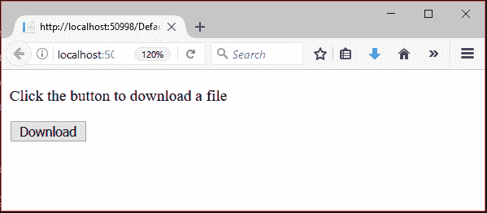
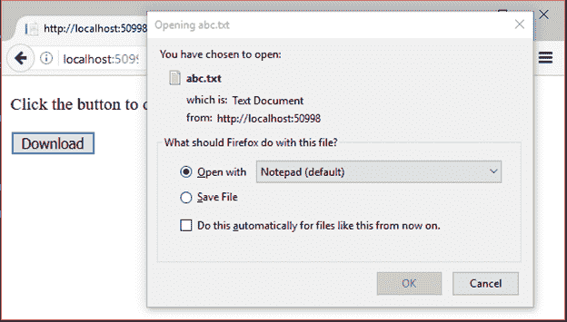

# ASP.NET 下载文件

> 原文:[https://www.javatpoint.com/asp-net-download-file](https://www.javatpoint.com/asp-net-download-file)

ASP.NET 提供了隐式对象**响应**及其从服务器下载文件的方法。我们可以在我们的应用程序中使用这些方法来添加从服务器下载文件到本地机器的功能。

这里，我们正在创建一个允许我们下载文件的例子。

## ASP.NET 下载文件示例

### // Default.aspx

```
<%@ Page Title="Home Page" Language="C#" AutoEventWireup="true" 
CodeBehind="Default.aspx.cs" Inherits="FileDownloadExample._Default" %>
<form id="form1" runat="server">
    <p>
        Click the button to download a file</p>
    <asp:Button ID="Button1" runat="server" OnClick="Button1_Click" Text="Download" />
    <br />
    <br />
    <asp:Label ID="Label1" runat="server"></asp:Label>
</form>

```

## 密码

### // Default.aspx.cs

```
using System;
using System.Collections.Generic;
using System.IO;
using System.Linq;
using System.Web;
using System.Web.UI;
using System.Web.UI.WebControls;
namespace FileDownloadExample
{
    public partial class _Default : Page
    {
        protected void Page_Load(object sender, EventArgs e)
        {
        }
        protected void Button1_Click(object sender, EventArgs e)
        {
            string filePath = "C:\\Users\\Admi\\Desktop\\abc.txt";
            FileInfo file = new FileInfo(filePath);
            if (file.Exists)
            {
                // Clear Rsponse reference
                Response.Clear();
                // Add header by specifying file name
                Response.AddHeader("Content-Disposition", "attachment; filename=" + file.Name);
                // Add header for content length
                Response.AddHeader("Content-Length", file.Length.ToString());
                // Specify content type
                Response.ContentType = "text/plain";
                // Clearing flush
                Response.Flush();
                // Transimiting file
                Response.TransmitFile(file.FullName);
                Response.End();
            }
            else Label1.Text = "Requested file is not available to download";
        }
    }
}

```

输出:



该应用程序将提示一个窗口从服务器下载文件。

