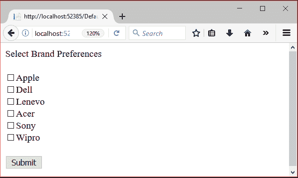
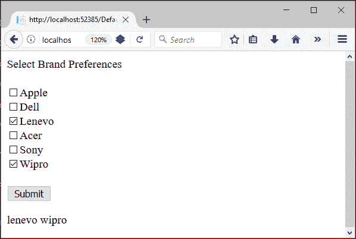

# ASP.NET 饼干

> 原文：<https://www.javatpoint.com/asp-net-cookie>

ASP.NET Cookie 是一小段用于存储用户特定信息的文本。每当用户访问网站时，web 应用程序都可以读取这些信息。

当用户请求一个网页时，网络服务器不仅发送一个网页，还发送一个包含日期和时间的 cookie。该 cookie 存储在用户硬盘上的一个文件夹中。

当用户再次请求网页时，浏览器会在硬盘上查找与网页关联的 cookie。浏览器为用户访问的每个不同站点存储单独的 cookie。

#### 注意:Cookie 的大小有限，只能用来存储 4 KB (4096 字节)的文本。

有两种方法可以在 ASP.NET 应用程序中存储 cookies。

*   饼干收藏
*   HttpCookie

我们可以将 Cookie 添加到 Cookies 集合中，或者通过创建 HttpCookie 类的实例。除了 HttpCookie 需要 Cookie 名称作为构造函数一部分之外，两者的工作原理相同。

* * *

## HttpCookie 示例

在下面的例子中，我们在 HttpCookie 类的帮助下创建和添加 cookie。

### // CookieExample.aspx

```
<%@ Page Language="C#" AutoEventWireup="true" 
CodeBehind="CookieExample.aspx.cs" Inherits="CoockieExample.CookieExample" %>
<!DOCTYPE html>
<html >
<head runat="server">
    <title></title>
</head>
<body>
    <form id="form1" runat="server">
        <div>
            <asp:Label ID="Label1" runat="server" Text="Label"></asp:Label>
        </div>
    </form>
</body>
</html>

```

## 密码

### // CookieExample.aspx.cs

```
using System;
using System.Web;
namespace WebFormsControlls
{
    public partial class CookieExample : System.Web.UI.Page
    {
        protected void Page_Load(object sender, EventArgs e)
        {
            //-------------- Creating Cookie --------------------------//
            // Creating HttpCookie instance by specifying name "student"
                HttpCookie cokie = new HttpCookie("student");
            // Assigning value to the created cookie
                cokie.Value = "Rahul Kumar";
            // Adding Cookie to the response instance
                Response.Cookies.Add(cokie);
            //--------------- Fetching Cookie -------------------------//
            var co_val  = Response.Cookies["student"].Value;
            Label1.Text = co_val;
        }
    }
}

```

## Cookie 收集示例

在下面的示例中，我们将 cookie 直接添加到 cookie 集合中。

### // Default.aspx

```
<%@ Page Title="Home Page" Language="C#" AutoEventWireup="true" CodeBehind="Default.aspx.cs"
Inherits="CoockieExample._Default" %>
<form id="form1" runat="server">
    <asp:Label ID="Label1" runat="server" Text="Select Brand Preferences"></asp:Label>
    <br />
    <br />
    <asp:CheckBox ID="apple" runat="server" Text="Apple" />
    <br />
    <asp:CheckBox ID="dell" runat="server" Text="Dell" />
    <br />
    <asp:CheckBox ID="lenevo" runat="server" Text="Lenevo" />
    <br />
    <asp:CheckBox ID="acer" runat="server" Text="Acer" />
    <br />
    <asp:CheckBox ID="sony" runat="server" Text="Sony" />
    <br />
    <asp:CheckBox ID="wipro" runat="server" Text="Wipro" />
    <br />
    <br />
    <asp:Button ID="Button1" runat="server" OnClick="Button1_Click" Text="Submit" />
    <p>
        <asp:Label ID="Label2" runat="server"></asp:Label>
    </p>
</form>

```

## 代码隐藏

### // Default.aspx.cs

```
using System;
using System.Web.UI;
namespace CoockieExample
{
    public partial class _Default : Page
    {
        protected void Page_Load(object sender, EventArgs e)
        {
            // Setting expiring date and time of the cookies
            Response.Cookies["computer"].Expires = DateTime.Now.AddDays(-1);
        }
        protected void Button1_Click(object sender, EventArgs e)
        {
            Label2.Text = "";
            // --------------- Adding Coockies ---------------------//
            if (apple.Checked)
                Response.Cookies["computer"]["apple"]  = "apple";
            if (dell.Checked)
                Response.Cookies["computer"]["dell"]   = "dell";
            if (lenevo.Checked)
                Response.Cookies["computer"]["lenevo"] = "lenevo";
            if (acer.Checked)
                Response.Cookies["computer"]["acer"]   = "acer";
            if (sony.Checked)
                Response.Cookies["computer"]["sony"]   = "sony";
            if (wipro.Checked)
                Response.Cookies["computer"]["wipro"]  = "wipro";
            // --------------- Fetching Cookies -----------------------//
            if (Request.Cookies["computer"].Values.ToString() != null)
            {
                if (Request.Cookies["computer"]["apple"] != null)
                    Label2.Text += Request.Cookies["computer"]["apple"] + " ";
                if (Request.Cookies["computer"]["dell"] != null)
                    Label2.Text += Request.Cookies["computer"]["dell"] + " ";
                if (Request.Cookies["computer"]["lenevo"] != null)
                    Label2.Text += Request.Cookies["computer"]["lenevo"] + " ";
                if (Request.Cookies["computer"]["acer"] != null)
                    Label2.Text += Request.Cookies["computer"]["acer"] + " ";
                if (Request.Cookies["computer"]["sony"] != null)
                    Label2.Text += Request.Cookies["computer"]["sony"] + " ";
                if (Request.Cookies["computer"]["wipro"] != null)
                    Label2.Text += Request.Cookies["computer"]["wipro"] + " ";
            }else Label2.Text = "Please select your choice";
            Response.Cookies["computer"].Expires = DateTime.Now.AddDays(-1);
        }
    }
}

```

输出:

本示例将选定的值存储为 cookie。


