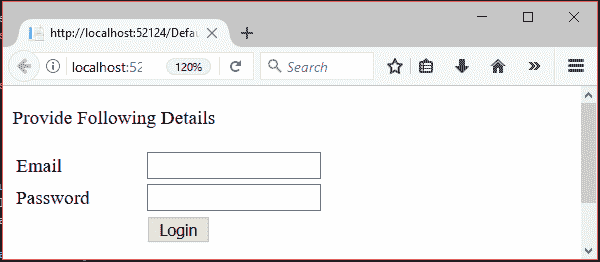

# ASP.NET 会议

> 原文:[https://www.javatpoint.com/asp-net-session](https://www.javatpoint.com/asp-net-session)

在 ASP.NET，会话是一种用于存储和检索用户值的状态。

它有助于识别一段时间(会话)内来自同一浏览器的请求。它用于存储特定时间会话的值。默认情况下，所有 ASP.NET 应用程序都启用了 ASP.NET 会话状态。

每个创建的会话都存储在**sessionstaitem collection**对象中。我们可以使用**页面**对象的**会话**属性获取当前会话值。让我们看一个例子，如何在 ASP.NET 应用程序中创建访问会话。

* * *

## ASP.NET 会议示例

在下面的示例中，我们正在创建一个会话并存储用户电子邮件。本示例包含以下文件。

### // Default.aspx

```
<%@ Page Title="Home Page" Language="C#" AutoEventWireup="true" CodeBehind="Default.aspx.cs"
Inherits="SessionExample._Default" %>
<head>
    <style type="text/css">
        .auto-style1 {
            width: 100%;
        }
        .auto-style2 {
            width: 105px;
        }
    </style>
</head>
<form id="form1" runat="server">
    <p>Provide Following Details</p>
    <table class="auto-style1">
        <tr>
            <td class="auto-style2">Email</td>
            <td>
                <asp:TextBox ID="email" runat="server" TextMode="Email"></asp:TextBox>
            </td>
        </tr>
        <tr>
            <td class="auto-style2">Password</td>
            <td>
                <asp:TextBox ID="password" runat="server" TextMode="Password"></asp:TextBox>
            </td>
        </tr>
        <tr>
            <td class="auto-style2"></td>
            <td>
                <asp:Button ID="login" runat="server" Text="Login" OnClick="login_Click" />
            </td>
        </tr>
    </table>
    <br />
    <asp:Label ID="Label3" runat="server"></asp:Label>
    <br />
    <asp:Label ID="Label4" runat="server"></asp:Label>
</form>

```

## 密码

### // Default.aspx.cs

```
using System;
using System.Web.UI;
namespace SessionExample
{
    public partial class _Default : Page
    {
        protected void login_Click(object sender, EventArgs e)
        {
            if (password.Text=="qwe123")
            {
                // Storing email to Session variable
                Session["email"] = email.Text;
            }
            // Checking Session variable is not empty
            if (Session["email"] != null)
            {
                // Displaying stored email
                Label3.Text = "This email is stored to the session.";
                Label4.Text = Session["email"].ToString();
            }
        }
    }
}

```

输出:

```
This application will store user email to the session when user login.

```



它将显示存储的会话值、用户电子邮件。

