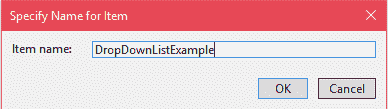
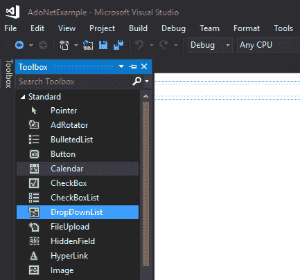
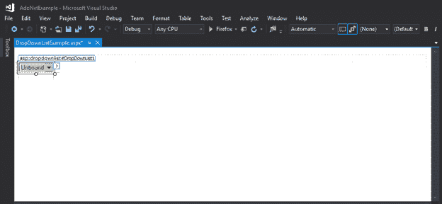
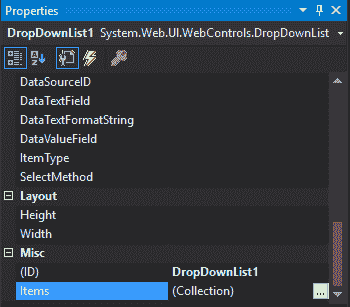
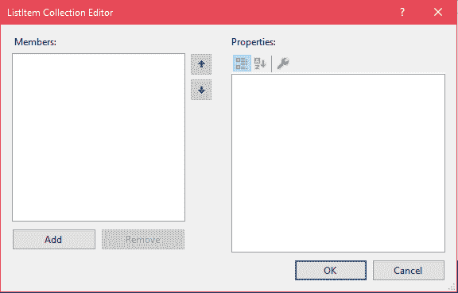
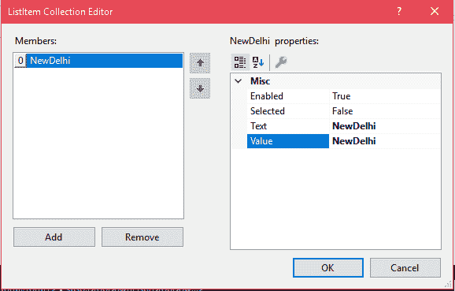
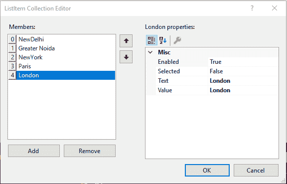
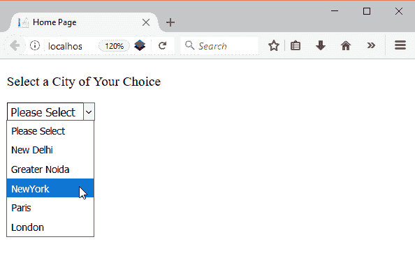
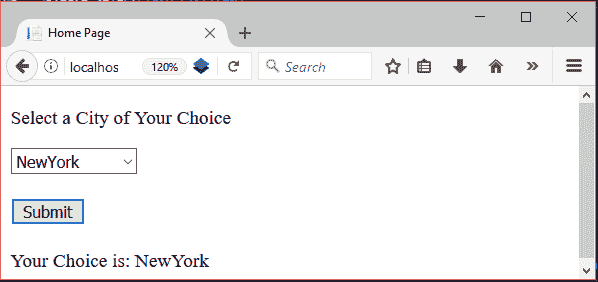

# ASP.NET 下载列表

> 原文：<https://www.javatpoint.com/asp-net-dropdownlist>

DropDownList 是一个网络服务器控件，用于创建一个 HTML 选择组件。它允许我们从下拉列表中选择一个选项。它可以包含任意数量的项目

ASP.NET 提供了一个标签来为 web 应用程序创建 DropDownList。以下是 DropDownList 标记的语法。

```
<asp:DropDownList id="DropDownList1" runat="server"
     DataSource="<% databindingexpression %>"
     DataTextField="DataSourceField"
     DataValueField="DataSourceField"
     AutoPostBack="True|False"
     OnSelectedIndexChanged="OnSelectedIndexChangedMethod">
   <asp:ListItem value="value" selected="True|False">
      Text
   </asp:ListItem>
</asp:DropDownList>

```

## ASP.NET 下载列表示例

我们正在使用 Visual Studio 2017 创建 DropDownList。该示例包括以下步骤。

### 创建网页表单

通过指定名称添加新表单。



最初，它是一个空的形式。现在，我们将通过从工具箱中拖动来添加一个新的 DropDownList。



拖动后，我们的 web 表单如下所示。



现在，为了向列表中添加项目，visual studio 提供了 **Items** 属性，我们可以在其中添加项目。属性窗口如下所示。



点击项目(集合)，它将弹出一个新窗口，如下所示。最初，它没有任何项目。它提供**添加**按钮，向列表中添加新项目。



通过向“文本”和“值”属性提供值，将项目添加到下拉列表中。



我们已经添加了更多的项目，现在，它看起来如下。



单击“确定”后，

* * *

## DropDownListExample.aspx

```
<%@ Page Title="Home Page" Language="C#" AutoEventWireup="true" 
CodeBehind="Default.aspx.cs" Inherits="DropDownListExample._Default" %>
<!DOCTYPE html>
<html >
<head runat="server">
    <title></title>
</head>
<body>
    <form id="form1" runat="server">
        <p>Select a City of Your Choice</p>
        <div>
            <asp:DropDownList ID="DropDownList1" runat="server" >
            <asp:ListItem Value="">Please Select</asp:ListItem>
            <asp:ListItem>New Delhi </asp:ListItem>
            <asp:ListItem>Greater Noida</asp:ListItem>
            <asp:ListItem>NewYork</asp:ListItem>
            <asp:ListItem>Paris</asp:ListItem>
            <asp:ListItem>London</asp:ListItem>
        </asp:DropDownList>
        </div>
        <br />
        <asp:Button ID="Button1" runat="server" OnClick="Button1_Click" Text="Submit" />
        <br />
        <br />
        <asp:Label ID="Label1" runat="server" EnableViewState="False"></asp:Label>
    </form>
</body>
</html>

```

### // DropDownListExample.aspx.cs

```
using System;
using System.Collections.Generic;
using System.Linq;
using System.Web;
using System.Web.UI;
using System.Web.UI.WebControls;
namespace DropDownListExample
{
    public partial class _Default : Page
    {
        protected void Page_Load(object sender, EventArgs e)
        {
        }
        protected void Button1_Click(object sender, EventArgs e)
        {
            if (DropDownList1.SelectedValue == "")
            {
                Label1.Text = "Please Select a City";
            }
            else
                Label1.Text = "Your Choice is: " + DropDownList1.SelectedValue;
        }
    }
}

```

输出:



在服务器端，提取选定的城市并显示给用户。

