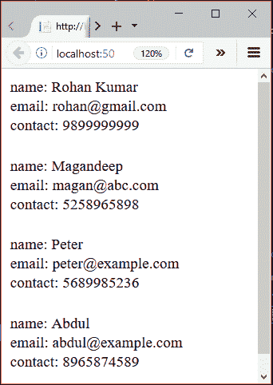

# ASP.NET 数据列表

> 原文：<https://www.javatpoint.com/asp-net-datalist>

ASP.NET 数据列表控件是一个轻量级的服务器端控件，用作数据项的容器。它用于以列表格式向网页显示数据。

它显示来自数据源的数据。数据源可以是数据表，也可以是数据库中的表。

在这里，首先，我们创建从数据表中获取数据的数据列表。该示例包括以下文件。

* * *

## 带有数据表的 ASP.NET 数据表示例

【t0///数据列表示例 2 . aspx】t1

```cs
<%@ Page Language="C#" AutoEventWireup="true" CodeBehind="DataListExample2.aspx.cs" 
Inherits="DataListExample.DataListExample2" %>
<!DOCTYPE html>
<html >
<head runat="server">
    <title></title>
</head>
<body>
    <form id="form1" runat="server">
        <div>
            <p>The DataList shows data of DataTable</p>
        </div>
        <asp:DataList ID="DataList1" runat="server">
            <ItemTemplate>
                <table cellpadding="2" cellspacing="0" border="1" style="width: 300px; height: 100px; 
				border: dashed 2px #04AFEF; background-color: #FFFFFF">
                    <tr>
                        <td>
                            <b>ID: </b><span class="city"><%# Eval("ID") %></span><br />
                            <b>Name: </b><span class="postal"><%# Eval("Name") %></span><br />
                            <b>Email: </b><span class="country"><%# Eval("Email")%></span><br />
                        </td>
                    </tr>
                </table>
            </ItemTemplate>
        </asp:DataList>
    </form>
</body>
</html>

```

## 代码隐藏

【t0///数据列表示例 2 . aspx . cs】t1

```cs
using System;
using System.Collections.Generic;
using System.Data;
using System.Linq;
using System.Web;
using System.Web.UI;
using System.Web.UI.WebControls;
namespace DataListExample
{
    public partial class DataListExample2 : System.Web.UI.Page
    {
        protected void Page_Load(object sender, EventArgs e)
        {
            DataTable table = new DataTable();
            table.Columns.Add("ID");
            table.Columns.Add("Name");
            table.Columns.Add("Email");
            table.Rows.Add("101", "Sachin Kumar", "sachin@example.com");
            table.Rows.Add("102", "Peter", "peter@example.com");
            table.Rows.Add("103", "Ravi Kumar", "ravi@example.com");
            table.Rows.Add("104", "Irfan", "irfan@example.com");
            DataList1.DataSource = table;
            DataList1.DataBind();   
        }
    }
}

```

输出:

它向浏览器生成以下输出。


* * *

## ASP.NET 数据列表示例和数据库

本示例从数据库表中获取数据，包括以下步骤。

### 1)添加网页表单

添加一个 web 表单，将数据列表拖到它上面，就像我们在下面的屏幕截图中所做的那样。


从工具箱的数据类别中选择数据列表。


将数据列表拖到表单中。拖动后，如下图所示。


现在，我们需要配置数据库连接。点击它并设置新的数据源。


它将弹出一个包含各种数据源的新窗口。选择 SQL 数据库，然后单击确定。


选择数据源后，现在需要选择数据连接。但是在继续之前，请将连接字符串添加到 **web.config** 文件中。

**// web.config**

```cs
<connectionStrings>
    <add name="DefaultConnection" connectionString="Data Source=(LocalDb)\MSSQLLocalDB;
	AttachDbFilename=|DataDirectory|\aspnet-AdoNetExample-20170712102014.mdf;
	Initial Catalog=aspnet-AdoNetExample-20170712102014;Integrated Security=True"
      providerName="System.Data.SqlClient" />
    <add name="StudentConnectionString" 
	connectionString="Data Source=DESKTOP-EDFPJEL;Initial Catalog=Student;Integrated Security=True"
      providerName="System.Data.SqlClient" />
  </connectionStrings>

```

数据源是连接 SQL Server 所需的连接的名称。对于其他计算机系统来说可能会有所不同。


单击“下一步”后，它会要求配置 select 语句。


它允许我们选择要获取自定义记录的列数。还提供&ast;选项，选择所有列记录。

现在，测试配置的查询，它是否工作，正如我们在下面的截图中所做的那样。


完成配置后，我们的数据列表如下所示:


这个**“DataListExample . aspx”**文件包含以下代码。

```cs
<%@ Page Language="C#" AutoEventWireup="true" 
CodeBehind="DataListExample.aspx.cs" Inherits="AdoNetExample.DataListExample" %>
<!DOCTYPE html>
<html >
<head runat="server">
    <title></title>
</head>
<body>
    <form id="form1" runat="server">
        <div>
        </div>
        <asp:DataList ID="DataList1" runat="server" DataSourceID="SqlDataSource1">
            <ItemTemplate>
                name:
                <asp:Label ID="nameLabel" runat="server" Text='<%# Eval("name") %>' />
                <br />
                email:
                <asp:Label ID="emailLabel" runat="server" Text='<%# Eval("email") %>' />
                <br />
                contact:
                <asp:Label ID="contactLabel" runat="server" Text='<%# Eval("contact") %>' />
                <br />
<br />
            </ItemTemplate>
        </asp:DataList>
        <asp:SqlDataSource ID="SqlDataSource1" runat="server" ConnectionString="<%$ 
        ConnectionStrings:StudentConnectionString %>" 
		SelectCommand="SELECT * FROM [student]"></asp:SqlDataSource>
    </form>
</body>
</html>

```

输出:

该应用程序产生以下输出。

