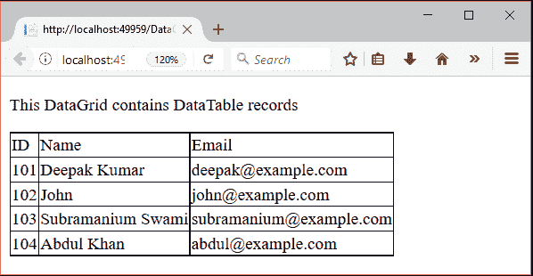
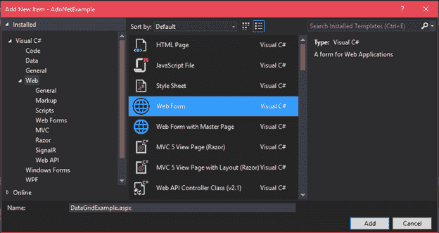
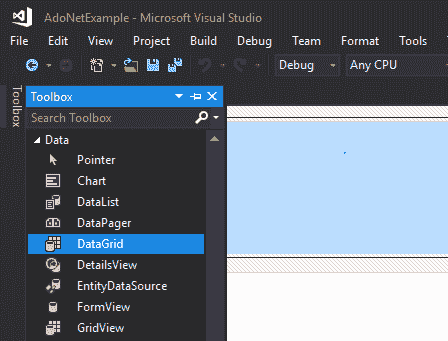
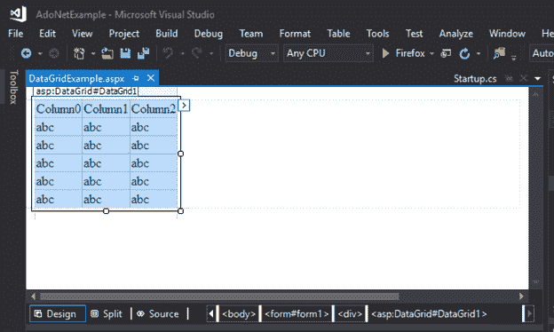
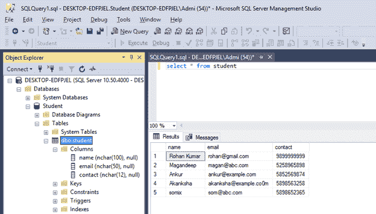
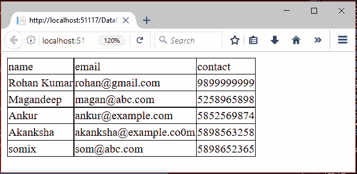

# ASP.NET 数据网格

> 原文：<https://www.javatpoint.com/asp-net-datagrid>

.NET 框架提供了数据网格控件来显示网页上的数据。它是在年引进的.NET 1.0，现已被弃用。数据网格用于在可滚动网格中显示数据。它需要数据源来填充网格中的数据。

它是一个服务器端控件，可以从工具箱拖动到 web 窗体。数据网格的数据源可以是数据表，也可以是数据库。让我们看一个例子，如何在我们的应用程序中创建一个数据网格。

本教程包含两个示例。一是使用数据表，二是使用数据库将数据显示到数据网格中。

* * *

## 带有数据表的 ASP.NET 数据网格示例

本示例使用数据表将数据绑定到数据网格控件。

**// DataGridExample2.aspx**

```
<%@ Page Language="C#" AutoEventWireup="true" CodeBehind="DataGridExample2.aspx.cs" Inherits="DataGridExample.DataGridExample2" %>
<!DOCTYPE html>
<html >
<head runat="server">
    <title></title>
</head>
<body>
    <form id="form1" runat="server">
        <div>
            <p>This DataGrid contains DataTable records </p>
            <asp:DataGrid ID="DataGrid1" runat="server">
        </asp:DataGrid>
        </div>
    </form>
</body>
</html>

```

## 代码隐藏

**//DataGridExample 2 . aspx . cs**

```
using System;
using System.Data;
namespace DataGridExample
{
    public partial class DataGridExample2 : System.Web.UI.Page
    {
        protected void Page_Load(object sender, EventArgs e)
        {
            DataTable table = new DataTable();
            table.Columns.Add("ID");
            table.Columns.Add("Name");
            table.Columns.Add("Email");
            table.Rows.Add("101", "Deepak Kumar", "deepak@example.com");
            table.Rows.Add("102", "John", "john@example.com");
            table.Rows.Add("103", "Subramanium Swami", "subramanium@example.com");
            table.Rows.Add("104", "Abdul Khan", "abdul@example.com");
            DataGrid1.DataSource = table;
            DataGrid1.DataBind();
        }
    }
}

```

输出:

它向浏览器生成以下输出。



* * *

## 带有数据库的 ASP.NET 数据网格示例

本示例使用数据库作为数据源向数据网格显示数据。该示例包括以下步骤。

### 1)添加网页表单

创建一个新表单，将数据网格拖到其上。看，正如我们在下面的截图中所做的。



添加后，现在，打开工具箱并将数据网格控件拖动到表单中。



拖动后，最初看起来如下。



该表单在后端包含以下源代码。

**// DataGridExample.aspx**

```
<%@ Page Language="C#" AutoEventWireup="true" 
CodeBehind="DataGridExample.aspx.cs" Inherits="AdoNetExample.DataGridExample" %>
<!DOCTYPE html>
<html >
<head runat="server">
    <title></title>
</head>
<body>
    <form id="form1" runat="server">
        <div>
        </div>
        <asp:DataGrid ID="DataGrid1" runat="server">
        </asp:DataGrid>
    </form>
</body>
</html>

```

### 2)连接到数据库

在代码隐藏文件中，我们有数据库连接的代码，并将提取的记录绑定到数据网格。

## 代码隐藏文件

**//DataGridExample . aspx . cs**

```
using System;
using System.Data;
using System.Data.SqlClient;
namespace AdoNetExample
{
    public partial class DataGridExample : System.Web.UI.Page
    {
        protected void Page_Load(object sender, EventArgs e)
        {
            using (SqlConnection con = new SqlConnection("data source=.; database=student; integrated security=SSPI"))
            {
                SqlDataAdapter sde = new SqlDataAdapter("Select * from student", con);
                DataSet ds = new DataSet();
                sde.Fill(ds);
                DataGrid1.DataSource = ds;
                DataGrid1.DataBind();
            }
        }
    }
}

```

* * *

## SQL Server 表中的记录

一个**学生**表包含了我们想要使用数据网格显示的记录。此表包含以下记录。



输出:

在执行这个应用程序之后，它从 SQL 服务器获取记录，并显示在网络浏览器上。

