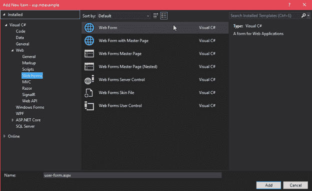

# 创建用户注册表单

> 原文：<https://www.javatpoint.com/asp-net-web-form-user-registration>

在学习了 web 服务器控件之后，现在让我们创建一个用户注册表单。该 web 表单接受用户输入并提交给服务器。提交后，返回注册成功的消息。整个过程需要以下步骤。

1.  **向项目添加网页表单**




这个表单包含一些默认的 html 代码。


7.  **向表单添加控件**

要将控件添加到表单中，我们可以从工具箱中拖动组件，或者手动编写代码来创建组件。

以下文件包含用户注册表单的代码。

**// WebControls.aspx**

```cs

<%@ Page Language="C#" AutoEventWireup="true" CodeBehind="WebControls.aspx.cs" 
Inherits="WebFormsControlls.WebControls" %>
<!DOCTYPE html>
<html >
<head runat="server">
<title></title>
<style type="text/css">
.auto-style1 {
     width: 100%;
      }
.auto-style2 {
     width: 278px;
       }
.auto-style3 {
      width: 278px;
      height: 23px;
        }
.auto-style4 {
      height: 23px;
        }
</style>
</head>
<body>
<form id="form1" runat="server">
<div>         
  <table class="auto-style1">
    <tr>
    <td>
    <asp:Label ID="Label1" runat="server" Text="User Name"></asp:Label>
    </td>
    <td>
    <asp:TextBox ID="username" runat="server" required="true"></asp:TextBox></td>
    </tr>
    <tr>
    <td>
    <asp:Label ID="Label6" runat="server" Text="Email ID"></asp:Label>
    </td>
    <td>
    <asp:TextBox ID="EmailID" runat="server" TextMode="Email"></asp:TextBox></td>
    </tr>
    <tr>
    <td>
    <asp:Label ID="Label2" runat="server" Text="Password"></asp:Label></td>
    <td>
    <asp:TextBox ID="TextBox2" runat="server" TextMode="Password"></asp:TextBox></td>
    </tr>
    <tr>
    <td>
    <asp:Label ID="Label3" runat="server" Text="Confirm Password"></asp:Label></td>
    <td>
    <asp:TextBox ID="TextBox3" runat="server" TextMode="Password"></asp:TextBox></td>
    </tr>
    <tr>
    <td>
    <asp:Label ID="Label4" runat="server" Text="Gender"></asp:Label></td>
    <td>
    <asp:RadioButton ID="RadioButton1" runat="server" GroupName="gender" Text="Male" />
	<asp:RadioButton ID="RadioButton2" runat="server" GroupName="gender" Text="Female" /></td>
    </tr>
    <tr>
    <td>
    <asp:Label ID="Label5" runat="server" Text="Select Course"></asp:Label>s</td>
    <td>
    <asp:CheckBox ID="CheckBox1" runat="server" Text="J2SEE" />
	<asp:CheckBox ID="CheckBox2" runat="server" Text="J2EE" />
	<asp:CheckBox ID="CheckBox3" runat="server" Text="Spring Framework" />
    </td>
    </tr>
    <tr>
    <td>
    </td>
    <td>
    <br />
    <asp:Button ID="Button1" runat="server" Text="Register" CssClass="btn btn-primary" OnClick="Button1_Click"/>
    </td>
    </tr>
    </table>
    <asp:Label ID="message" runat="server" Font-Size="Medium" ForeColor="Red"></asp:Label>
    </div>
    </form>
    <table class="auto-style1">
    <tr>
    <td class="auto-style2"><asp:Label ID="ShowUserNameLabel" runat="server" ></asp:Label></td>
    <td>
    <asp:Label ID="ShowUserName" runat="server" ></asp:Label></td>
    </tr>
    <tr>
    <td class="auto-style2"><asp:Label ID="ShowEmailIDLabel" runat="server" ></asp:Label></td>
    <td>
    <asp:Label ID="ShowEmail" runat="server" ></asp:Label></td>
    </tr>
    <tr>
    <td class="auto-style3"><asp:Label ID="ShowGenderLabel" runat="server" ></asp:Label></td>
    <td class="auto-style4">
    <asp:Label ID="ShowGender" runat="server" ></asp:Label></td>
    </tr>
    <tr>
    <td class="auto-style2"><asp:Label ID="ShowCourseLabel" runat="server" ></asp:Label></td>
    <td>
    <asp:Label ID="ShowCourses" runat="server" ></asp:Label></td>
    </tr>
    </table>
</body>
</html>

```

12.  **处理提交请求**

在文件后面的代码中，我们添加了一条消息，该消息仅在用户提交注册表单时触发。该文件包括以下代码。

**// WebControls.aspx.cs**

```cs

using System;
using System.Collections.Generic;
using System.Linq;
using System.Web;
using System.Web.UI;
using System.Web.UI.WebControls;
namespace WebFormsControlls
{
    public partial class WebControls : System.Web.UI.Page
    {
        protected System.Web.UI.HtmlControls.HtmlInputFile File1;
        protected System.Web.UI.HtmlControls.HtmlInputButton Submit1;
        protected void Page_Load(object sender, EventArgs e)
        {
        }
        protected void Button1_Click(object sender, EventArgs e)
        {
            message.Text      = "Hello " + username.Text + " ! ";
            message.Text      = message.Text + " <br/> You have successfuly Registered with the following details.";
            ShowUserName.Text = username.Text;
            ShowEmail.Text    = EmailID.Text;
            if (RadioButton1.Checked)
            {
                ShowGender.Text = RadioButton1.Text;
            }
            else ShowGender.Text = RadioButton2.Text;
        var courses = "";
            if (CheckBox1.Checked)
            {
                courses = CheckBox1.Text + " ";
            }
            if (CheckBox2.Checked)
            {
                courses += CheckBox2.Text + " ";
            }   
            if (CheckBox3.Checked)
            {
                courses += CheckBox3.Text;
            }
            ShowCourses.Text = courses;
            ShowUserNameLabel.Text = "User Name";
            ShowEmailIDLabel.Text = "Email ID";
            ShowGenderLabel.Text = "Gender";
            ShowCourseLabel.Text = "Courses";
            username.Text = "";
            EmailID.Text = "";
            RadioButton1.Checked = false;
            RadioButton2.Checked = false;
            CheckBox1.Checked = false;
            CheckBox2.Checked = false;
            CheckBox3.Checked = false;
        }
    }
}

```

16.  **运行用户登记表**

要运行此表单，只需右键单击并选择浏览器中的**视图**选项。我们在例子中做到了。


输出:

它产生以下输出。


填写完表单并注册后，它会向用户显示一条问候消息。


提交注册详情后。

