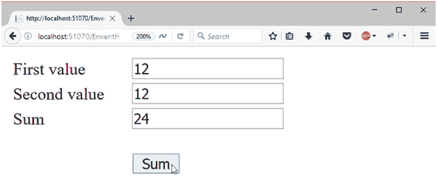

# ASP.NET 网络表单事件处理

> 原文：<https://www.javatpoint.com/asp-net-web-form-events-handling>

ASP.NET 为网络表单提供了重要的功能事件处理。它允许我们为应用程序实现基于事件的模型。举个简单的例子，我们可以向 ASP.NET 网页表单页面添加一个按钮，然后为按钮的点击事件编写一个事件处理程序。ASP.NET 网络表单允许客户端和服务器端的事件。

但是，在 ASP.NET 的 Web 窗体页中，与服务器控件相关联的事件起源于客户端，但由 ASP.NET 在 Web 服务器上处理。

ASP.NET 网络表单遵循一个标准。事件处理程序方法的. NET 框架模式。所有事件都传递两个参数:一个表示引发事件的对象的对象，以及一个包含任何特定于事件的信息的事件对象。

## 示例:创建事件处理程序

这里，我们正在为 click 事件创建一个事件处理程序。在本例中，当用户单击按钮时，会触发一个事件，并在服务器端执行处理程序代码。

**// EventHandling.aspx**

```

<%@ Page Language="C#" AutoEventWireup="true" CodeBehind="EnventHandling.aspx.cs" 
Inherits="asp.netexample.EnventHandling" %>
<!DOCTYPE html>
<html >
<head runat="server">
<title></title>
<style type="text/css">
.auto-style1 {
width: 100%;
        }
.auto-style2 {
width: 108px;
        }
</style>
</head>
<body>
<form id="form1" runat="server">
<div>
<table class="auto-style1">
<tr>
<td class="auto-style2">First value</td>
<td>
<asp:TextBox ID="firstvalue" runat="server"></asp:TextBox>
</td>
</tr>
<tr>
<td class="auto-style2">Second value</td>
<td>
<asp:TextBox ID="secondvalue" runat="server"></asp:TextBox>
</td>
</tr>
<tr>
<td class="auto-style2">Sum</td>
<td>
<asp:TextBox ID="total" runat="server"></asp:TextBox>
</td>
</tr>
<tr>
<td class="auto-style2"></td>
<td>
<br/>
<asp:Button ID="Button1" runat="server" OnClick="Button1_Click"Text="Sum"/>
</td>
</tr>
</table>
</div>
</form>
</body>
</html>

```

## 代码隐藏

**// EventHandling.aspx.cs**

```

using System;
using System.Collections.Generic;
using System.Linq;
using System.Web;
using System.Web.UI;
using System.Web.UI.WebControls;
namespace asp.netexample
{
public partial class EnventHandling : System.Web.UI.Page
    {
protected void Button1_Click(object sender, EventArgs e)
        {
int a = Convert.ToInt32(firstvalue.Text);
int b = Convert.ToInt32(secondvalue.Text);
            total.Text = (a + b).ToString();
        }
    }
}

```

输出:

