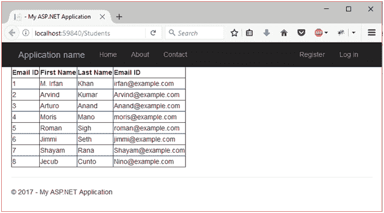

# ASP.NET 网络表单模型绑定

> 原文：<https://www.javatpoint.com/asp-net-web-form-model-binding>

本主题说明如何使用模型绑定和网络表单处理数据。与处理诸如 ObjectDataSource 或 SqlDataSource 之类的数据源对象相比，模型绑定使数据交互更加直接。

在本教程中，我们将使用数据实体框架和 GridView 在网页上显示数据。在这里，我们创建了一个包括以下步骤的示例。

1.  创建 ASP.NET 网络应用程序


3.  选择模板

选择模板作为网站表单，并将身份验证更改为单个用户帐户。


6.  创建母版页

使用母版页模板创建新的 web 窗体。我们将使用此母版页来显示模型数据。


9.  创建数据模型和数据库

我们将使用代码优先迁移来创建对象和相应的数据库表。这些表格将存储关于学生及其课程的信息。

在“模型”文件夹中创建新的模型类。

**//学生模型. cs**

```cs
using System;
using System.Collections.Generic;
using System.Linq;
using System.Web;
using System.Data.Entity;
using System.ComponentModel.DataAnnotations;
namespace ModelBindingDemo.Models
{
public class SchoolContextDemo : DbContext
    {
public DbSet<Student> Students { get; set; }
public DbSet<Enrollment> Enrollments { get; set; }
public DbSet<Course> Courses { get; set; }
    }
public class Student
    {
        [Key, Display(Name = "Email ID")]
        [ScaffoldColumn(false)]
public int StudentID { get; set; }
        [Required, StringLength(40), Display(Name = "Last Name")]
public string LastName { get; set; }
        [Required, StringLength(20), Display(Name = "First Name")]
public string FirstName { get; set; }
        [Required, StringLength(50), Display(Name = "Email ID")]
public string Email { get; set; }
        [EnumDataType(typeof(AcademicYear)), Display(Name = "Academic Year")]
public AcademicYear Year { get; set; }
public virtual ICollection<Enrollment> Enrollments { get; set; }
    }
public class Enrollment
    {
        [Key]
public int EnrollmentID { get; set; }
public int CourseID { get; set; }
public int StudentID { get; set; }
public decimal? Grade { get; set; }
public virtualCourse Course { get; set; }
public virtualStudent Student { get; set; }
    }
public class Course
    {
        [Key]
public int CourseID { get; set; }
public string Title { get; set; }
public int Credits { get; set; }
public virtual ICollection<Enrollment> Enrollments { get; set; }
    }
public enum AcademicYear
    {
        Freshman,
        Sophomore,
        Junior,
        Senior
    }
}

```

SchoolContextDemo 类从管理数据库连接和数据更改的数据库上下文派生而来。

我们将使用代码优先迁移工具来建立基于这些类的数据库。按照**视图- >其他窗口- >包管理器控制台，从菜单栏打开**包管理器控制台**。**

它将在 Visual Studio 集成开发环境的底部提示一个屏幕。我们需要在这个控制台中执行以下命令。

```cs
enable-migrations -Force -ContextTypeName ModelBindingDemo.Models.SchoolContextDemo

```

执行上述命令后，它会产生以下输出。


之后创建了一个名为 **Configuration.cs** 的新文件。该文件在创建后会自动打开。这个类包含一个**种子**方法，使我们能够用测试数据预填充数据库表。

*   在配置文件中添加测试数据

在这里，我们将向配置文件添加一些数据，我们可以在网页上向用户显示这些数据。将数据添加到文件中后，我们的 **Configuration.cs** 文件如下所示:

**// Configuration.cs**

```cs
namespace ModelBindingDemo.Migrations
{
using System;
using System.Data.Entity;
using System.Data.Entity.Migrations;
using System.Linq;
using ModelBindingDemo.Models;
internal sealed class Configuration : DbMigrationsConfiguration<ModelBindingDemo.Models.SchoolContextDemo>
    {
public Configuration()
        {
            AutomaticMigrationsEnabled = false;
        }
protected override void Seed(ModelBindingDemo.Models.SchoolContextDemo context)
        {
            context.Students.AddOrUpdate(
new Student
                 {
                     FirstName = "M. Irfan",
                     LastName = "Khan",
                     Email = "irfan@example.com",
                     Year = AcademicYear.Freshman
                 },
new Student
                 {
                     FirstName = "Arvind",
                     LastName = "Kumar",
                     Email = "Arvind@example.com",
                     Year = AcademicYear.Freshman
                 },
new Student
                 {
                     FirstName = "Arturo",
                     LastName = "Anand",
                     Email = "Anand@example.com",
                     Year = AcademicYear.Sophomore
                 },
new Student
                 {
                     FirstName = "Moris",
                     LastName = "Mano",
                     Email = "moris@example.com",
                     Year = AcademicYear.Sophomore
                 },
new Student
                 {
                     FirstName = "Roman",
                     LastName = "Sigh",
                     Email = "roman@example.com",
                     Year = AcademicYear.Junior
                 },
new Student
                 {
                     FirstName = "Jimmi",
                     LastName = "Seth",
                     Email = "jimmi@example.com",
                     Year = AcademicYear.Junior
                 },
new Student
                 {
                     FirstName = "Shayam",
                     LastName = "Rana",
                     Email = "Shayam@example.com",
                     Year = AcademicYear.Senior
                 },
new Student
                 {
                     FirstName = "Jecub",
                     LastName = "Cunto",
                     Email = "Nino@example.com",
                     Year = AcademicYear.Senior
                 }
                 );
         context.SaveChanges();
            context.Courses.AddOrUpdate(
new Course { Title = "Chemistry", Credits = 3 },
new Course { Title = "Microeconomics", Credits = 3 },
new Course { Title = "Macroeconomics", Credits = 3 },
new Course { Title = "Calculus", Credits = 4 },
new Course { Title = "Trigonometry", Credits = 4 },
new Course { Title = "Composition", Credits = 3 },
new Course { Title = "Literature", Credits = 4 }
                );
         context.SaveChanges();
            context.Enrollments.AddOrUpdate(
new Enrollment { StudentID = 1, CourseID = 1, Grade = 1 },
new Enrollment { StudentID = 1, CourseID = 2, Grade = 3 },
new Enrollment { StudentID = 1, CourseID = 3, Grade = 1 },
new Enrollment { StudentID = 2, CourseID = 4, Grade = 2 },
new Enrollment { StudentID = 2, CourseID = 5, Grade = 4 },
new Enrollment { StudentID = 2, CourseID = 6, Grade = 4 },
new Enrollment { StudentID = 3, CourseID = 1 },
new Enrollment { StudentID = 4, CourseID = 1 },
new Enrollment { StudentID = 4, CourseID = 2, Grade = 4 },
new Enrollment { StudentID = 5, CourseID = 3, Grade = 3 },
new Enrollment { StudentID = 6, CourseID = 4 },
new Enrollment { StudentID = 7, CourseID = 5, Grade = 2 }
                );
         context.SaveChanges();
        }
    }
}

```

之后，在包管理器控制台中，运行以下命令。

```cs
PM> add-migration initial

```

和

```cs
PM> update-database

```


现在已经创建了一个数据库，并将其添加到 **App_Data** 文件夹下的项目中。

*   显示数据

现在，让我们从创建的数据库中向网页显示数据。我们将使用 GridView 控件以网格形式显示数据。学生. aspx 文件如下所示:

**// Student.aspx**

```cs
<%@PageTitle="" Language="C#" MasterPageFile="~/Site.Master" AutoEventWireup="true" 
CodeBehind="Students.aspx.cs" Inherits="ModelBindingDemo.Students" %>
<asp:ContentID="Content1"ContentPlaceHolderID="MainContent"runat="server">
<asp:GridViewrunat="server"ID="studentsGrid"
ItemType="ModelBindingDemo.Models.Student"DataKeyNames="StudentID"
SelectMethod="studentsGrid_GetData"
AutoGenerateColumns="false">
<Columns>
<asp:DynamicFieldDataField="StudentID"/>
<asp:DynamicFieldDataField="FirstName"/>
<asp:DynamicFieldDataField="LastName"/>
<asp:DynamicFieldDataField="Email"/>
</Columns>
</asp:GridView>
</asp:Content>

```

### 代码隐藏

**// Student.aspx.cs**

```cs
using System;
using System.Collections.Generic;
using System.Linq;
using ModelBindingDemo.Models;
using System.Data.Entity;
namespace ModelBindingDemo
{
public partial class Students : System.Web.UI.Page
    {
protected void Page_Load(object sender, EventArgs e)
        {
        }
public IQueryable<Student> studentsGrid_GetData()
        {
SchoolContextDemo db = newSchoolContextDemo();
var query = db.Students.Include(s => s.Enrollments.Select(e => e.Course));
return query;
        }
    }
}

```

最后我们的项目看起来如下。


输出:

在浏览器中运行 **Student.aspx** 文件作为视图，它将产生以下输出。

