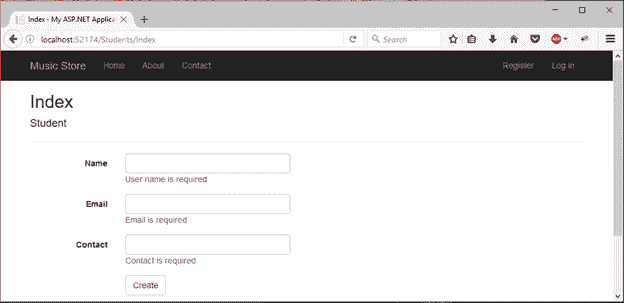
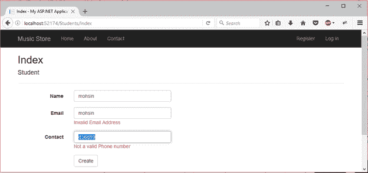

# ASP.NET 验证

> 原文：<https://www.javatpoint.com/asp-net-web-form-comparevalidator>

在本章中，我们将讨论 Web 表单中的数据验证。为了执行验证，ASP.NET 提供了自动检查用户输入并且不需要代码的控件。我们还可以为应用程序创建自定义验证。

## ASP.NET 验证控制

以下是验证控制

| 验证器 | 描述 |
| 比较器 | 它用于将一个输入控件的值与另一个输入控件的值进行比较。 |
| 范围验证控件 | 它计算输入控件的值，以检查指定的范围。 |
| 正则表达式验证器 | 它计算输入控件的值，以确定它是否与正则表达式定义的模式匹配。 |
| 验证 | 它用于使控件成为必需的。 |
| 验证总结 | 它显示网页上所有验证错误的列表。 |

* * *

## ASP.NET 比较器控制

该验证器根据指定的运算符，针对另一个输入控件评估输入控件的值。

我们可以使用比较运算符，如:小于、等于、大于等。

#### 注意:如果输入字段为空，将不会执行任何验证。

## 比较器属性

| 财产 | 描述 |
| 访问密钥 | 它用于设置控件的键盘快捷键。 |
| tab 键索引 | 控件的制表符顺序。 |
| 背景色 | 它用于设置控件的背景色。 |
| 单元格的边框颜色 | 它用于设置控件的边框颜色。 |
| 边框宽度 | 它用于设置控件的边框宽度。 |
| 字体 | 它用于设置控件文本的字体。 |
| 前景色 | 它用于设置控件文本的颜色。 |
| 文本 | 它用于设置要为控件显示的文本。 |
| 工具提示 | 当鼠标在控件上时，它显示文本。 |
| 看得见的 | 设置窗体上控件的可见性。 |
| 高度 | 它用于设置控件的高度。 |
| 宽度 | 它用于设置控件的宽度。 |
| 或指定控件 | 需要控件的 ID 来比较。 |
| 件实 | 需要控件的标识来验证。 |
| 出错信息 | 它用于在验证失败时显示错误消息。 |
| 操作员 | 它用于设置比较运算符。 |

## 例子

在下面的例子中，我们通过使用 CompareValidator 控制器来验证用户输入。下面给出了这个例子的源代码。

**//compare _ validator _ demo . aspx**

```
<%@ Page Language="C#" AutoEventWireup="true" CodeBehind="compare_validator_demo.aspx.cs" 
Inherits="asp.netexample.compare_validator_demo" %>
<!DOCTYPE html>
<html >
<head runat="server">
<title></title>
<style type="text/css">
.auto-style1 {
width: 100%;
        }
.auto-style2 {
height: 26px;
        }
.auto-style3 {
height: 26px;
width: 93px;
        }
.auto-style4 {
width: 93px;
        }
</style>
</head>
<body>
<form id="form1" runat="server">
<table class="auto-style1">
<tr>
<td class="auto-style3">
                        First value</td>
<td class="auto-style2">
<asp:TextBox ID="firstval" runat="server" required="true"></asp:TextBox>
</td>
</tr>
<tr>
<td class="auto-style4">
      Second value</td>
<td>
<asp:TextBox ID="secondval" runat="server"></asp:TextBox>
       It should be greater than first value</td>
</tr>
<tr>
<td class="auto-style4"></td>
<td>
<asp:Button ID="Button1" runat="server" Text="save"/>
</td>
</tr>
</table>
< asp:CompareValidator ID="CompareValidator1" runat="server" ControlToCompare="secondval" 
ControlToValidate="firstval" Display="Dynamic" ErrorMessage="Enter valid value" ForeColor="Red" 
Operator="LessThan" Type="Integer"></asp:CompareValidator>
</form>
</body>
</html>

```

输出:


