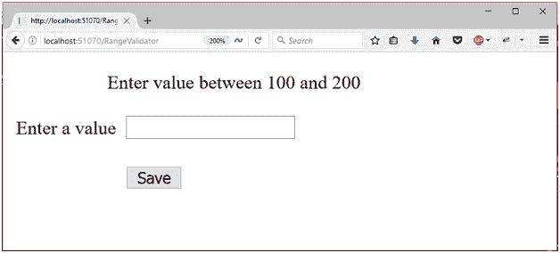
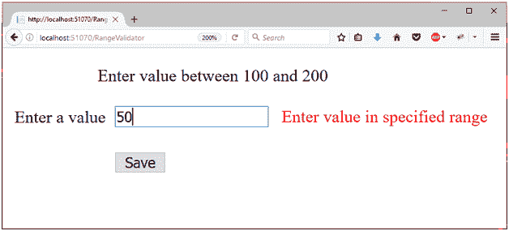

# ASP.NET 范围验证器控件

> 原文：<https://www.javatpoint.com/asp-net-web-form-rangevalidator>

该验证器评估输入控件的值，以检查该值是否在指定范围内。

它允许我们检查用户输入是否在指定的上下边界之间。该范围可以是数字、字母字符和日期。

#### 注意:如果输入控件为空，将不会执行任何验证。

**控件验证**属性用于指定要验证的控件。**最小值**和**最大值**属性用于设置控件的最小和最大边界。

## 范围验证器属性

| 财产 | 描述 |
| 访问密钥 | 它用于设置控件的键盘快捷键。 |
| tab 键索引 | 控件的制表符顺序。 |
| 背景色 | 它用于设置控件的背景色。 |
| 单元格的边框颜色 | 它用于设置控件的边框颜色。 |
| 边框宽度 | 它用于设置控件的边框宽度。 |
| 字体 | 它用于设置控件文本的字体。 |
| 前景色 | 它用于设置控件文本的颜色。 |
| 文本 | 它用于设置要为控件显示的文本。 |
| 工具提示 | 当鼠标在控件上时，它显示文本。 |
| 看得见的 | 设置窗体上控件的可见性。 |
| 高度 | 它用于设置控件的高度。 |
| 宽度 | 它用于设置控件的宽度。 |
| 件实 | 需要控件的标识来验证。 |
| 出错信息 | 它用于在验证失败时显示错误消息。 |
| 类型 | 它用于设置控制值的数据类型。 |
| 最大值 | 用于设置范围的上限。 |
| 最小值 | 用于设置范围的下限。 |

## 例子

在下面的例子中，我们使用**范围验证器**来验证指定范围内的用户输入。

**// RangeValidator.aspx**

```

<%@ Page Language="C#" AutoEventWireup="true" CodeBehind="RangeValidator.aspx.cs" 
Inherits="asp.netexample.RangeValidator" %>
<!DOCTYPE html>
<html >
<head runat="server">
<title></title>
<style type="text/css">
.auto-style1 {
height: 82px;
        }
.auto-style2 {
width: 100%;
        }
.auto-style3 {
width: 89px;
        }
.auto-style4 {
margin-left: 80px;
        }
</style>
</head>
<body>
<form id="form1" runat="server">
<div class="auto-style1">
<p class="auto-style4">
            Enter value between 100 and 200<br/>
</p>
<table class="auto-style2">
<tr>
<td class="auto-style3">
<asp:Label ID="Label2" runat="server" Text="Enter a value"></asp:Label>
</td>
<td>
<asp:TextBox ID="uesrInput"runat="server"></asp:TextBox>
<asp:RangeValidator ID="RangeValidator1" runat="server" ControlToValidate="uesrInput" 
ErrorMessage="Enter value in specified range" ForeColor="Red" MaximumValue="199" MinimumValue="101" 
SetFocusOnError="True"Type=" Integer"></asp:RangeValidator>
</td>
</tr>
<tr>
<td class="auto-style3"></td>
<td>
<br/>
<asp:Button ID="Button2" runat="server" Text="Save"/>
</td>
</tr>
</table>
<br/>
<br/>
</div>
</form>
</body>
</html>

```

输出:



当输入不在范围内时，它会抛出一条错误消息。

