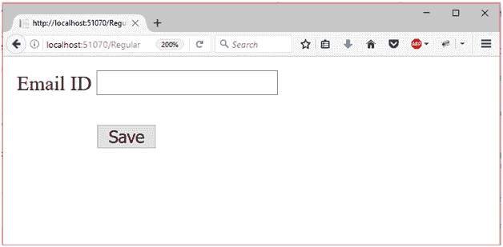
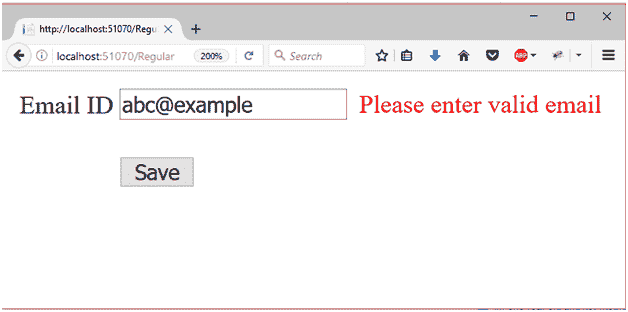

# ASP.NET 正则表达式验证器控件

> 原文：<https://www.javatpoint.com/asp-net-web-form-regular-expression-validator>

该验证器用于根据正则表达式定义的模式验证输入控件的值。

它允许我们检查和验证可预测的字符序列，如:电子邮件地址、电话号码等。

**验证表达式**属性用于指定正则表达式，该表达式用于验证输入控件。

## 正则表达式属性

| 财产 | 描述 |
| 访问密钥 | 它用于设置控件的键盘快捷键。 |
| 背景色 | 它用于设置控件的背景色。 |
| 单元格的边框颜色 | 它用于设置控件的边框颜色。 |
| 字体 | 它用于设置控件文本的字体。 |
| 前景色 | 它用于设置控件文本的颜色。 |
| 文本 | 它用于设置要为控件显示的文本。 |
| 工具提示 | 当鼠标在控件上时，它显示文本。 |
| 看得见的 | 设置窗体上控件的可见性。 |
| 高度 | 它用于设置控件的高度。 |
| 宽度 | 它用于设置控件的宽度。 |
| 出错信息 | 它用于设置验证失败时显示的错误消息。 |
| 件实 | 需要控件的标识来验证。 |
| 验证表达式 | 它用于设置正则表达式以确定有效性。 |

## 例子

在下面的示例中，我们将解释如何使用正则表达式验证器控件来根据给定的模式验证用户输入。

**//正则表达式. aspx**

```

<%@ Page Language="C#" AutoEventWireup="true" CodeBehind="RegularExpressionDemo.aspx.cs" 
Inherits="asp.netexample.RegularExpressionDemo" %>
<!DOCTYPE html>
<html >
<head runat="server">
<title></title>
</head>
<body>
<form id="form1" runat="server">
<div>
<table class="auto-style1">
<tr>
<td class="auto-style2">Email ID</td>
<td>
<asp:TextBox ID="username" runat="server"></asp:TextBox>
<asp:RegularExpressionValidator ID="RegularExpressionValidator1" runat="server"ControlToValidate="username" 
ErrorMessage="Please enter valid email" ForeColor="Red"ValidationExpression="\w+([-+.']\w+)*@\w+([-.]\w+)*\.\w+([-.]\w+)*">
</asp:RegularExpressionValidator>
</td>
</tr>
<tr>
<td class="auto-style2"></td>
<td>
<br/>
<asp:Button ID="Button1" runat="server" Text="Save"/>
</td>
</tr>
</table>
</div>
</form>
</body>
</html>

```

输出:

在浏览器中查看时，它会产生以下输出。



它将验证我们在正则表达式中指定的电子邮件格式。如果验证失败，它将抛出一条错误消息。

