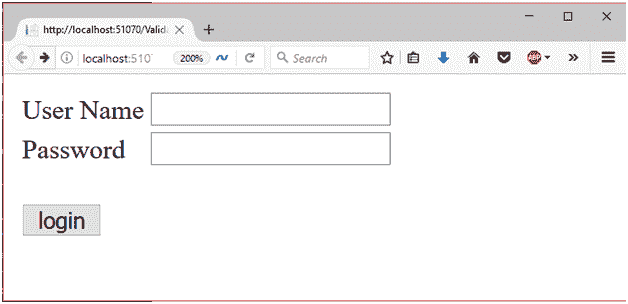
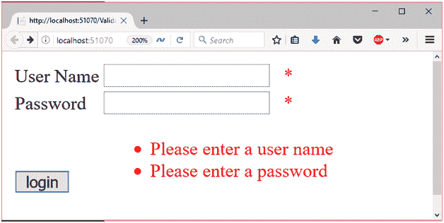

# ASP.NET 验证汇总控制

> 原文：<https://www.javatpoint.com/asp-net-web-form-validation-summary>

该验证程序用于显示 web 表单中所有验证错误的列表。

它允许我们在一个位置总结错误信息。

我们可以设置 **DisplayMode** 属性，将错误消息显示为列表、项目符号列表或单个段落。

## 有效性摘要属性

此控件具有以下属性。

| 财产 | 描述 |
| 访问密钥 | 它用于设置控件的键盘快捷键。 |
| 背景色 | 它用于设置控件的背景色。 |
| 单元格的边框颜色 | 它用于设置控件的边框颜色。 |
| 字体 | 它用于设置控件文本的字体。 |
| 前景色 | 它用于设置控件文本的颜色。 |
| 文本 | 它用于设置要为控件显示的文本。 |
| 工具提示 | 当鼠标在控件上时，它显示文本。 |
| 看得见的 | 设置窗体上控件的可见性。 |
| 高度 | 它用于设置控件的高度。 |
| 宽度 | 它用于设置控件的宽度。 |
| 显示消息框 | 它在高级浏览器中显示一个错误消息框。 |
| 显示摘要 | 它用于在表单页面上显示摘要文本。 |
| 显示验证错误 | 用于设置是否显示验证摘要。 |

## 例子

以下示例说明了如何在应用程序中使用 **ValidationSummery** 控件。

**//validationsummarydemo . aspx**

```
<%@ Page Language="C#" AutoEventWireup="true" CodeBehind="ValidationSummeryDemo.aspx.cs" 
Inherits="asp.netexample.ValidationSummeryDemo" %>
<!DOCTYPE html>
<html >
<head runat="server">
<title></title>
</head>
<body>
<form id="form1" runat="server">
<div>
</div>
<table class="auto-style1">
<tr>
<td class="auto-style2">User Name</td>
<td>
<asp:TextBox ID="username" runat="server"></asp:TextBox>
<asp:RequiredFieldValidator ID="user" runat="server" ControlToValidate="username" 
ErrorMessage="Please enter a user name" ForeColor="Red">*</asp:RequiredFieldValidator>
</td>
</tr>
<tr>
<td class="auto-style2">Password</td>
<td>
<asp:TextBox ID="password" runat="server"></asp:TextBox>
<asp:RequiredFieldValidator ID="pass" runat="server" ControlToValidate="password" 
ErrorMessage="Please enter a password" ForeColor="Red">*</asp:RequiredFieldValidator>
</td>
</tr>
<tr>
<td class="auto-style2">
<br/>
<asp:Button ID="Button1" runat="server"Text="login"/>
</td>
<td>
<asp:ValidationSummary ID="ValidationSummary1" runat="server" ForeColor="Red"/>
<br/>
</td>
</tr>
</table>
</form>
</body>
</html>

```

输出:

在浏览器中查看时，它会产生以下输出。



当用户在没有凭据的情况下登录时，它会抛出错误摘要。

