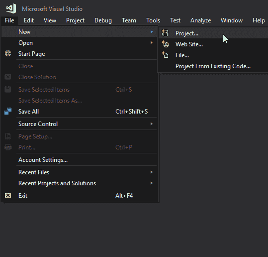
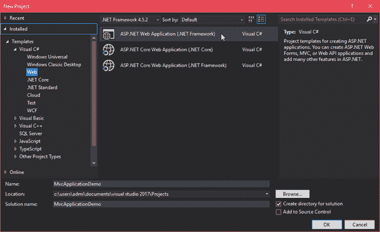
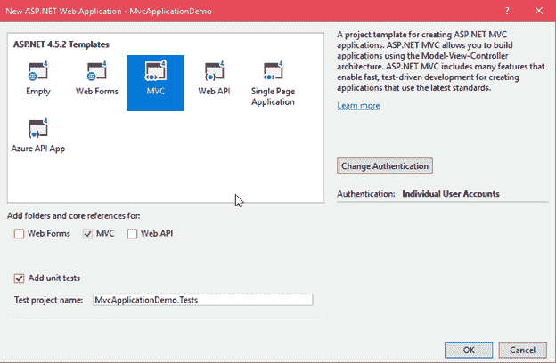
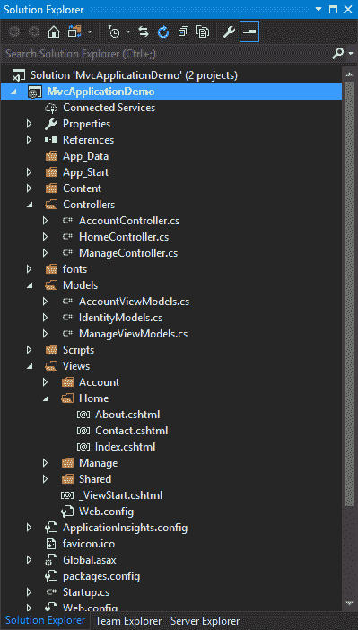
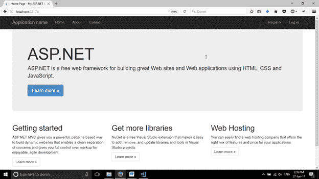

# ASP.NET MVC 项目

> 原文：<https://www.javatpoint.com/asp-net-mvc-project>

在本主题中，我们使用 visual studio 2017 IDE 来创建 MVC web 应用程序。它包括下面给出的各种步骤。以下步骤解释了如何创建基于 MVC 的 web 应用程序。

1.  **创建网络项目**

按一下功能表列中的[档案]功能表，然后选取[新增]子功能表以建立新专案。下图说明如何创建新项目。



4.  **选择项目类型**

在这里，选择项目类型为 web 项目，并提供项目名称。



7.  **选择 MVC 模板**

选择项目类型后，现在选择我们要实现的 web 模板。既然我们正在进行 MVC，那么从可用模板列表中选择 MVC 模板。同时，向应用程序提供身份验证类型。



单击“确定”后，它会创建一个具有以下结构的项目:

11.  **MVC Web 应用项目结构**

下面是我们刚刚创建的项目结构。



仔细看，这个项目，包含三个文件夹，分别是**模型、视图**和**控制器**。**家庭控制器**是应用程序的默认控制器。该控制器包含以下代码:

* * *

### // HomeController.cs

```
using System;
using System.Collections.Generic;
using System.Linq;
using System.Web;
using System.Web.Mvc;
namespace MvcApplicationDemo.Controllers
{
    public class HomeController : Controller
    {
        public ActionResult Index()
        {
            return View();
        }
        public ActionResult About()
        {
            ViewBag.Message = "Your application description page.";
            return View();
        }
        public ActionResult Contact()
        {
            ViewBag.Message = "Your contact page.";
            return View();
        }
    }
}

```

索引文件是视图文件夹中主控制器的默认文件。

### // index.cshtml

```
@{
    ViewBag.Title = "Home Page";
}
<div class="jumbotron">
    <h1>ASP.NET</h1>
    <p class="lead">ASP.NET is a free web framework for building great Web sites and Web applications 
    using HTML, CSS and JavaScript.</p>
    <p><a href="https://asp.net" class="btn btn-primary btn-lg">Learn more</a></p>
</div>
<div class="row">
    <div class="col-md-4">
        <h2>Getting started</h2>
        <p>
            ASP.NET MVC gives you a powerful, patterns-based way to build dynamic websites that
            enables a clean separation of concerns and gives you full control over markup
            for enjoyable, agile development.
        </p>
        <p><a class="btn btn-default" href="https://go.microsoft.com/fwlink/?LinkId=301865">
        Learn more</a></p>
    </div>
    <div class="col-md-4">
        <h2>Get more libraries</h2>
        <p>NuGet is a free Visual Studio extension that makes it easy to add, remove, and update libraries
        and tools in Visual Studio projects.</p>
        <p><a class="btn btn-default" href="https://go.microsoft.com/fwlink/?LinkId=301866">
        Learn more</a></p>
    </div>
    <div class="col-md-4">
        <h2>Web Hosting</h2>
        <p>You can easily find a web hosting company that offers the right mix of features and price
        for your applications.</p>
        <p><a class="btn btn-default" href="https://go.microsoft.com/fwlink/?LinkId=301867">
        Learn more</a></p>
    </div>
</div>

```

输出:

当在浏览器中查看时，该项目会生成以下输出。

