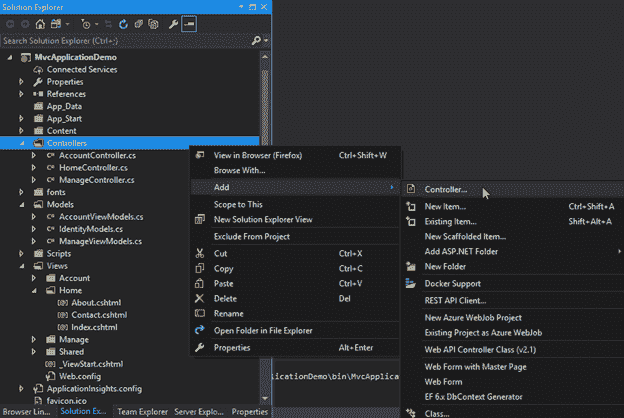
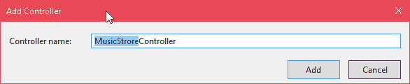
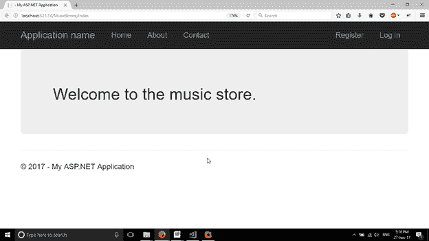

# ASP.NET MVC 控制器

> 原文：<https://www.javatpoint.com/asp-net-mvc-controller>

控制器是一个处理用户请求的类。它从模型中检索数据，并将视图呈现为响应。

ASP.NET MVC 框架将请求的 URL 映射到被称为控制器的类。控制器处理传入的请求，处理用户输入和交互，并执行适当的业务逻辑。

**控制器类**是所有控制器类的基类。它提供了通用的 MVC 处理。控制器主要执行以下任务。

*   它定位要调用和验证的适当操作方法。
*   它获取用作操作方法参数的值。
*   它处理操作执行过程中可能出现的所有错误。
*   它使用 WebFormViewEngine 类来呈现 ASP.NET 页面。

#### 注意:所有控制器类必须使用“控制器”后缀命名。

* * *

## 创建控制器

我们可以通过在控制器文件夹中添加一个新项目来为应用程序创建控制器。右键点击控制器文件夹，点击**添加- >控制器**，如下图。



提供控制器名称，然后单击添加。



添加此控制器后，按照惯例项目将在视图文件夹中创建一个与控制器名称同名的文件夹，以存储属于控制器的视图文件。

该控制器包含如下默认代码。

### // MusicStoreController.cs

```cs

using System;
using System.Collections.Generic;
using System.Linq;
using System.Web;
using System.Web.Mvc;
namespace MvcApplicationDemo.Controllers
{
    public class MusicStoreController : Controller
    {
        // GET: MusicStrore
        public ActionResult Index()
        {
            return View();
        }
    }
}

```

为了让浏览器访问这个控制器，我们将一个索引文件添加到视图文件夹内的 MusicStore 文件夹中。该索引文件包含以下代码。

### // index.cshtml

```cs

<div class="jumbotron">
    <h2>Welcome to the music store.</h2>
</div>

```

通过按下 **Ctrl+F5** 在非调试模式下运行该文件。这将产生以下输出。

