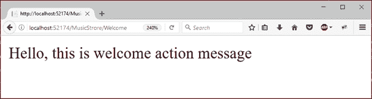
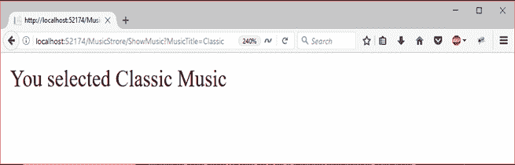

# ASP.NET 控制器动作和参数

> 原文:[https://www.javatpoint.com/asp-net-mvc-actions](https://www.javatpoint.com/asp-net-mvc-actions)

在 ASP.NET MVC 应用程序中，控制器定义了用于处理用户请求的操作方法，并将视图呈现为响应。控制器可以有任意数量的动作。

用户请求可以是以下任何一种:在浏览器中输入网址、单击链接或提交表单。

MVC 应用程序使用在 **Global.asax.cs** 文件中定义的路由规则。该文件用于解析网址并确定控制器的路径。现在，控制器执行适当的操作来处理用户请求。

* * *

## ActionResult Return Type(操作结果返回类型)

ActionResult 类是所有操作结果的基类。操作方法返回这个类的一个实例。根据操作正在实现的任务，可以有不同的操作结果类型。例如，如果一个操作要调用视图方法，则视图方法返回一个从 ActionResult 类派生的视图结果的实例。

我们还可以创建返回任何类型对象的操作方法，如:整数、字符串等。

下表包含内置的操作结果类型。

| 行动结果 | 助手方法 | 描述 |
| 查看结果 | 视角 | 它用于将视图呈现为网页。 |
| PartialViewResult | PartialView | 它用于渲染局部视图。 |
| 重定向结果 | 再直接的 | 它用于通过使用其 URL 重定向到另一个操作方法。 |
| redirecttoroaureresult | 重定向至操作重定向至路径 | 它用于重定向到另一个操作方法。 |
| ContentResult | 内容 | 它用于返回用户定义的内容类型。 |
| JsonResult | 数据 | 它用于返回一个序列化的 JSON 对象。 |
| JavaScriptResult 结果 | Java Script 语言 | 它用于返回可以在客户端上执行的脚本。 |
| 文件结果 | 文件 | 它用于返回二进制输出以写入响应。 |
| EmptyResult | (无) | 它表示如果操作方法必须返回空结果时使用的返回值。 |

* * *

## 添加操作方法

在这里，我们将向控制器添加一个新的动作方法，这是我们在上一章中提出的。

为了给现有的控制器添加动作，我们需要给控制器定义一个公共方法。我们的 **MusicStoreController.cs** 文件是添加了一个欢迎动作方法后的样子如下。

### // MusicStoreController.cs

```

using System;
using System.Collections.Generic;
using System.Linq;
using System.Web;
using System.Web.Mvc;
namespace MvcApplicationDemo.Controllers
{
    public class MusicStoreController : Controller
    {
        // GET: MusicStrore
        public ActionResult Index()
        {
            return View();
        }
        public string Welcome()
        {
            return "Hello, this is welcome action message";
        }
    }
}

```

输出:

要访问欢迎动作方法，执行应用程序，然后使用**音乐商店/欢迎**网址访问它。它将产生以下输出。



* * *

## 动作方法参数

操作参数是用于从网址检索用户请求值的变量。

这些参数是从请求的数据集合中检索的。它包括表单数据、查询字符串值等的名称/值对。控制器类根据 RouteData 实例定位参数值。如果该值存在，则将它传递给参数。否则，将引发异常。

控制器类提供了两个属性请求和响应，可以用来处理用户请求和响应。

**例**

这里，我们在控制器中创建一个动作方法。此操作方法有一个参数。控制器代码如下所示:

### // MusicStoreController.cs

```

using System;
using System.Collections.Generic;
using System.Linq;
using System.Web;
using System.Web.Mvc;
namespace MvcApplicationDemo.Controllers
{
    public class MusicStoreController : Controller
    {
        // GET: MusicStrore
        public ActionResult Index()
        {
            return View();
        }
        public string ShowMusic(string MusicTitle)
        {
            return "You selected " + MusicTitle + " Music";
        }
    }
}

```

输出:

在 URL 中，我们必须传递参数值。所以，我们是通过这个 URL**localhost:port-no/music store/show music 来做的？音乐标题=经典**。它会产生以下结果。

