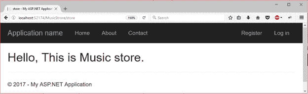
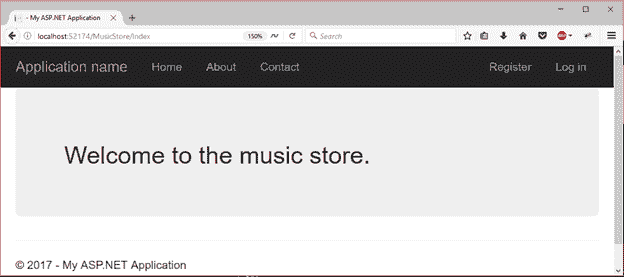
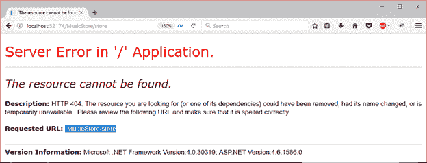

# ASP.NET MVC 动作选择器

> 原文:[https://www.javatpoint.com/asp-net-mvc-action-selectors](https://www.javatpoint.com/asp-net-mvc-action-selectors)

动作选择器是应用于控制器动作方法的属性。用于根据请求选择正确的动作方法进行调用。MVC 提供了以下操作选择器属性:

1.  ActionName
2.  动作动词

* * *

## ActionName

该属性允许我们为操作方法指定不同的名称。当我们想用不同的名字来称呼行动时，这很有用。

**例**

这里，我们使用 ActionName 属性为索引操作方法应用不同的名称。控制器代码如下所示:

### // MusicStoreController.cs

```

using System;
using System.Collections.Generic;
using System.Linq;
using System.Web;
using System.Web.Mvc;
namespace MvcApplicationDemo.Controllers
{
    public class MusicStoreController : Controller
    {
        [ActionName("store")]
        public ActionResult Index()
        {
            return View();
        }
    }
}

```

现在，我们需要在 MusicStore 文件夹中创建一个与 ActionName 相同的视图。因此，我们创建了一个 **store.cshtml** 文件，该文件包含以下代码。

### // store.cshtml

```

@{
    ViewBag.Title = "store";
}
<h2>Hello, This is Music store.</h2>

```

输出:

当用不同的名称**“store”**调用动作时，会产生以下输出。



* * *

## 动作动词

ASP.NET MVC 提供了应用于动作方法的动作动词，并且适用于 HttpRequest 方法。下面列出了各种动作动词和。

*   http post(http post)
*   http get(http get)
*   http put(http put)
*   HttpDelete
*   HttpOptions
*   HttpPatch

动作动词是控制器处理的 http 请求的名称。我们可以用它来选择行动方法。

**例**

在下面的例子中，我们试图通过 get 请求来访问一个索引操作，该操作只对 Http 请求是可访问的。控制器代码如下所示:

### // MusicStoreController.cs

```

using System;
using System.Collections.Generic;
using System.Linq;
using System.Web;
using System.Web.Mvc;
namespace MvcApplicationDemo.Controllers
{
    public class MusicStoreController : Controller
    {
        [HttpGet]
        public ActionResult Index()
        {
            return View();
        }
        [HttpPost]
        public ActionResult Welcome()
        {
            return View();
        }
    }
}

```

以下是音乐存储控制器的索引文件。

### // index.cshtml

```

<div class="jumbotron">
    <h2>Welcome to the music store.</h2>
</div>

```

输出:

当调用索引操作时，它会产生以下输出。



当我们对存储操作方法发出 get 请求时，它会产生错误消息。

