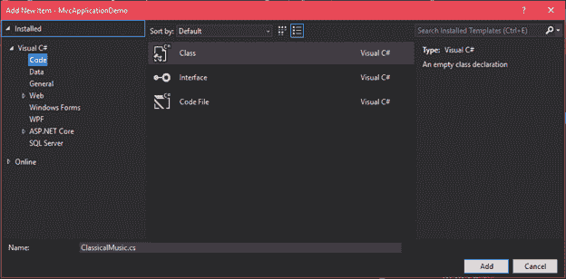

# ASP.NET MVC 模式

> 原文：<https://www.javatpoint.com/asp-net-mvc-model>

模型是包含应用程序业务逻辑的类。它还用于从数据库中访问数据。模型类不直接处理来自浏览器的输入。它也不包含任何 HTML 代码。

模型也被称为对象，用于实现应用程序的概念逻辑。控制器与模型交互，访问数据，执行逻辑并将数据传递给视图。

* * *

## 创建模型

让我们在现有项目中添加一个新模型。模型包含属性的 setter 和 getter。要添加模型，只需右键单击项目的**模型**文件夹，然后按照此顺序**模型- >添加- >新项目- > Visual C#- >代码- >类。**



它包含一些默认代码，如下所示。

### //古典音乐

```cs

using System;
using System.Collections.Generic;
using System.Linq;
using System.Web;
namespace MvcApplicationDemo.Models
{
    public class ClassicalMusic
    {
    }
}

```

现在，我们可以在模型中添加任意数量的属性和方法。这些有助于使 MVC 成为一种干净的框架方法。就像这里，我们正在创建一些属性和一个方法。

### //古典音乐

```cs

using System;
using System.Collections.Generic;
using System.Linq;
using System.Web;
namespace MvcApplicationDemo.Models
{
    public class ClassicalMusic
    {
        public int ID { get; set; }
        public string Title { get; set; }
        public DateTime ReleaseDate { get; set; }
        public string Genre { get; set; }
        public string GetDateTime()
        {
            return DateTime.Now.ToString();
        }
    }
}

```