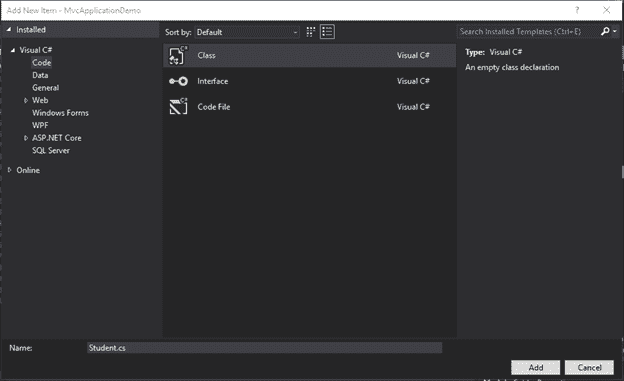
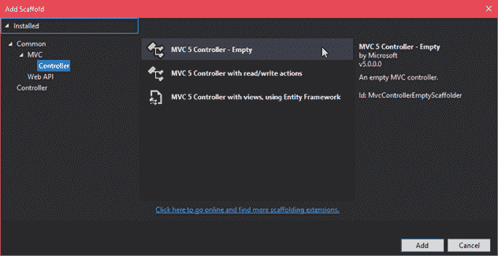
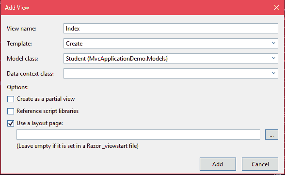
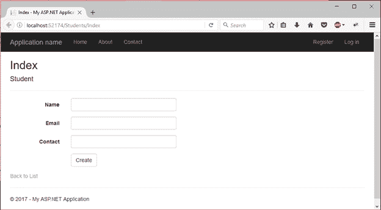

# ASP.NET MVC 模型绑定

> 原文：<https://www.javatpoint.com/asp-net-mvc-model-binding>

模型绑定是我们将模型绑定到控制器和视图的过程。这是一种将发布的表单值映射到. NET Framework 类型并将该类型作为参数传递给操作方法的简单方法。它充当转换器，因为它可以将 HTTP 请求转换为传递给操作方法的对象。

**例**

在这里，我们创建了一个例子，其中一个简单的模型与视图和控制器绑定。我们正在创建一个具有一些属性的学生模型。这些属性将用于创建表单域。

* * *

## 创建模型

右键单击**模型**文件夹，添加一个类来创建新模型。



这个文件包含一些默认代码，但是我们已经给它添加了一些属性。模型看起来像这样:

### // Student.cs

```

using System;
using System.Collections.Generic;
using System.Linq;
using System.Web;
namespace MvcApplicationDemo.Models
{
    public class Student
    {
        public int ID { get; set; }
        public string Name { get; set; }
        public string Email { get; set; }
        public string Contact { get; set; }
    }
}

```

* * *

## 创建控制器

创建模型之后，现在让我们为这个类创建一个控制器。右键点击**控制器**文件夹，添加控制器类。



添加后，它会提供以下预定义代码。

### //学生控制器. cs

```

using System;
using System.Collections.Generic;
using System.Linq;
using System.Web;
using System.Web.Mvc;
namespace MvcApplicationDemo.Controllers
{
    public class StudentsController : Controller
    {
        // GET: Students
        public ActionResult Index()
        {
            return View();
        }
    }
}

```

* * *

## 创建视图

要创建视图，右键单击**索引**动作方法的主体，选择**添加视图**选项，将弹出视图名称和模型，与视图一起附加。



添加后，它会在学生文件夹中生成一个包含以下代码的索引文件。

### // Index.cshtml

```

@model MvcApplicationDemo.Models.Student
@{
    ViewBag.Title = "Index";
}
<h2>Index</h2>
@using (Html.BeginForm()) 
{
    @Html.AntiForgeryToken()
    <div class="form-horizontal">
        <h4>Student</h4>
        <hr />
        @Html.ValidationSummary(true, "", new { @class = "text-danger" })
        <div class="form-group">
            @Html.LabelFor(model => model.Name, htmlAttributes: new { @class = "control-label col-md-2" })
            <div class="col-md-10">
                @Html.EditorFor(model => model.Name, new { htmlAttributes = new { @class = "form-control" } })
                @Html.ValidationMessageFor(model => model.Name, "", new { @class = "text-danger" })
            </div>
        </div>
        <div class="form-group">
            @Html.LabelFor(model => model.Email, htmlAttributes: new { @class = "control-label col-md-2" })
            <div class="col-md-10">
                @Html.EditorFor(model => model.Email, new { htmlAttributes = new { @class = "form-control" } })
                @Html.ValidationMessageFor(model => model.Email, "", new { @class = "text-danger" })
            </div>
        </div>
        <div class="form-group">
            @Html.LabelFor(model => model.Contact, htmlAttributes: new { @class = "control-label col-md-2" })
            <div class="col-md-10">
                @Html.EditorFor(model => model.Contact, new { htmlAttributes = new { @class = "form-control" } })
                @Html.ValidationMessageFor(model => model.Contact, "", new { @class = "text-danger" })
            </div>
        </div>
        <div class="form-group">
            <div class="col-md-offset-2 col-md-10">
                <input type="submit" value="Create" class="btn btn-default" />
            </div>
        </div>
    </div>
}
<div>
    @Html.ActionLink("Back to List", "Index")
</div>

```

输出:

执行索引文件时，它会产生以下输出。

